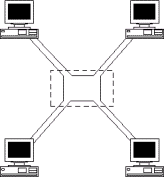

# 1-3 一些網路名詞

## **工作站\(Workstation\)**

任何能夠提供對網路環境進行輸入的機器﹐都可以說是**工作站**﹐其主要定義元素就是「輸入」。這可以包括個人電腦﹑掃描器﹑終端機﹑等等。每一工作站都有其自己的網路卡。

## **節點\(Node\)**

每一個工作站﹑網路傳真機﹑網路印表機﹑檔案伺服器﹑或任何其它擁有自己唯一網路地址的設備都是**節點**。它們是怎樣獲得網路地址的呢﹖從網路卡那裡獲得。每一張網路卡在出廠的時候都會被廠家分配一個地址﹐使用者是不可能變更此地址的。

這樣的地址安排就如我們日常的家庭地址一樣﹐是用來區分各自的身份的。您的網路必須有能力去區別這一個地址有別於其它的地址。在網路裡面﹐有很多資料**封包**會由一個節點傳送到另一個節點﹐同時要確定封包會被正確的傳達目的地﹐而這個目的地就必須依靠這個網路卡地址來認定了。

## **伺服器\(Server\)**

從技術角度而言﹐**伺服器**就是在網路中具備某些特定功能的集散地。伺服器也有分好些類型﹐比如﹐一個印表伺服器就是一台讓一群使用者儲列和處理列印工作的機器﹔一台傳真伺服器可以接受傳真請求﹑儲列和處理傳真等工作。建立一個印表伺服器﹐您可能需要騰空一台機器只用來專門處理列印服務﹐或是需要一些本身帶有網路卡的印表機。

最常見的伺服器莫過于檔案伺服器了。一個檔案伺服器就是一台儲存和管理檔案﹑應用程式和數據﹑以及對其負責保安服務的電腦。它可以對您的數據提供集中控制﹐和建立一個共同的地方為您的檔案進行集中備份。

## **封包\(Packet\)**

**封包**是能夠在網路上面進行傳輸的最小資訊單位。一個封包包含有發送端節點地址﹑接收端節點地址﹑和這兩個節點之間需要傳送的數據。

## **網路形態\(Topology\)**

這一解釋牽涉到網路上的各節點之物理和邏輯關係。從表面上看﹐就是這網路的“長像”。可以從兩個角度\(或曰形態\)看待您的網路﹕物理上的和邏輯上的。

### **網路物理形態**

這種形態就是講述一個網路上面的各個節點之間在物理上面的佈置﹐和它們在總體配置上看去的樣子。如果您在紙上將各台電腦的位置標示出來﹐同時將連接它們的網線\(Cable\)也畫出來﹐您就會比較清楚的看到其物理形態了。

比如﹕**總線狀\(bus\)﹑環狀\(ring\)﹑**或是**星狀\(star\)**。

### **網路邏輯形態**

這種形態講述的是信息如何在網路中行走。我們不妨舉個例子來模擬一下﹐好讓我們更好理解邏輯形態﹕

假如您有一份長達400頁的文件由台南送到台北﹐而且必須最遲明天送到﹐那麼您很可能會使用網中人快遞服務\(假設已經成立 ^\_^\)了。不過要處理這個傳送﹐您還必需要使用網中人快遞的信封和地址標籤。同時﹐您必需提供發信人和接收人的地址﹐當然少不了您那400頁文件啦。

在您的網路上﹐從一台電腦傳送數據到另一台電腦﹐也需要相同的資料﹕它需要您的**發送端地址﹑接收端地址**和**數據**數項資料。正如剛剛所述﹐這些資料都包含在**封包**裡面了。邏輯形態就接管著如何將這封包在網路中傳輸了。

1. 首先﹐邏輯形態會判定這個封包的格式﹐一如您必須按網中人快遞的地址標籤格式來填寫地址一樣。您必須使用網路能夠明白的地址格式。
2. 邏輯形態會判定有多少數據需要攜帶﹐一如網中人快遞也有規定一個標準信封只能最多裝30頁文件一樣。
3. 然後邏輯形態會判定使用什麼方法來追蹤在網路傳輸的封包。有些邏輯形態則不會追蹤封包而假設一切無誤﹐有些則會對路徑中的每一個步驟進行追蹤。

如果您已經聽過**乙太網\(Ethernet\)**或者**令牌環\(Token Ring\)**﹐其實您已經接觸過邏輯形態了。每一種邏輯形態常常會和網路物理形態聯係起來﹐但物理形態卻不一定就是邏輯形態。如下圖﹐在物理上面我們可以說它是一個 Star 網路形態﹐然而在邏輯上﹐它卻很可能是 Token Ring 網路形態。

在後面﹐我們將會對不同的邏輯形態進行講述﹐包括它們各自的優缺點。這是一個非常重要的題目﹐因為不同類型的網路形態會影響到您需要在您的網路安裝什麼類型的網路卡。在一個複雜的網路裡面﹐可以由好幾種不同類型的網路形態共同組成。

