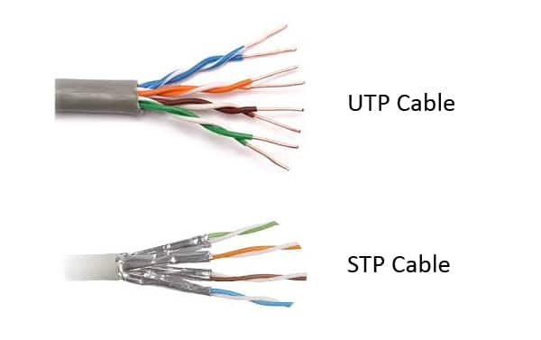
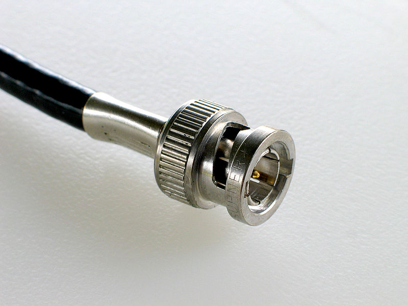
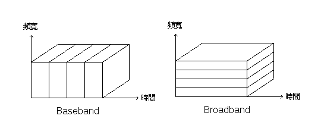
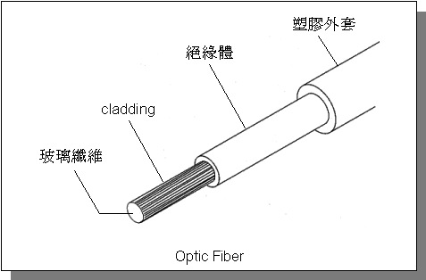
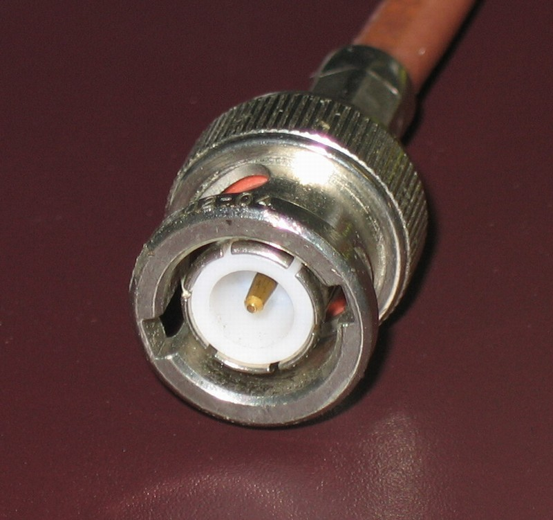
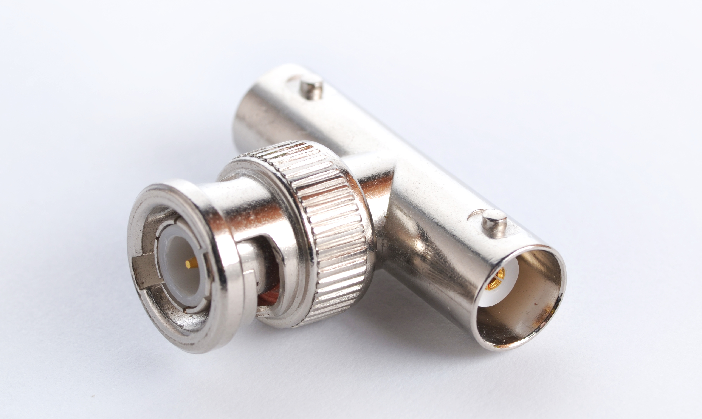
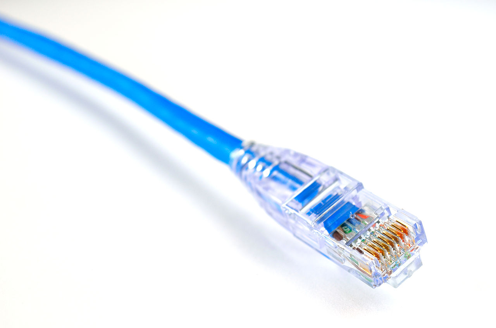
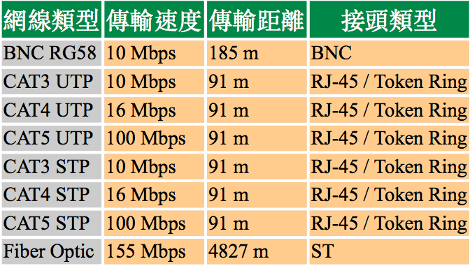

# 1-4 連線材料

## **網路卡**

網路卡可以說是我們進入網路世界之門﹐如果網路卡不工作﹐那麼您也就被屏之門外了。所以﹐首先要選擇和安裝好網路卡是非常重要的一關。

現在的網路卡多會帶有一張磁片﹐除了裡面提供了給不同作業系統使用的 Driver 之外﹐應該還有一個設定程式的。它可以用來設定網卡的 IO﹑IRQ﹑DMA﹑或是使用 PnP ﹔也可以設定連線類型﹐比如﹕BNC﹑RJ45 ﹐或 AUTO﹔同時還可以選擇使用 Boot ROM 與否。有些還帶有測試程式來確定網卡是否正常工作。

正如前面所述﹐不同的網路形態會決定不同的網路卡﹐但不管使用何種類型的網路卡﹐關鍵的還是它要能夠在您當前的作業系統上工作﹐而且還要考慮到它的穩定性和速度。現在市面上通常見到的是 Ethernet 10/100/1000 網路卡﹐那個 10/100/1000 就是速度﹐也可以說是傳輸量﹕1000 Megabits/每秒﹐**注意**﹕千萬不要將 Mbps 和 MBps 搞混了﹐因為前者是每秒 Millions of bits ﹐而後者是每秒 Millions of bytes \( 1byte=8bits﹐相差 8 倍之多哦~~ Byte 是電腦的運算單位﹐而 bit 則是網路的傳輸單位﹐要注意分清楚\)。那個10/100/1000 的意思就是支持 10Mbps、100Mbps、1Gbps 三種速度的網卡。以前 10/100Mbps 網卡的價錢比單純 10Mbps 的網卡貴幾乎十倍價錢﹐不過現在它們的價錢便宜多了。從現在起，市面上已經有 10Gpbs的網路卡在銷售了。還聽說100Gbps的網路卡規格也都制定好了。

Anywan，要連上網路﹐首先要設定好網路卡。

## 網路**線**

雖然網路卡設定好了﹐但是沒有網路線什麼地方也接不上去。

選擇一個網線系統也要考慮到很多因素的﹐比如﹐您的網路架構，您需要什麼樣的物理形態和邏輯形態﹖什麼樣的網線既不會超支預算又可以符合傳輸要求\(速度和距離\)﹖您需要什麼樣的接頭來連接它們﹖等等。同時﹐不同類型的數據要求\(如純文字﹑大量的圖片﹑影像﹑和語音等\)﹐以及電腦之間的距離長短﹐也會影響到網線的取材。

網路線也有分好幾種類型，下面一一來介紹

### **雙絞線\(Twisted Pair Cable\)**

通常由兩對或四對相互纏繞的銅線組成。為什麼要把線纏繞著呢﹖因為任何電流流經導體都會產生電波干擾 \(RFI﹐ Radio Frequency Interference\)，在網路傳輸中，我們稱這類干擾為 "串音" \(Cross Talk\)。若是相鄰的導體的電流方向是一致的話，那彼此的干擾就會重疊﹔但若是電流方向相反的話，則彼此抵消。因此，將兩條線相互的旋轉纏繞著的話﹐一來可以更容易確保其電流方向是相反的，同時彼此產生的干擾也會因其纏擾而抵消得更徹底。雙絞線還分為屏蔽雙絞線\(STP﹐Shielded Twisted Pair\) 和非屏蔽雙絞線\(UTP﹐Unshielded Twisted Pair\)。其唯一分別是 STP 有一層導電金屬膜將每對雙絞線包裹起來﹐提供更透徹的抗干擾能力。當然﹐STP 比 UTP 要貴多了﹐但在一些 UTP 實在應付不來的場合裡﹐還是物有所值的。它們的外觀分別如圖﹕

Elecrtonics Industry Association \(EIA\), Telecommunications Industry Association \(TIA\), 和 National Electrical Manufacturers Association \(NEMA\) 等機構對雙絞線建立了 5 個標準等級。按照等級高低﹐級數越高﹐其每英尺的絞接數目也越多﹐抗干擾能力也越強。這 5 個種類分列如下﹕

* CATEGORY-1﹐這是一種從 1983 年就被廣泛使用的老式電話線﹐它不適合於任何高速數據傳輸﹐只不過其得名於將線絞接起來而已。
* CATEGORY-2﹐此種線可以傳輸達 4Mbps 的數據﹐它擁有兩個特徵﹕  1. 在一英尺直線距離最少有 3 個絞接。  2. 沒有任何兩對線是相同的絞接色樣的﹐這可以降低線線之間的串音\(crosstalk\)。比如其中一對線在每英尺之內使用了 3 個絞接﹐而另外一對則使用 31/8 個絞接。

\(**注意**﹕其後的 3 個等級也具備這兩個特性﹐只是要求更嚴格而已。\)

* CATEGORY-3﹐這是您能夠由來做 LAN 網線的最低等級了﹐它可以最高傳輸 10Mbps 的數據﹐同時構造上面也要比 CAT1 和 CAT2 要好。
* CATEGORY-4﹐可以用來給 16Mbps 的 Token Ring 網路使用的最低等級﹐實際上﹐對 LAN 而言﹐最好將此等級作為最低等級了﹐而非 CAT3。
* CATEGORY-5﹐無論在速度上和抗干擾能力上﹐這個才是您真正需要的等級﹐其最高傳輸速度可以達到 100Mbps。
* CATEGORY-5e / CATEGORY-6 ﹐比 CAT5 更高的等級，其要求及工藝更為嚴格。傳輸速度可超過 1000Mbps，應是目前網路佈線的起碼等級了。

CAT5 等級以上的網線被指定可以使用在 FDDI \(Fiber Distributed Data Interface\) 網路上面﹐定義了如何將銅線和光纖在同一網路環境的整合。它被設計成為配合光纖導線而提供更好的多媒體\(語音和影像\)承載網路方案。

### **同軸網線\(Coaxial Cable\)**

其構造是﹕中央是一條被隔離層保護著的銅導芯﹐其外隔著一層絕緣體還有一層導體金屬網﹐在最外層則是保護外皮。它有更好的屏蔽能力﹐如果您需要比雙絞線更高的抗干擾要求﹐但又用不起光纖的話﹐Coaxial 可以說是您的選擇。不過傳輸上面﹐Coaxial 只能最高有 10Mbps。連接頭稱為 BNC 接頭\(得名於Bayonet-Naur Connector\)，看起來是這樣的﹕

用在網路上的 Coaxial Cable 大致分為 4 類﹕

* RG-11, 厚 0.4 英寸﹐也常被稱為 10Base5 \(Thick Ethernet\)﹐其標準由 Institue for Elecrical & Electronic Engineers \(IEEE\) 制定。
* RG-58A/U﹐厚 0.18 英寸﹐也常被稱為 10Base2 \(Thin Ethernet\)。
* RG-59/U﹐厚0.25英寸﹐用在 Cable TV 和 ARCnet\(一種古老網路形態\)上面。
* RG-62/U﹐厚0.25英寸﹐用在 ARCnet 和 IBM 終端上面。  \( 也有網友來信指出：ARCnet 使用的線材應該是跟 10 baes2 相同的 RG-58 , 至於網路與 CATV 用線的不同在於線路阻抗, 一個是 50 歐姆, 一個是 75 歐姆, ARCnet 是 Token bus 的樹狀結構, 現在沒人用了。\)

要**注意**的是：雖然後面三種網線差不多大小﹐但卻是不可以調換使用的。而在這四種類型之中﹐只有兩種是適合於 LAN 使用的﹕10Base5 和 10Base2。我們使用這些名稱是有其意思的﹐其中的信息可以分拆成以下部份﹕過載速度\(頻寬\)﹑頻寬類型﹑和信號在網線中行走的最長距離。

拿 10Base5 為例﹕首先是速度﹐10 代表 10Mbps﹐這個前面解釋過了﹔最後是信號距離﹐5 代表 500 米\(大約 1640 英尺\)﹔然後是中間部份了﹐它是用來描述頻寬在多工使用時的切隔方式。

#### **何為頻寬呢﹖**

沒得解釋﹐就是頻寬﹗或是說媒體所承載的訊息量，越多越好。如果要形象地理解頻寬﹐我們可以拿一條高速公路來做例子。如果此公路是四線行車的﹐那麼汽車就好比是數據﹐這樣就有四條傳輸數據的通道了。如果在交通在非繁忙時候﹐每輛車以 100KMph 行走輕鬆有餘﹐但在高峰期呢﹖就跟台灣的高速公路差不多了。這情形跟網路的交通是一樣的﹐解決方法有兩個﹕一是在高峰期減少封包的傳輸﹐例如利用工作排程將一些比較繁重的網路傳送工作安排到晚上或非繁忙時間﹔另一種方法就是增加頻寬了﹐跟我們的 MODEM 從 33.6Kbps 換到 56Kbps 一樣。

而頻寬的分割方式也有兩種﹕一種叫 Baseband﹐另一種叫 Broadband。再以高速公路為例﹕前者將整條公路併成一條線﹐這樣可以容許比較大載量的卡車通過﹔後者則將公路分成數條行車線﹐可以允許幾部小車一次通過。如果貨物來到公路一端﹐使用 Baseband﹐我們就用大容量的卡車﹐一次出發一輛的運送﹐不管誰的貨物﹐也不管貨物多大﹐都要排隊輪候﹔如果利用 Broadband﹐我們就用小點的車﹐分配給各人一條車道\(但卻不可以轉換車道哦\)﹐這樣排隊的人就比較少了。

關於 baseband 指的是基頻訊號，像是我們看的電視的 AV 訊號一樣，同一時間就只有一組訊號在傳輸﹔那相對於基頻訊號的就是射頻訊號，像是 CATV 就是運用射頻訊號進行傳輸，同時以不同的載波，傳輸不同的訊號。對於 broadband 是相對於窄頻，這兩個字一個指的是訊號的調變方式，一個是在對頻寬的稱呼,兩個不能相比較。上圖是以多工方式來說明：一個是時間為基底的多工\(TDM, Time Division Multiplexing\)，一個是以頻率為基底的多工方\(Frequency Division Multiplexing\)。一般而言網路都是時間多工的方式來進行傳輸，這也是 CSMA/CD 的作用。

好了﹐那麼我們也應該知道 10Base5 裡面的 Base 是怎麼樣的頻寬了吧。不過在講到頻寬的時候﹐我們還要了解一個概念﹐就是**流量**﹕即是資料每秒所流過的數量\(以頻寬乘以時間為極限\)。頻寬的流量都是有極限的﹐我們可以稱這個極限為 100% 飽和量。因為我們在網路中使用 bit 來做單位﹐而電腦運算則以 byte 單位\( 1byte=8bits \)﹐所以在數值上﹐流量只是頻寬的 1/8。例如您使用 56KMODEM 來下載資料﹐如果您發現程式顯示的是 4Kps 的話﹐那麼您當時的流量就是50%了。但，這仍然是一個粗略的估計而已，因為當數據交到底層網路進行傳送的時侯，各種 protocol 在溝通上會產生非常大量的 overhead 。因此，電腦程式的資料交到網路上傳輸的時侯，絕對不僅僅是程式數據本身的傳輸量。

這裡我還要提醒一下﹕10Base2 的 2 並不是真正的 200 米﹐準確來說應該是 185 米﹐200 只是取比較好聽的近似值罷了。而 10BaseT 的 T 則代表 Twisted Pair。

### **光纖網線\(Fiber Optic Cable\)**

到目前為止﹐我們所介紹的都是以電子方式傳遞的介質﹐而光纖網線則是以光為傳遞方式的介質﹐它完全是不受電波干擾的。在這種網線上﹐光只在塑料或玻璃纖維裡面傳導﹐其外面則由一層薄薄的被稱為 cladding 的外衣保護著﹐然後整根或多根導線則隔著一層絕緣材料被包裹在塑膠外套裡面。請參考下圖﹕

使用光纖的最大好處是其傳輸量大﹕可達 155Mbps 或更高﹔傳輸距離遠﹕信號有時候可以傳送好公里而不會衰減。所以光纖網線一般都會用來做高速網路的骨幹\(Backbone\)﹐也通常是用來做長途電話通訊及 FDDI 的導線。光纖比起 Coaxial 和 UTP 來說﹐光纖是先天性對 Cross Talk 免疫的，因此抗干擾能力特強，也更難遭到竊聽﹐所以也多用來傳送機密通訊。

光纖最大的壞處是價錢高﹐而且架設費用也很高。不過近年來隨著光纖的普及﹐其造價也急跌許多﹐相信不久的將來﹐使用光纖在辦公室架網恐怕也是很平常的事情。

### **無線網路**

除了以上說的有形網線之外。在某些特殊的環境中﹐我們還可以使用無線技術將電腦連接起來。因為在一個網路工程當中﹐線路鋪設所佔的成本是頗高的。如果工程結構比較複雜﹐或因制度而令到網線鋪設費用過高的話﹐使用無線通訊未嘗不是好的提案。當然﹐無線網路對辦公室的物理環境影響最少﹐節點的可移性也是非常吸引的。

在無線網路裡面﹐每台電腦都必須要安裝無線網卡來傳送和接收數據。~~但無線網路的傳輸能力暫時還差強人意﹐大概只有 242Kbps ﹐應付一般的文字檔案或許還可以﹐要是傳送大量的圖片或音像則恐力有不逮了。不過現在新的 IEEE802.11 PCMCIA 標準已經可以達到 1Mbps 或 2Mbps了。在 802.11b 規格中，其傳輸量則根據環境品質自動於 11Mbps、5.5Mbps、2Mbps、1Mbps 等速度之間調整，還可擴充到 22Mbps 。新的能在 5GHz 頻段工作的 802.11a 規格， 甚至能傳送 72Mbps 呢！~~


現在的無線網路已達到802.11 ac，在160Mhz狀況下最高速可達886M

有興趣可以往這邊走：


## **網線接頭**

### **BNC**

假如您要使用 Coaxial Cable 的話﹐那您很可能需要 BNC 接頭了﹐其形為圓狀﹐後接 Coaxial 網線﹐前面中間是根銅針﹐外面是個可以旋轉的金屬環。在 BNC 連線上面﹐您必須在網路的兩端使用 50 歐姆的**終端電阻**﹐而且在網線和網卡之間必須使用**T 型接頭**。它們的外觀如圖﹕

連接 BNC 和 T 型接頭也很容易﹐把接頭對準卡口套進去然後順時針擰上就可以了。您的手指應該會感覺到是否擰好了﹐如果不確定重複試試就是了。這點很重要﹐要是因為其中一個接頭沒擰好﹐可能會導致整個 BNC 連線失敗哦。

不過 BNC 連線在使用上面﹐被發現越來越多的弊端﹐比如﹕接頭不牢靠﹑終端不穩定﹑接頭與網線連接不好﹑網線容易斷﹑等等。其中最不好的是﹕只有其中任何一部份出問題﹐都可能會影響整個網路﹐而且除錯也比較困難。\(不同於下面介紹的 RJ45 連線﹐RJ45 如果有問題只會影響有問題的機器而不會是整個網路\)。

另外﹐要是自己動手做 BNC 網線的時候﹐要注意網線最短不能少於 1 米。

### **RJ-45**

RJ-45 接頭通常是給雙絞線使用的。其形狀很似我們日常使用的電話接頭﹐不過體積比較大些而已。仔細數數接頭﹐上面應該有 8 根銅腳﹔其另一邊是個可壓式的塑料卡荀﹐當您把它插進網卡或牆跟的插座﹐這個卡榫就會把接頭鎖好在插座裡面﹐要取出來把卡口按下則可。從下圖您可以看出 RJ-45 接頭的模樣﹕

使用 RJ-45 的連線﹐必須使用集線器\(HUB\)或 SWITCH﹐所有的電腦都必須先接到 HUB 上面才可以彼此溝通。如果只是兩台電腦之間的連線﹐您也可以不要 HUB﹐但您得為您的 RJ-45 接頭動動手術﹕將一端的第 1 線接到另一端的第 3 線﹑一端的第 2 線接到另一端的第 6 線。方向是網線在接頭左邊﹐銅線向自己\(如上圖\)﹐從上到下數。

### **其它接頭**

除了上面兩種我們比較常見之外﹐還有諸如 D-Shell Connector﹑Token Ring Connector﹑和 Fiber Optic Connector 等接頭﹐不過這裡也就不一一說明了。

## **小結**

我們可以在下面的列表中看看各網線的特徵﹕

