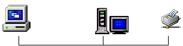
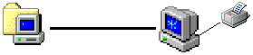
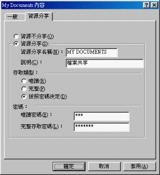

# 1-6 網路管理模式

在前面我們已經講過網路的物理形態和邏輯形態了﹐雖然很不好理解和容易混亂﹐但對於學習網路來說卻是不可少的一課。

採用什麼樣的網路管理模式﹐可以不受網路形態的限制﹐但離開了網路形態則什麼模式也是徒然的。在這一章裡﹐我們主要講述 Client / Server 和 Peer / Peer 的網路管理模式﹐同時也會對各自的優缺點進行評估。

## **Client / Server 網路**

Client/Server 網路有一些電腦專門是用來管理個網路和處理 client 的請求﹐我們稱之為 "伺服器" \(Server\)﹔相對而言，client 電腦都有能力處理自己的電腦運算﹐但卻往往是提出服務請求的機器。

一般在比較大型的辦公室裡面﹐使用的都是 Client/Server 網路架構。

相對於 Peer/Peer 網路﹐Client/Server 網路可以提供更好的集中管理和控制﹐同時在擴展能力上也比較強﹐\(雖然 P/P 網路也容易擴展﹐但如果超過 50 台電腦就不那麼好玩了\)。或許 C/S 網路最討好的地方是能夠提供嚴謹和更充份的網路安全服務﹐而避免了沒有經過批准的連線。

大多數 C/S 網路使用者必須先輸入使用者名稱\(ID\)和密碼\(password\)才能連接網路﹐ID 和 password 永遠是一對的。當使用者繼續嘗試使用到網路服務\(如檔案﹐程式\)的時候﹐不同的 ID 所擁有的權限是不同的﹐比如﹕有些只能讀取﹐有些則可以修改﹐有些甚至可以刪除和建立。

再到程式的使用﹐也可以在設定上是否需要密碼﹐如果有設定需要﹐可以使用相同的網路密碼﹐也可以使用不同的 ID 和密碼，端看程式的設計。離開了 ID 和密碼﹐您將使用不到任何的網路資源。雖然在 P/P 網路上面也有密碼﹐但其設定和管理上面則比 C/S 鬆散得多。

下面所介紹的是我們比較常見的幾種伺服器：

### **磁碟伺服器\(Disk Server\)**

它是在網路中一個提供中央儲存檔案和數據的地方﹐提供給其它 client 連上來使用﹐就如使用本地的硬碟一般。當然﹐當 client 讀寫資料時候卻需要點技術了：

我們知道當電腦讀取本機硬碟的時候﹐會先到 FAT \(File Allocation Table\) 找到檔案的位置﹐然後硬碟移動磁頭去讀取該檔案。但在 Disk Server 上面的 FAT 可跟本機的 FAT 不一樣的﹐那麼當一個 client 向 server 要求讀取檔案的時候﹐server 會將自己的 FAT 複製一份給 client ﹐然後 client 先將這個 FAT 複製件存儲在 RAM 裡面﹐而後每次要讀取檔案就先從這個複製件中尋找。

但問題又來了﹐因為 disk server 是在網路中提供好幾個使用者的﹐要是您剛剛獲取了一份 FAT 複製件﹐然後別的使用者有在上面增加了檔案﹐那樣您獲得的 FAT 就過時了﹐而您又不知道其改變了﹐當您要回存資料的時候﹐因為 FAT 的改變﹐很可能會造成資料的流失。

為了解決這一問題﹐則需要在 client/server 間提供某種鎖定能力，以確保檔案的完整性。在常見的實作中， disk server 會將硬碟分割成好幾個標籤\(volume\)﹐然後給不同的使用者以不同的 volume﹐而另外設立一個唯讀的 public 空間給全部使用者共用。

### **檔案伺服器\(File Server\)**

您已經了解到使用 Disk Server 存在的問題和複雜性了﹐在今天﹐file server 則稍有不同。一個 file server 會有自己的作業系統﹐就有如一個外殼般包圍著磁碟操作系統﹐然後作業系統會過濾掉從網路傳來的命令﹐然後翻譯成作業系統能夠懂得命令。

File server 和 disk server 都很相似﹕都是提供一個中央的儲存空間給網路使用。它們最大的分別是 file server 會維護和使用著自己的 FAT﹐而 disk server 只提供 FAT 的複製本。當 client 要求檔案的時候﹐file server 會從硬碟中找到這個檔案﹐然後寄一份複製件給 client 使用。

其情形就像這樣﹕   
client 問 : “抱歉﹐我要一份檔案。”   
disk server 會回答﹕“別煩我﹐自己去 FAT 找啦﹗”﹔   
然而 file server 則會這樣回答﹕“沒問題﹐我找給你﹐請稍侯。”

當您聽到有關於檔案伺服器的討論的時候﹐或許您還聽過 **指定檔案伺服器**\(Dedicated file server\) 和 **非指定檔案伺服器**\(non-dedicated file server\)。它們又是什麼東東呢﹖

前者是一個專門負責檔案管理的工作﹐除此之外別的什麼都不管﹐其終生目標就是提供檔案服務﹔而後者通常是一台工作站﹐只不過分擔著檔案服務功能﹐它的記憶體也分一半給工作站事務﹐另一半則提供檔案服務。既然如此﹐為什麼不乾脆使用指定伺服器呢﹖這樣又快又安全~~~ 。哎呀~﹐以前的 PC 可不同現在這樣便宜哦﹐如果那時候您是老闆的是﹐就不是這麼想了。

### **程式伺服器\(Application Server\)**

從字面上理解﹐當然是存放程式的伺服器啦。如果您有在自己電腦安裝程式的經驗就知道﹐程式必須要先等作業系統安裝好才能安裝﹐同時也得為它們安排空間存放。但如果有上百台電腦要安裝的話﹐不僅要重複著大量的工作﹐而也浪費很多空間\(整體而言\)。如果使用 application server ﹐我們只需在上面安裝一次主程式﹐然後在各 client 上面安裝體積少很多的 client 程式就可以了。有些 DOS 的程式﹐甚至連 client 程式都無需安裝呢﹐直接使用就可以了。

無論如何﹐您得先確定您所使用的程式有網路功能﹐要不然您還是使用不到 application server 的好處。

## **Peer / Peer 網路**

Peer/Peer 網路帶出的是和 Client/Server 完全不同的網路概念。與其在網路上建立中央控制的機器﹐取而代之的是﹕每台電腦都保存著自己的程式在本地硬碟上﹐它們也各自有著自己的週邊設備。

通過共享﹐每一台電腦都可以是工作站﹐同時也可以是一個伺服器﹐它們之間的地位都是平等的。在使用中﹐將它們集中在同一工作組就可以了﹐您可以為每一個共享的服務設立密碼保護﹐只有知道密碼才可以使用。

### **安裝 Peer/Peer 網路**


資料過舊，現在已經到Windows 10了，資料分享分享請看這邊：


我們今天使用的 Windows95 或 98 就已經具備 Peer/Peer 網路的功能了﹕

1. 您只要為每台電腦安裝好網路卡﹐並且網線也連接好\( BNC 的話﹐別忘了終端電阻﹔hub 的話別忘了接通電源\)。
2. 然後在控制台裡面﹐找到網路這個圖標並打開它﹐然後在“組態”裡面按“新增... -&gt; 服務 -&gt; 新增... -&gt; Microsoft -&gt; File and printer sharing for Microsoft network”。
3. 然後按“確定”﹐再到“識別資料”裡面﹐給您的電腦取一個有別其它的“電腦名稱”﹐但“工作群組”則要選擇一個相同的。
4. 然後在“存取控制”裡面選用“共用級存取控制”﹐再來按“確定”則可。假如您的機器是按我在“電腦基礎”裡面教的方法來安裝的話﹐您無需使用 Windows CD﹐等一會按“確定”讓機器重新啟動則可，否則，您可能需要根據提示插入 Windows 的安裝光碟。
5. 等重新啟動之後﹐你任意右選一個磁碟或資料夾﹐再選擇“資源分享”﹐繼續選擇“資源分享”﹐再設定“存取類型”和“密碼”之後﹐您會看到您剛才選的資料夾下面會多了一隻手﹐那就大工告成了。

然後您在其它機器重複這些步驟﹐那，您就可以在「網路上的芳鄰」看到彼此共享出來的資料了。 ^\_^

## **比較**

要區分 Client/Server 與 Peer/Peer 網路，關鍵詞就是 "集中" 與否。其中尤其反映在帳號的管理上：在 C/S 架構中，所有帳號資料都集中在 server 端管理和驗證﹔在 P/P 架構下，則各自的 peer 維護著各自獨立的帳號資料。

沒有任何一種網路可以說是對任何情形都是最好的。Client/Server 網路擁有比較好的網路安全服務﹐但 Peer/Peer 相對來說卻提供了比較靈活且便宜的方案﹔Client/Server 通常都需要由專門的人員來管理﹐也比較難安裝﹐而 Peer/Peer 卻需要比較少的培訓則可使用了。

