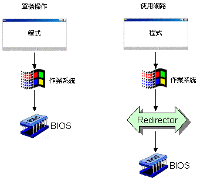
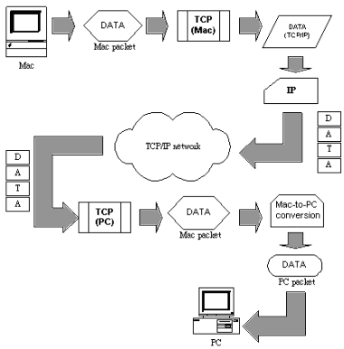
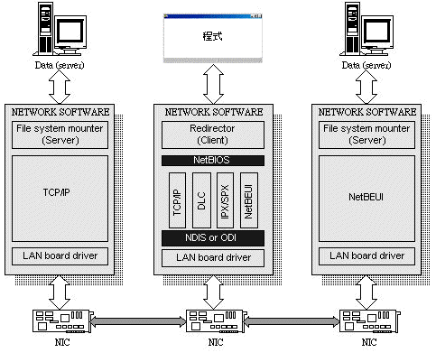
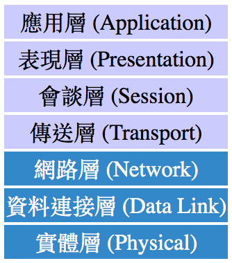

# 1-7 通訊協定

由於網路的迅猛發展﹐出現了許多供網路使用的軟體和硬體﹐為了讓它們都能夠有效的溝通﹐我們需要建立一些規則。

在這一章裡面﹐我會向大家介紹目前比較通用的網路通訊協定﹐和模擬數據是如何的從一個節點傳送到另一個節點﹐從功能上面看看通訊協定的定義。

## **何為通訊協定﹖**

一個比較好理解的講法是﹕通訊協定就是一些標準和規則。例如﹐我們看到紅燈就要停、綠燈才可以走，者就是一種協定了。若是彼此使用不同的協定，那就會造成混亂：澳洲\(或英聯邦\)開車考左行使、台灣則靠右。只要所在國家不變，那麼該協定就可以運作，但是當到達協定不一樣的國家，就得進行協定上的轉換了。否則，不出車禍才怪！

在網路通訊中，如果主機 A 要將一個 packet 送給主機 B﹐它們就必須使用相同的通訊協定。

LAN 的工作就是讓應用程式利用網路獲得﹑管理﹑和安排數據。每一個節點都透過一張網路卡\(NIC, Network Interface Card\)連接到網路﹐再由此和其它的節點溝通。在每一個獨立的工作站上面﹐已經安裝了一些應用程式﹐如 Word﹑Outlook 等。這些程式如果想使用網路上面的資源﹐比如在伺服器上面的數據﹑網路印表機﹑電子郵箱等等﹐會使用網路軟體\(network software\)去和 NIC 溝通﹐然後 NIC 再和網路上的其它節點溝通。所有這些信息都要經過轉換﹐就必須要使用通訊協定來確保所有這些參與者﹐能夠彼此理解對方和進行有效的溝通。

正如您所見到的﹐在節點與節點之間﹐最先的交流是在 NIC 的層次上。當數據從一個節點通過 NIC 傳送到另一個節點之後﹐數據再從 NIC 傳送到網路軟體。而這個網路軟體就是我們所說的**傳輸通訊協定**\(Transport protocol\)了﹐在雙方的機器上都會有這些 transport protocol。對於這個所謂的網路軟體﹐我們可以從好些不同的角度去理解﹐不過我們可以簡單的從三個層次去看﹕

### **第一**﹐也是最容易的理解的﹐就是 NIC 的**驅動程式**。

它負責處理網路卡和傳輸協定之間的溝通。網路卡的廠家都會提供一支驅動程式讓您使用一些特定的協定﹐您可以使用同一張卡來供不同的作業系統使用。只要這張網卡在“物理”上是兼容的﹐那你就可以在作業系統上面使用了。換而言之﹐您大可不必只依賴一個牌子的廠家。當然﹐您不能將 Ethernet 網路卡當 Token Ring 來使用。

我們也知道要讓網路卡工作﹐除了要使用正確的驅動程式之外﹐您還得要確定 IRQ 和 IO 要正確。另外﹐在網路卡上面﹐還有一個由 6 組十六進位數字組成的 48bit 的**物理位址**\(Physical Address\)﹐也叫 MAC\(Media Access Control\) Address 或 Node ID﹐等名稱﹐相信我們前面也聽過數次了。這個位址其實分為兩個部份：前面三組數字為 Manufacture ID﹐也就是廠商 ID﹔而後面的三組是 Card ID。如果我們見到一張卡的 MAC 位址是﹕02-60-8C-67-CD-54﹐那麼我們可以知道這張卡是 3Com 的﹐因為 02608C 就是 3Com 的ID。透過這兩組 ID ，我們可以在實體上區分各自的網路卡。理論上來說，全世界沒有兩張卡的 MAC Address 是相同的，而且我們也不應去修改它。

然後﹐基於這個物理位址﹐我們就可以把邏輯位址綑綁於其上。物理位址我們是無法更改的﹐而且您也很難找到兩張相同物理位址的網路卡﹔但邏輯位址則是由網路管理員來設定。就好比您不能將公司地址門牌給改了﹐但您喜歡給您的公司起什麼名字或搬到別的地址去都可以﹐只要不會和其它公司搞混了就行。

如果使用不同的傳輸協定﹐邏輯位址的格式也不相同\(後面我們會就會講到這問題了\)。但無論是物理位址還是邏輯位址﹐要在網路上面溝通的話﹐就必須不同﹐否則就是所謂的位址衝突啦。

下面我們以 IPX 協定為例子認識一下邏輯位址﹕

* **內部網路位址**\(Internal Network Address\)。

  簡單地說﹐internal address 是用來識別每一台機器是“誰”。很重要一點是﹐這個內部 IPX 號碼在同一個網路中﹐對每一台機器來說必須是唯一的。例如 Novell NetWare 使用內部 IPX 號碼來識別網路中的伺服器﹐當您安裝 NetWare Server 的時候﹐您會被問及接受或更改一個隨機產生的內部 IPX 號碼﹐然後這個號碼就成了該 server 的 ID 了。當您從工作站中輸入 slist 命令﹐您就可以看到每一台 server 的 ID 都被列出來。

* **外部網路位址**\(External Network Address\)。

  這是用來識別一個網路或一個在網路中的網段\(segment\)用的。如果在同一個網路上面同時有兩台 server 出現﹐那麼它們就必須使用相同的 external address 了。這個 external address 好比是用來識別所有的 server 在“哪裡”的。在 Novell Netware 裡面﹐只有 Server 才需要設定 external address ﹐工作站使用的是它登錄所在的 server 的 external address。

  一個完整的 IPX 位址會是這個樣子的﹕1C9FDB42 : 2E701AID﹐在“﹕” 前面的部份為 external address﹐而後一部份則為 internal。不過這樣設定也有一個潛在的危險﹐如果您在安裝 Novell server 的時候一不留神﹐接受了程式自選的 External Address﹐那樣就很可能不能和其它 server 溝通了﹐而且在接下來的安裝中﹐您會被諸如 wrong router address 等錯誤信息煩死﹗程式通常也可以提示您正確的號碼﹐但如果您有兩張網路卡在上面﹐您就要自己設定了。如果您的號碼輸入錯誤﹐您或許不可能修改系統的 AUTOEXEC.NCF 檔案﹐而 external 和 internal 位址都包括在這個檔案裡面﹐所以務必小心﹗

### **第二**。在網路處理程式的另一端﹐需有一個**重導向**\(Redirector\) 的軟體。

我們知道在單機作業模式下﹐當程式呼叫檔案 IO 的時候﹐會由作業系統接管這個請求﹐然後再傳給 BIOS﹐再到硬體那裡。如果當程式呼叫的檔案 IO 為網路位址的時候﹐那麼 redirector 就會接管這個請求﹐而重新導向到網路上面去﹐把請求交給對方機器。

例如﹐當您使用 Word 的時侯﹐要開啟一個在網路磁碟上面的檔案﹐將會如何呢﹖從 Word 的角度去看﹐它根本不知道有網路這回事﹐它只知道有一個和多個像 A﹕﹑B﹕﹑C﹕這樣的磁碟。就像您吃麥當勞的時候﹐您不用知道漢堡包是怎樣製作出來的﹐您只需知道魚柳包﹑雞柳包和拿到什麼樣的 Kitty 貓就是了。Word 在設計上並不是應用於非本地磁碟上的﹐當要使用存儲在網路上面的數據的時候﹐就必須有一種軟體能夠以磁碟代號的形式告訴 Word 才行。所以﹐如果您告訴 Word 去一個在叫 FILESER1 的伺服器之 DOC 目錄下面找檔案﹐那麼 redirector 軟體就會接管這個請求了。

然而﹐redirector 在這個網路軟體集團裡面﹐也只是其中一個角色而已﹐要真正能夠拿回資料﹐我們還得需要另一角色的配合﹕ Redirector 只是工作在 client 上面﹐而在 server 那邊﹐還必須有一個檔案系統\(File System\)﹐或曰 mounter﹐來接應 redirector 的請求。

在網路世界中﹐有許多種這樣的 file system﹐最出名的有 Novell 的 NetWare File System﹑Unix 網路的 Network File System \(NFS\)﹑以及 Microsoft 的 CIFS \(Common Internet File System\)。在 client 端的 redirector 必須要和在 server 上面的 file system 兼容\(使用相同的協定\)﹐否則 client 也只能望 file 興嘆而已。

**第三**。終于來到這章的戲肉了﹗出場的就是**通訊協定**﹐也就是節點和節點之間在網路上搬運數據的方法。

我之所以將這三個層次的中間部份留在現在才說﹐是因為它是最抽象的。您或許可以這樣想象﹕NIC 驅動程式負責和 NIC 之間的溝通且儘力討其歡心﹔在 client 上面的 redirector 和在 server 上面的 mounter ﹐則和程式溝通﹐也極盡體貼之能事﹔然後通訊協定﹐則出盡法寶綴合 NIC 驅動程式和 redirector \(或 mounter\)﹐並建立起網路通訊的交通規則。

正如前述﹐通訊協定只是一些標準和規則而已﹐而這些規則令到交流的融合性得以標準化。就如我們不能離開一些經已認同的規矩去使用道路一樣﹐我們的網路也需要一些共同的溝通語言﹐才能讓所有機器相互交流而不至于混亂。

LAN 和 LAN 之間的通訊也一樣需要一些網路語言﹐所以它們都需要有語言大師的本領才行。事實上﹐網路語言有多種多樣﹐由于它們在設計之初只為了應付不同的工作﹐而且它們大部份都從來不考慮要和其它網路兼容的。傳輸協定雖然可說琳琅滿目﹐然而不幸得很﹐各自的廠商都有各自的一套偏好。但又非常幸運的是﹕大部份新的網路作業程式都支持超過一種協定﹐可以和不同的作業系統溝通﹐比起以前獨沽一味的情形的確容易多了。

下面我們就淺略的瀏覽一些您將會在網路上運用到的通訊協定。

## 常用的通訊協定

### **NetBEUI**

讓我們回到 IBM 最初進軍個人電腦網路的時代﹐他們當時的確需要一個很基本的網路通訊協定﹐但他們並不打算用此來建構大型網路﹐僅僅供數十台電腦甚至更小的網路而已。基于這個訴求﹐就誕生了Network Basic Input/Output System﹐或稱 NetBIOS。

NetBIOS 其實只有 18 個命令\(command\)來讓網路的電腦能夠建立﹑維持﹑和使用連接服務。不過 IBM 在不久後又再推出了 NetBIOS 的延伸版本﹕NetBIOS Extened User Interface﹐或稱 NetBEUI﹐基本上是 NetBIOS 的改良版本而已。然而﹐NetBIOS 和 NetBEUI 終究是不同的﹕NetBEUI 事實上可以說是一個傳輸協定﹐而 NetBIOS 充其量只是一組命令來讓系統可以使用網路而已﹐在技術角度來看﹐它是一個 Application Program Interface \(API\)。關於 NetBIOS 與 NetBEUI 的技術分歧，請參考：

[Netbios Network Basic Input/Output System Protocols](http://www.study-area.net/linux/linuxfr.htm)   
[NetBios, NetBEUI, NBF, SMB, CIFS Networking ](http://www.study-area.net/linux/linuxfr.htm)

NetBEUI 可以算是您在 LAN 中能夠用到的最快通訊協定了。這個“最快”是指它可以將格式化資料放進封包裡面﹐而接收節點又可以迅速的解讀到內容。然而﹐NetBEUI 卻有一個最致命的弱點﹕它不是可路由\(routable\)協定﹐也就是不能夠和其它網路的機器對講。NetBEUI 在本地網路裡面是非常優秀的協定﹐但如果您想和設在其它網路的機器溝通﹐NetBEUI 就不是您所需要的了。如果您想實現和其它網路的電腦溝通﹐您極有可能必需通過路由設備或路由軟體來實現﹐但無論用哪一樣﹐很遺憾﹐NetBEUI 都做不到。

不過﹐Microsoft 網路則運用一種叫 NetBIOS over IP 的技術﹐來連接不同網路的 NetBEUI 客戶。但歸根結底﹐用來達成路由的不是 NetBIOS 而是 TCP/IP﹐也就是下一個要介紹的協定。

### **TCP/IP**

若說起歷史，TCP/IP 也算得上是個冷戰時代的產物，它是應美國國防部的戰爭考量而提出開發的。TCP/IP 當初是用來配合 ARPANET \(Advanced Research Projects Agency Network\) 來處理不同硬體之間的連接問題的﹐比如 Sun 系統和 Mainframe﹑Mainframe 和個人電腦之間的連接。

事實上，TCP/IP 所指的是一整套龐大的通訊協定家族，其中以 Transmission Control Protocol\(TCP\) 及 Internet Protocol \(IP\) 這兩套協定最具代表性。IP 協定工作於網路層\(以後會繼續和大家探討 OSI 的網路層級\)﹐它提供了一套標準讓不同的網路有規則可循。當然﹐前提是您想使用 IP 從一個網路將封包路由到另一個網路。IP 在設計上可用來在 LAN-LAN 及 PC-PC 之間進行傳輸的。

您可以把 IP 看成是游戲規則﹐而 TCP 則用來詮釋這些規則的。雖然 TCP/IP 原先是專門為幾所大學和機構的使用而設計的﹐但現在 TCP/IP 已經成為最流行的通訊協定了﹐我們使用的 Internet 就是用 TCP/IP 來傳送封包的了。下面就讓我們看看 TCP/IP 是怎樣工作的﹕

假如您的公司在好些地方都有分公司﹐各自都有著自己的本地網路\(LAN\)﹐在總公司跑的是 PC 網路﹐但分公司大部份都是用麥金塔電腦。當 Mac 有數據要傳送給 PC 的時候將會如何呢﹖

首先﹐TCP 會在這兩個平臺建立起一個可以提供全雙工檢錯\(對雙向的數據都進行錯誤檢測\)的連接。

接著﹐IP 制定好 Mac 和 PC 之間的溝通規則，TCP 與上層協定制定用以連接的埠\( port \)。到這裡為止﹐Mac 端已經準備好數據了﹐如果數據太大﹐就將之分拆成幾份較小的封包﹐並且在封包上面加上一個新的 header \(內含轉送位址\)﹐確保封包會被正確傳送。TCP/IP 還會加上標籤說明數據的種類及其長度。

再下來﹐IP 協定將負責將封包傳送給 PC。

最後﹐在 PC 上面的 TCP 將封包解碼並翻譯成 PC 能夠懂的格式﹐也就是它自己所使用的網路協定。您可以從下圖看到這個過程﹕

TCP/IP 可說是現行協定中用途最廣的協定之一﹐它嘗試在所有硬體上實現所有事情。不過﹐它也是最慢的傳輸協定之一﹐在某些情形之下﹐它的傳送速度只有 NetBEUI 的七成。然而，由於 TCP/IP 在設計上可供多種硬體部件使用﹐所以它是一個可路由協定。

### **DLC**

Data Link Control 協定﹐為國際標準 IEEE802.2 協定﹐它的使用主要基於兩個原因﹕

第一﹐許多 Token Ring 網路是使用 DLC 來讓 PC 工作站和 mainframe 網關\(gateway\)溝通的。如果您使用 Token Ring 而且在 CONFIG.SYS 裡面又有三個裝置驅動程式是以 DXM 開頭的﹐那您就是使用 DLC 驅動程式了。

第二﹐如果您有一些網路印表機本身直接通過 JetDirect 網卡連上網路的﹐那麼您或許需要 DLC 來控制印表機了。

### **IPX/SPX**

Internetwork Packet Exchange \(IPX\) 是一個由 Novell 公司制定的協定﹐可以在網路設備之間建立﹑維持和終止通訊連接﹐他既負責數據的傳出﹐也負責傳入。當數據抵達的時候﹐IPX 會讀取數據的位址﹐和將之搬運到網路伺服器或工作站的正確地方。如果伺服器或工作站需要送出數據﹐IPX 則會確定好數據封包位址﹐然後再通過網路路由出去。

Sequenced Packet Exchange \(SPX\) 協定則是用來控制網路處理過程﹐諸如處理丟失封包或其它狀況。

雖然 IPX 和 SPX 都是屬于 Novell 的﹐但他們的使用並不限制於 Novell 網路。作為一個傳輸協定﹐IPX/SPX 可以被用在許多不同的硬體上面﹐所以 IPX/SPX 也是一個可路由協定。

### **多種傳輸堆疊\(Multiple Transport Stack\)**

到現在﹐有兩件事情是最明顯不過的﹕首先﹐沒有任何一個協定說得上是最好的﹔其次﹐您或者很想將上面所說的四個協定全跑上﹐而好消息是﹕您可以這樣做﹗

現行網路模式是可以支持多傳輸協定的﹐我們稱之為協定堆疊\(protocol stack\)。比如﹐您可以在 client 機器上面安裝多個協定﹐而 server 機器卻只裝一個協定。如果您的 client 同時連接好幾個 server ﹐這完全是可能的﹕IPX 可以和 Novell server 溝通﹑DLC 可以讓工作站和 mainframe gateway 對講﹑和 TCP/IP 可以使用 Internet mail 路由﹑等等。

但要讓以上這些協定同時工作﹐我們還需要用一個方法將網路卡和協定堆疊連接在一起﹐也就是將網路傳輸層和網路卡驅動程式**捆綁**\(bind\)在一起﹐即在 NIC driver 和 transport stack 之間建立一個軟體連接﹐這樣在它們之間就需要一個很重要的標準界面了。

通常有兩個競爭者在爭拼這一戰場﹕Novell 的 Open Datalink Interface \(ODI\) 和 Mircosoft 的 Network Driver Interface Specification \(NDIS\)。下面我們就探討一下網路捆綁界面和應用程式界面是如何工作的。

### **網路捆綁界面 \(Network Binding Interface, NBI\)**

由於網路卡驅動程式的不足﹐您還必需額外的軟體來令到通訊協定工作﹐因為 NIC driver 在設計上只會和一個協定對講﹕IPX/SPX 或 NetBEUI 或 TCP/IP。這時﹐ Network Binding Interface \(NBI\) 就派得上用場了﹐NBI 可以提供一個共同的前端接面給設備驅動程式﹐ ODI 和 NDIS 都可以做到這點。這樣﹐NIC driver 就無需再直接和什麼 IPX﹑TCP/IP 或 NetBEUI 之類的協定打交到了﹐它只需要一個 ODI 或 NDIS 界面就可以了﹐因為它們可以將這些協定“翻譯”給 NIC 聽。

我們可以從下圖看看client和server的傳輸過程中﹐網路軟體中各組件之間的關係﹕

### **網路應用程式界面 \(API\)**

正如您在上面所讀到的﹐大多數應用程式其實都不為意到網路的存在。不過﹐有些程式﹐如果 e-mail 或群組程式﹐是必須認知到網路﹐更可以說﹐它們是應網路而生的。它們要能夠“插入”到網路中﹐並和其它在網路機器上面跑的程式溝通。程式設計者建立的網路應用程式﹐都要適應於網路給應用程式的一套指令﹐這些指令就是所謂的 API 了。

如果您懂得開汽車的話﹐您一定知道當初學開車的時候是先學如何踏油門﹑如何踩煞車﹑如何轉向等基本動作。我們可以將這些動作看成是一些“原始命令”﹐通過這些命令我們就可以做出將汽車倒出車庫然後開到目的地﹐雖然，學車的時候是沒有諸如“倒出車庫”的動作。那麼我們就可以將 API 當成是那些學車的“基本動作”，也就是所謂的操作界面。

在那些網路服務中﹐比如 redirector ﹐可以居於各種不同的傳輸協定之上﹐如果沒有 API ﹐您的網路軟體程式就要開發一個 redirector 程式來接通 IPX/SPX ﹐又要另外一個 redirector 程式接通 TCP/IP 了。其實來來去去都是同一個 redirector ﹐只是和不同的協定連接而已﹐而 API 則提供了一個共同的界面給所有網路服務使用。這樣﹐我們就算開 BMW 或 Benz 都知道如何操作了﹐但您未必會開游艇哦﹐因為汽車和游艇 API 是不同的。當然﹐如果有台汽車的油門是在左邊﹑煞車在右邊﹑離合器卻在中間﹑不用方向盤而是用搖竿﹗我們也可以說這台車的 API 是不同的。

剛才說的 redirector 並不是寫來供通訊協定使用﹐而是給一個 API 使用\(在我們的例子中是 NetBIOS \) ﹕NetBIOS 可以居於 IPX/SPX﹑NetBEUI﹑和 TCP/IP 這些協定之上。這樣有個好處是﹐您可以改變您的通訊協定﹐而無需重寫您的網路服務﹐因為您的網路服務是針對API來寫的。API 會接管您的網路請求﹐然後運用正確的通訊協定進行工作。

您或許聽過 socket 這個詞﹐它其實就是 API 啦。在網路世界中﹐有三種 API 您或許會接觸到的﹕

* Novell Sockets
* NetBIOS
* TCP/IP Sockets \(用來和Internet上面的其它網路溝通\)

### **OSI 模型**

有好幾個主要電腦廠家﹐如 IBM﹑DEC﹑Burroughs 等﹐都有設計它們各自的網路結構和通訊協定﹐如果採用這些設計的機器﹐在其各自的網路上面運作良好﹐但卻不能在不同廠家的機器之間進行溝通。為了解決這個問題﹐International Standardization Organisation \(ISO\) 於 1978 年開始開發一套標準架構﹐終於成功推出 Reference Model for Open System Interconnection \(OSI\) 作為其標準﹐它提供了一個很有用的模型去解釋各個不同層面的網路協定。

OSI 模型共有七個層面﹐且它們可以被劃分為兩組﹕

* 網路群組﹕由實體層﹑資料連接層﹑和網路層組成。
* 使用者群組﹕由傳送層﹑會談層﹑表現層﹑和應用層組成。

您也可以從下圖看到些協定層的排列﹕

前面我們集中討論的就是其中的底層協定﹐也就是網路協定﹐這些功能是保障數據在網路中能夠迅速且準確的轉送。

#### **實體層**

在這層裡面您必須作出一些機械和電子方面的決定﹐也就是要定義出在終端和網絡之間要使用的設備。同時﹐採用何種佈線也要在這裡決定出來。

#### **資料連接層**

在這層指定了要採用的信息單元\(message unit\)是什麼﹐通常在 LAN 上面的信息單元被稱為 frame 。以及它們的格式﹑和如何穿越網路。每一個 packet 都會被賦予一個位址碼和偵錯監測值\(checksum\)。有一個 Binary synchronous communications 協定﹐會判定出一個封包如果在丟失的情況下﹐要等待多久會被重新發送﹐這個協定也是在這層裡面定義。

總體來說﹐這層的工作就是保證一個無錯誤的物理上的數據傳輸。

#### **網路層**

這層就好比是一個中間人界乎於網絡功能和使用者功能之間。它會定義出封包在網路中移動的路由和其處理過程﹐這層還決定了網路是如何進行管理功能的﹐比如﹐發送狀態信息給接點和規範封包的流動等。

一個有趣的事情是﹐網路層還能將底層協定\(網路功能\)對上層協定\(使用者功能\)隱藏起來。這樣﹐在網路的使用者就可以使用不同種類的硬體了。假如您用來建置網的材料都不盡相同的話，這是非常好的事情。

在底下的三層之上﹐還有四層是屬于使用者功能範圍的﹐不過它們也常常會被整合在一起。您要記住的一點是﹕無論程式設計者如何定義這些協定﹐\(例如﹐把它們分為兩層或四層\)﹐這四層在實際上都會被執行的。

#### **傳送層**

在這層﹐將會設定節點位址的傳達﹐還有錯誤檢測和修正的方法。

#### **會談層**

這層定義了如何連接和掛斷連接﹐和在網路上面的數據如何交換。

#### **表現層**

在這層﹐定義了數據的語法\(syntax\)﹑變更﹑和格式。當應用程式的語法和格式都不同的時候﹐這層還將定義了如何翻譯這些不同。

#### **應用層**

這是最後一層了﹐它定義了應用程式是如何進入 OSI 模式進行傳送。它自己並不屬於應用程式﹐但它支持使用者的應用程式﹐如﹕檔案傳送﹑密碼驗證﹑和網路工具等。

以上所列舉的協定層並非是他們的詳細定義﹐只是一個框架而已。您可以把 OSI 模型當成是大體的骨架﹐當您套上這個框架之後﹐您就差不多可以描繪出大致形狀了﹐雖然外表會有所不同﹐但骨子裡還是一樣的。

### 

### 

### 

### 

### 

###    

