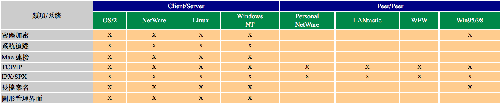

# 1-8 網路作業系統

當您在規劃網路的過程中﹐使用什麼樣的網路作業系統\(NOS, Network Operating System\)會是一個非常關鍵的考量﹐直接影響到您連到其它網路的能力、節點間如何交流、您可以使用哪些應用程式、以及數據的可攜性、等等因素。

我們將會在這章裡面看看一些比較流行的 NOS 和它們的功能﹐這將有助於您選擇一個適合自己的 NOS。

## **Client / Server 系統**

如果您要**集中**控制和管理您的網路和資源的話﹐您就應該找 Client/Server 的網路作業系統了﹐比如 LAN Manager﹑LAN Server﹑Windows NT﹑NetWare﹑和 BanyanVINES 等﹐當然還有現在炙手可熱的 Linux 啦。

### **LAN Manager**

OS/2 當初是 IBM 和 Microsoft 共同開發的﹐然而在 80 年代中期﹐IBM 和 Microsoft 翻臉的時候﹐IBM 卻保留了 OS/2 下來。不過其後他們都有繼續生產各自的系統﹐Microsoft 發展的是 LAN Manager ﹐而 IBM 的則是 LAN Server。雖然 IBM 的 OS/2 才算是正宗的版本﹐但 LAN Manager 和其它 OS/2 基礎的網路系統在功能上都極其相似﹐所以我們這裡就以 LAN Manager 為例子就好了。

LAN Manager 系統主要分為兩個部份﹕redirector 和 server。正如我們在前面討論過了﹐redirector 控制著網路資料的流向﹐決定資料從哪裡送到哪裡。redirector 還有一個功能﹐就是配置工作站所連著的資源﹐讓其它工作站可以找到這些資源。而 server 部份則處理網路排程﹑安全﹑列印服務﹑和檔案管理等事務﹐它還包括各種不同的網路管理工具﹐可以幫助您找到諸如不良資訊﹑安裝漏洞﹑和網路瓶頸等信息。

LAN Manager 還可以將幾個不同的 server 當成一個 server ﹐那樣工作站就只需要一個密碼就可以連接到網路中的不同 server 了。它還有遠端管理功能﹐您可以從任何工作站使用 supervisor 身份登錄網路並提取網路管理工具。

最後﹐LAN Manager 還有網路稽查功能﹐讓網路管理員能夠追查有多少使用者連到什麼設備去了﹐也可以知道多少人在使用哪些檔案和應用程式等。您也可以知道使用者有否連上網路和什麼時候連上來的。假如您發現某君正在使用一個檔案﹐而他不應該這時候還在網路上面的﹐如果不是別人盜用了他的帳號﹐那麼他去使用這個檔案就好可能有問題了。

在網路安全方面\(這是任何 client/server 系統的重要功能\)﹐LAN Manager 採用的是美國政府的 DES \(Data Encryption Standards\) 演算法﹐對網路密碼進行加密。如果一個使用者開啟了一個帶有網路密碼的檔案﹐他卻不能夠知道其它使用者的密碼的。就如其它網路一樣﹐LAN Manager 也能讓網路管理員保護特定的目錄﹑甚至整個檔案伺服器﹑或個別檔案。作為網路管理員﹐您可以決定哪些使用者可以連接哪些網路資源﹐這完全由您做主。

LAN Manager 還有一個很好用的工具叫 hot fix ﹐當網路要將一個資料寫進硬碟的時候﹐如果 hot fix 檢測到上面有壞磁區的話﹐馬上會將資料再複製一份另外存到一個保留的空間去﹐然後嘗試修復這個壞區﹐如果失敗則會將壞區做好記號再把資料寫到另外的地方去。

LAN Manager 還可以和 Mac 機器溝通﹐讓您可以和 Mac 工作站交換資料。同時還支持 TCP/IP ﹐它有一整套工具可以輔助 TCP/IP 協定﹐所以網路也就具備了擴展的餘地了。除了 TCP/IP﹐LAN Manager 也支持 Novell 網路﹐使用其自帶的工具﹐您可以很輕鬆的就連上 Novell 網路。

如果您要安裝 LAN Manager 的話﹐有幾個服務您是要知道的﹕

**Redirector \(RDR\)**﹐它可以讓工作站對網路發出請求﹐諸如使用網路印表機或從檔案伺服器獲取檔案等

**Messager \(MSG\)**﹐可以讓您在工作站之間發送﹑接收﹑儲存﹑和轉送訊息\(message\)﹐如果您想接收諸如“Network is going down in five minutes”這樣的信息﹐那麼您就需要跑 message 服務了。

**Receiver \(RCV\)**﹐只允許您使用網路磁碟發送和接收信訊息﹐不過這個服務顯然已經過時且很少有人用了。

**Server \(SRV\)**﹐讓您擁有全部的功能﹐如果您要這台工作站或伺服器可以分享它的硬碟﹑印表機﹑等設備﹐那麼您就要跑 server 服務了。

不過有一個安裝指引您或許可以借鑒﹕所有的工作站都要跑 redirector 服務﹐否則就不能發出網路請求了。如果您要安裝的機器是一台 client 機器﹐或許這個服務就夠了。在您的 AUTOEXEC.BAT 檔案裡面加入 NET START 這個命令﹐就可以載入這個服務。

是否要在 client 上面安裝 message 服務﹐則是見人見智﹐因為它有時候會令到機器當機﹗

### **Windows NT**

在 client/server 網路系統裡面﹐Mircrosoft 的 Windows NT \(New Technology，現在的版本為 Windows 2000 \)， 可以說是冒起最快的新貴﹐其市場佔用率憑 Microsoft 的強勢推銷在過去數年間有著很大的提升。NT 算得上是 Mircrosoft 最頂尖的作業系統了﹐而且 Microsoft 也不遺餘力的促使其下的 Windows 系統朝著和 NT 整合的方向發展。

由於 NT 提供的是一個圖形環境來管理網路﹐所以您的 NT 伺服器必需具備 VGA 或更好的螢幕。在 client/server 系統家族中﹐NT 可以說是少數使用非指定\(non-didicated\)伺服器的系統之一。連上 NT 網路也是非常簡單的事情﹐如果您已經安裝有 Windows NT﹑Windows 95/98﹑或 Windows for Workgroup 等桌上系統﹐這些工作站在連上網路的時候自動的就可以看到 NT 伺服器﹐\(當然要提供合法的登錄和密碼啦\)。如果您跑的是 DOS﹐那麼您就要安裝 NT 所提供的驅動程式了。

NT 還提供 IPX 傳輸協定﹐所以也很容易和 Novell 伺服器或工作站溝通。另外 NT 還支援遠端連接服務\(RAS, Remote Access Services\)﹐可以讓人們在遠端通過撥接連上 NT 伺服器去﹐RAS 可以同時支援高達 256 個連線。\(後面我們還會再討論遠端連接服務的\)。

### **Novell NetWare**

NetWare 是 Novell 公司全副精力的傑作﹐從其“硬撼式”的市場策略到其 CNE\(Certified NetWare Engineer\) 體系\(使用者在通過一系列的考試可以獲得Novell認證的工程師資格\)﹐Novell 已經成功地展現人前﹐並曾一度執局域網路系統\(LAN\)的牛耳。其既有的陣地實在不容忽視﹐因而許多其它的網路系統都會在設計上有連接 Novell 網路功能。

Novell 努力試圖適合任何人們去做任何事情﹕如果您跑 Apple 網路﹐Novell 可以和 AppleTalk File Protocol \(AFP\) 一起工作﹔如果您有 LAN Manager 或 3Com 網路﹐NetWare 可以連上來讓您工作﹔從物理的星形態到 Token Ring 到邏輯 Bus﹐總之您能夠安排得出的網路形態﹐NetWare 都可以在上面跑﹔不想用 client/server 而只喜歡 peer/peer 網路嗎﹖Novell 也有提供 peer/peer 版本的 Personal NetWare﹗一言敝之﹐Novell 試圖令您無藉口不選擇NetWare來作為您的網路系統。

NetWare 對您的磁碟作業系統來說是一個殼程式\( shell﹐就如一個外殼一個把 DOS 包在其中﹐其名因此而起\)。當有指令到達﹐不管是來自本機的還是網路的﹐都必需經過 shell。和 redirector 的功能一樣﹐shell 會知道一個功能是本機的還是網路的﹐如果是本地的﹐他讓本機作業系統來接管﹔但如果是網路的﹐NetWare 就接下來並自己和伺服器的 BIOS 對講。

列如﹐有一個工作站程式要儲存一份檔案﹐它會告訴作業系統﹐然後再到 BIOS﹐再到磁碟將資料寫上。當一個在 Novell 網路的工作站告訴作業系統它要儲存資料﹐這時候 NetWare 就會插話來問程式需要存到哪裡去。程式當然不知道網絡磁碟和本地磁碟的分別啦﹐它或許隨便回答﹕“H:磁碟吧。”而這個磁碟正是伺服器磁碟在工作站上面的對應邏輯磁碟名稱﹐這樣 NetWare 就會接管這個操作﹐然後發出指令到伺服器的檔案系統將資料寫入。

NetWare 還有幾路板斧是非常了得的﹐籍此可以提高獲取檔案的速度﹐下面我們逐一介紹一下﹕

**Directory Hashing**﹐NetWare 用來提高獲取檔案的一個方法是保持一份目錄樹和 Novell 版本的 FAT 的複印本在記憶體上面﹐所以它找到一份檔案的速度比直接到硬碟尋找的速度會快多了。到 RAM 和到硬碟找目錄樹的速度相差可大了﹕如果去硬碟找﹐需要的時間大概為幾千份之一秒﹔而到 RAM 找則只需要幾百萬份之一秒。而且﹐NetWare 同時還對保存在記憶上面的目錄樹按規則排列好﹐令到它更容易瞄準檔案的位置。

**Disk Caching**﹐這個處理會將一些最常用的資料在 RAM 上面保留一個 copy ﹐和上一個方法一樣﹐到 RAM 獲取資料的速度比到硬碟上面找快多了。這樣當有請求獲取這些常用資料的時候﹐其速度就可以提高好幾百倍。

**Elevator-seeking**﹐不知道您還記得在“電腦基礎”裡面講述 CPU Cache 之 Write Back 和 Write Through 模式嗎﹖NetWare 的這個 Elevator-seeking 跟 Write Back 的方法簡直如出一徹﹕當伺服器同時接到多個檔案請求的時候﹐它並不是按請求先後順序來讀取檔案﹐而是按照磁碟磁頭移動順序來讀取檔案。

對 DOS 的使用者來說﹐NetWare 還有一個很有用的功能叫做 mapping ﹐可以簡化工作站和檔案伺服器的連接。Novell 使用一系列的 map 跟檔案伺服器上的不同目錄鏈接\(link\)起來﹐所以在工作站上面﹐這些目錄就被看成好些邏輯磁碟一樣了。

NetWare 在系統安全上面也是非常考究的﹐您可以分別從下面的項目來了解﹕

* Login ID
* Trustee rights
* Directory rights
* File attributes

使用者每次連上網路都必需提供使用者名稱和密碼﹐這將決定使用者在網路上獲得的權限。如果密碼只對某些檔案或目錄具備讀取的權限﹐那麼他就不能夠修改任何的檔案了﹔掉過來﹐如果密碼具備最高\(full\)權限﹐那麼使用者就可以執行任何動作。作為系統管理員﹐在設定使用者權限的時候都要非常小心。

Novell 網路將每位使用者都看成是一個 trustee ﹐可以指定其對資源擁有以下不同的權限﹕

* 讀取一份開啟的檔案
* 寫入一份開啟的檔案
* 開啟現行檔案
* 建立新檔案
* 刪除現行檔案
* 為目錄/子目錄設定其它 trustee 的權限
* 修改檔案屬性

如果管理員喜歡的話﹐可以針對一個磁碟裡面的特定目錄對某一使用者設定不同的權限。例如﹐可以讓他/她對整個磁碟擁有全部權限﹐但對某些特定目錄或檔案卻只能具備讀取的權力。雖然 NetWare 在預設的情況下﹐trustee 對子目錄會具備與父目錄相同的權限﹐但還是可以對網路上每個目錄和子目錄設立不同的權限的。

這還不止﹐在最後一道防線上﹐網路管理員還可以針對每個檔案建立屬性﹐來限制如何和什麼時候可供使用者使用。您可以參考下面所列舉的檔案屬性﹕

**共享與非共享**﹐如果一個檔案是共享的﹐當一個使用者在使用它的時候﹐其它使用者也可以使用﹔如果為非共享﹐則在同一時間內不能超過一個使用者使用\(甚至連讀取也不可能\)。

**讀/寫和唯讀**﹐您或許已經對這兩個屬性非常熟悉了﹕如果一個檔案是唯讀的﹐任何使用者都可以讀取它和進行修改﹐但所做的修改卻不會影響到源檔案﹐而只能夠以另外的檔案名稱儲存﹐\(這樣的限制對於一些由一人領導的分組項目非常便利﹐領導者對源檔案的修改也就心中有數了\)﹔如果使用者對檔案具備讀和寫的能力﹐則可以將修改和回存到原來的檔案﹐而原來的檔案除非有備份﹐否則就會從此灰飛煙滅了。

您可以在 NetWare3.x 的文字模式使用 Syscon﹐或在 NetWare4.x 的圖形界面使用 NETADMIN 來進行權限設定﹐Netware 帶有一套完整的工具幫您設定諸如目錄﹑使用者﹑trustee﹑檔案屬性等系統安全項目。

### **Linux**

在本世紀末的網路操作系統這一田野上﹐還奔跑著一匹驃駻的黑馬﹕這﹐就是 Linux了。對於那些受 Microsoft 強力促銷下漸感窒息的人士﹐Linux 的出現﹐無異是一股清流。畢竟在 IBM 停止發展 OS/2 系統之後﹐還能有一套系統抗衡 Mircrosoft 霸業﹐的確是令人鼓舞的。

Linux 是由一位名叫 Linus B. Tovalds 的芬蘭人在 1991 年推出來的﹐它是一套類 UNIX 的桌上型系統。眾所週知﹐UNIX 的商業版本價格都相當昂貴﹐並非一般用戶玩得起﹐Liux 系統﹐好比是 UNIX 這隻昔日王府堂前燕﹐飛入了尋常百姓家。

Linux 是免費的﹗而且系統要求一點也不高﹐如果您嫌棄您的 486 機器跑 Windows NT 實在老態籠鐘﹐換 Linux 試試﹐您會覺驚奇這機器怎麼忽然生籠活虎起來了呢﹗而且它提供的服務比 NT 毫不遜色﹐甚至更加穩定﹗

哇﹗﹗還不趕快找 Linux 試試﹖﹖﹗且慢﹐Linux 也不是毫無暇瞝的。

首先﹐Linux 雖然對硬體要求不高﹐但對使用者要求卻不低﹕如果您對電腦和網路沒一定基礎﹐要玩 Linux 恐怕會感到非常吃力\(這其實是我寫這個網頁的真正動機\)﹔而且如果您對技術問題沒有持之以恆的解決精神﹐您的脾氣最好多修養修養﹐否則很容易暴三字經\(其實對任何系統都如此\)﹔如果您獨愛 Windows 的花俏﹐您會覺得它醜醜的﹐當然情人眼裡出西施﹐等你發現已經迷戀上了她﹐您或許視其它的界面如糞土\(不過也不應該夜郎自大﹐開口閉口除了 Linux 其它都一文不值﹐沒有虛懷若谷的胸襟﹐其實和 Linux 自由奔放的精神格格不入﹐充其量只是葉公好龍而已﹐也徒增別人的反感﹐唉~~~ 題外話啦﹐暫且打住 ^\_^ \)。

好了﹐閒話休提﹐言歸正傳。Linux 主要部份是其核心\( kernel \)﹐且版本更新很快﹐目前或許已經到了 2.2x 版本了。然後一些廠商另外加上一些軟體連同 kernel 組合在一起﹐以 distribution 的形式推出 Linux ﹐這樣就成了各種不同的 Linux 版本了。我們比較熟悉的有 RedHat﹑Slackware﹑Debian﹑SuSE 等 distribution﹐它們也有各自的發行版本。雖然這些 distribution 也會對其包裝收取一定的費用﹐但如果您有 Internet 連線﹐和肯花時間蒐集﹐其實裡面的所有 package 連同 kernel 都可以免費得到的。更值得一提的是﹐您可以對您的 kernel 進修更新而無需重新安裝所有的軟體。

Linux 主要是以 TCP/IP 為通訊協定﹐而且許多功能都必需依靠 TCP/IP ﹐不過它也提供了和 Netware 、Mac、及 Microsoft Network 的連接能力。而且 Linux 的架構和服務都是 Unix 的標準﹐許多程式已經經過多年的開發和改進﹐比如 FTP、Telnet、SMTP、HTTP 等﹐所以穩定性和效率上面都非常優秀﹐因而備受近年來蓬勃發展的互聯網服務供應商\(ISP\)的青睞。基本上，現今在 Internet 上找得到的服務，都能在 Linux 上找到。再加上 Linux 的眾多優點，越來越多企業及政府機關也激極引進 Linux 來作為其網路作業系統。

假如您本來就對 Unix 有所接觸﹐那麼學起 Linux 將完全不會感覺陌生﹔如果您想進入 Unix 的世界﹐Linux 可以說是最佳之門了。

和 Unix 系統一樣﹐Linux 也是一個完全的多人多工\(Multi User & Multi Task\)的網絡系統﹐這概念和 NT 網絡的資源分享完全不同﹕在 NT 網絡中﹐每台工作站\(或伺服器\)每次只能允許一位使用者登陸﹐雖然其它使用者也能從網絡中使用到其共享出來的資源﹐但這些動作歸根結底都只是 redirector 的傑作而已﹐使用者本身還是必需使用自身的 CPU 和程式來做到這些動作﹔然而﹐在 Linux 網絡上面﹐一台工作站可以允許多位使用者同時登陸﹐並使用的資源完全是本機的\(除了基本的輸入輸出和網卡這些設備\)﹐也就是說﹐在這台機器上面的設備和程式﹐都是直接給使用者支配﹐而不僅是共享著。不過﹐現在 Microsoft 的 Back Office 系列\(基本上以 NT 為主\)的 Terminal Server ﹐也開始具備相似 Linux 的多使用者環境了。

為了讓操作更加方便和更具親和力﹐Unix 一早\(甚至比 MS Windows 更早\)就已經有圖形面的 Xwindow 系統了﹐今天 Linux 之 XWindow 更加好用和漂亮﹐而且可供選擇的 X 界面也非常多種多樣﹐如﹕Open Look﹑Fvwm﹑KDE﹑Gnome 等等。只要您喜歡﹐您可以在同一台機器上配置多個 X 界面並輕易的在它們之間切換﹐這可不同于 MS Windows 的換換背景和顏色那樣哦﹐而是整個外觀甚至操作都是不同的。

Linux 也支援中文環境﹐比如聞名台灣的 CLE \(Chinese Linux Extensions\)﹐就可以將純英文環境的 Linux 給改頭換面到中文環境去。然而﹐純中文的 Linux 也在相繼推出和開發中﹐比如大陸的 Red Flag 和 Blue Point 等就是純中文的 Linux 系統。

以往玩 Linux 的時候﹐硬體的支援是一個很頭痛的問題﹐不過現在的 Linux kernel 所支持的硬體也越來越多﹐且也越來越新﹐有些硬體廠家在其新產品上已經加進了 Linux 版本的驅動程式了。當然﹐無可否認的是﹐Linux 的硬體支援方面在目前來說﹐還不及 Windows 那麼普遍﹐尤其是對一些最新的顯示卡和一些古怪週邊來說。然而，只要硬體廠商認知到 Linux 市場的迅速成長，自然就會投入人力去開發 Linux Driver 的。隨著 Linux 的普及，相信這是一定會實現的。

後面，我會另闢專門的文章討論 Linux 的各種服務及其架設。

## **Peer / Peer 系統**

正如前面在比較 Client/Server 和 Peer/Peer 網絡的時候已經提到﹐P/P 網絡在成本和管理難度上面都要比 C/S 網絡要低﹐所以在一些較小型的公司網絡裡面﹐Peer/Peer 還是有其受歡迎之處的。下面讓我們一起看看幾個主要的 P/P 網絡操作系統﹕

### **LANtastic**

這是一個很早期的 P/P 網絡系統﹐它專門就是設計給那些對集中管理模式要求不高的小公司。不過它也具有諸如 LAN Cache \(也就是將資料存放在 RAM 來提高儲存速度\)和印表機共享等功能。網絡的安全考慮在 LANtastic 上面是非常原始的﹐主要針對每一獨立的檔案和目錄而已。

LANtastic 使用的也是 Ethernet 環境﹐屬於 IEEE802.3 的標準。它也有 Windows 版本﹐可以讓您在 Windows 環境中分享資源和接收 e-mail 等。

LANtastic 自帶有一個叫做 Network Eye 的網絡管理工具﹐可以讓使用者看到還有誰在網絡上﹐及分享著什麼資源。您還可以“轉播”其它使用者的螢幕到自己的機器上﹐這樣您還可以看到他們在做些什麼東東呢﹗LANtastic 在您的工作站上面總共可以支持到 32 個這樣的模擬屏幕。

### **MS Windows**

在此一家族中﹐從 Windows For Workgroups 到 Windows95/98 和Windows ME/XP 些系統﹐都自帶有 P/P 的網絡功能了﹐\(在上面討論 P/P 網絡的時候就介紹過如何安裝 Win95 的 P/P 網絡\)。

既然同是 Mircosoft 的產品﹐他們當然支持 NDIS 這個網卡驅動界面了﹐不過他們同時對 ODI 也是支持的。這樣使得這些系統得到的硬體支援也特別多﹐而且有些網絡卡廠商只提供 MS Windows 的驅動程式而已。

配合著它們的圖形界面﹐在這些平臺上面分享磁碟﹑檔案﹑印表機等動作﹐很輕鬆的就可以完成。假如您使用 Windows95/98 系統來架設一個 50 台機器或更小的 P/P 網絡﹐相信並不需要很大的力氣﹕只要將網卡和連線設定好﹐然後安裝相同的通訊協定\(比如 NetBEUI \)﹐再逐一設定好資源分享﹐這樣就大功告成了﹗

### **Apple Talk**

說到蘋果﹐當然除了現代諺語“每天一個蘋果﹐醫生遠離我”所指的水果之外﹐我們還不能忘記這個和 IMB 兼容電腦分庭抗禮的電腦公司啦﹐也不能忘記這個優越的圖形系統先驅對今天電腦界面的影響。事實上﹐很多人根本就把其下的麥金塔\(Mac\)系統稱做蘋果機器﹐當然﹐領導今日電腦之透明時尚的 iMac﹐也令不少發燒友趨之若騖。

當初蘋果公司開發 AppleTalk 的目的也只是針對 P/P 網絡而已﹐不過 AppleShare File Server 或其類似程式﹐也可以當 client/server 來跑。AppleTalk 其實是一個很簡單的 LAN ﹐而且它讓 Mac 的傳統用戶免除了硬體方面的頭痛﹕所有 System 7.x 的 Mac 都本身自帶有 peer/peer 網路卡﹐如果您想用這些系統開啟網路的時候﹐您全部要做的就是﹕找一根電話線﹐兩個終端器﹐然後啟動另外一台 Mac 而已。

不過 Mac 網路使用的物理網路形態和我們前面討論的網路形態卻是不同的﹐它跑的是 daisy-chain topology ﹐看起來有的像 bus﹐不過布線比較整齊﹐通常會走在牆壁裡面而不是到處掛得像意大利麵條一樣﹐而且使用的不是 coaxial 而是 UTP 網線。不過﹐您也可以在 star 形態上面跑 Mac ﹕一種是靜態 punchdown blocks﹐並沒有增益和路由功能﹐網路總長只有 3000 英尺﹔另一種為動態的 concentrator ﹐具有多埠\(Multiport\)增益器﹐且每一條網線都可以支持 3000 英尺的傳輸距離。

不過 Mac 卻可以跑任何種類的邏輯形態﹕Ethernet﹑Token Ring﹑或者 AppleTalk 等。AppleTalk 盡管可以使用增益器\(repeater\)﹐但由於節點 ID 的限制﹐最多只能支持 254 個設備﹕128 個工作站和 126 個伺服器/印表機。它的網路距離也因採用的種類不同而異﹕LocalTalk﹐這是一個 PC 版本的 AppleTalk ﹐使用的是 STP 網線﹐它可以有 24 個節點且可以擴展至 1800 英尺﹔PhoneNet ﹐使用的是 UTP 網線﹐可以擴展到 1000 英尺﹐但就可以有 32 個節點。如果您想要一個更大的和更快的網路﹐您最好還是使用 Ethernet 吧\(AppleTalk只有230.4Kbps的傳輸速度\)。

Mac 的 Ethernet 也有兩種﹕Phase 1 可以有最多 254 個設備﹐除了速度可以有 10Mbps 之外﹐其它和 AppleTalk 一樣﹔Phase 2 也可以支持 254 個設備﹐不過還可以橋接\(bridge\)到另外一個 Phase 2 網路。技術上而言﹐在 Phase 2 上您可以有一千六百萬個位址\(因為 Ethernet 卡採用的是 48-bit 的位址\)﹐但您卻要有一個大得駭人的辦公室和冷卻系統。

## **網路系統比較**

我們已經簡單地認識了一些主要的網路作業系統﹐不過您或許會有花多眼亂之感﹐不知如何選擇一套適合自己環境的系統﹐下面我們嘗試列舉出一些選擇網路系統時的參考因素﹕**網路體積**

也就是節點數目﹐數目越大﹐就越應該考慮 client/server 系統﹐主要是基於集中管理的考慮。

### **指定的網路管理員**

如果您有專門的網路管理人員\(除了網路管理﹐其它事情都不理\)﹐您或許已經使用的是 client/server 系統了﹐因為這些系統都比較複雜和需時設定。而 Peer/Peer 系統﹐通常都是各自的使用者在管理自己的機器﹐他們不需要很專業的網路管理知識﹐但卻具備了一般的電腦使用能力﹐而且網路管理並不是他們的主要職責。

### **集中式網路控制**

如果您對您的網路系統安全比較注重﹐且試圖使用集中管理模式﹐那麼您也應該考慮 Client/Server 系統。不過﹐好多小公司使用網路僅是共享檔案和週邊設備﹐其實 Peer/Peer 也足夠了。然而員工數目越多﹐就越應該考慮 C/S 系統。

### **員工培訓**

假如您要安裝一個只有 25 台機器的 Peer/Peer 網路﹐可能一個週末就可以搞定﹐而且使用者也無需特別的培訓。但在相同大小 Client/Server 環境中﹐需要兩個星期去完成其設定一點也不出奇\(根據要求而定\)﹐然後使用者還得要學習如何使用該種網路和語法技巧等知識。

### **成本**

如果在 50 台機器的數目以下﹐Peer/Peer 網路會比較便宜﹐但如果超過 100 台的話﹐在某些情況下﹐Peer/Peer 可能比 Client/Server 更加昂貴﹐比如 License 等因素。

### **網路軟體的兼容性**

通常一些網路備份程式和工作排程程式﹐都只能在一些特定的網路中工作﹐當您選擇這些 groupware 的時候﹐就得留意區分它們究竟是在哪些網路上面使用。

我們可以從下面類別中看看不同的網路作業系統的比較﹕

