# 1-9 超越Lan之外 - Internetworking

基本上我們前面所接觸的都是在LAN的範圍﹐但時至今日的網絡﹐尤其是 Internet 的蓬勃發展﹐我想也很少網絡會獨立在局域之內吧﹐所以了解一下網路和網路之間的通訊是勢在必行的了。

在某些定義來看﹐一個 LAN 就好像一台放大比例的電腦﹐只不過更加複雜而已﹔那麼在 LAN 和 LAN 之間組建網路﹐我們稱之為 internetworking 。其應用非常廣泛，比如﹕

* 圖書館可以通過它安排聯網借還
* 可以將各醫院的病人記錄集中管理
* 銀行可以通過它進行轉帳
* 報館之間可以進行新聞交換
* 旅行社可以為客人預定全世界的機票和座位

可以說 internetworking 所帶來的便利遠超過我們能夠想象的。

## **Internetworking設備**

### **增益器\(Repeater\)**

我們已經在前面講述過 repeater 的功能了﹕它是用來放大傳輸信號的。當我們的網路線路過長的時候﹐信號會因為損耗而減弱甚至丟失﹐這樣的話﹐repeator 就可以在中間幫我們將信號接收下來﹐然後把它放大重新繼續傳送以達到我們預定的距離。

準確來講﹐repeater 不能算是 internetworking 的設備﹐僅可以算是網路的延伸設備﹐基本上它做到的只是重複它所收到的信號而已。如下圖：

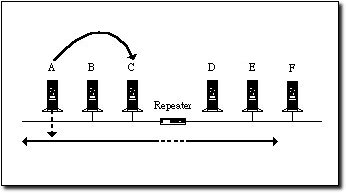

### **集線器\(Hub\)**

Hub 和 Repeater 都是 OSI 中第一層\(Physical\) 的設備。在技術上差不多是同一樣的動西，只不過在早期的 physical bus topology 上，我們稱之為 repeater ：通常有兩各 port 分別連接兩個 segment \(一個 segment 就是一個無需借助 Internetworking 設備連接的彼此相鄰的電腦群體\)。而 Hub 則常見於 physical star topology 上，有多各 port ，分別連接主機/設備或是其它 Hub 。功能上，兩者都是一樣的：將信號放大，再重送一遍。或許，我們可以簡單的將 hub 的每一各 port 都視為 repeater 就是了。

### **橋接器\(Bridge\)**

它是一個硬體或軟體用來連接不同的網路區段\(segment\)的設備。例如﹐您可以用一個 bridge 來連接兩個 Ethernet segment﹑或連接一個 Token Ring segment 到一個 Ethernet segment﹑或連接一個 Mac segment 到一個 PC segment。

只要網路間使用相同的傳輸協定\(如 IPX 或 TCP/IP \)﹐bridge 就可以成功的將任何網路連接到其它網路﹐它們之間的溝通就無需理會對方使用的是何種網路硬體了。

一個 bridge 的資料傳輸主要有三個步驟﹕

1. **Discovery**﹐就是 bridge 的任意一端是否有資料到達
2. **Filtering**﹐接著 bridbe 過濾\(filter\)資料，並決定是否需要傳送到另一端
3. **Forwarding**﹐然後 bridge 將資料傳送\(forward\)給目的端位址，若使用的格式不一致，則同時進行轉換。

其實 bridge 是很簡單的﹐就像一座橋架於不同的網路之間﹐您可以將它想象成兩個國家之間的邊境橋樑﹐而兩國都使用著自己各自的語言﹕一邊說 Token 語﹔另一邊說 Ether 語。由於兩國過從甚密﹐然語言又互不相通﹐所以他們就聘請了一個傳譯員坐在橋中間﹐再另外聘兩個跑腿各站兩邊。當說 Token 語的跑腿來告訴傳譯員他們有信息傳到另一邊﹐傳譯員首先將地址翻譯成 Ether 語﹐再將信息重新裝進 Ether 國的信封﹐然後叫說 Ether 語的跑腿將信送到該地址去。傳譯員一點也不在乎信是從哪邊過來的﹐他只關心的是地址之準確性就行。

另外﹐bridge 除了是一個傳譯員之外﹐它還可以充當交通警察。當我們發現網路過于繁忙的時候﹐那麼我們就可以將網路分成兩個或多個 segment﹐而 bridge 就可以幫助網路更好的管理交通和解決瓶頸問題了。事實上，我們也經常用 bridge 將一個相同類型的大 segment 切成多個小 segment ，利用其 filtering 的功能將網路廣播降下來，已提高整體網路的傳送能力。請大家復習一下 CSMA/CD 就知道 bridge 的好了：

若沒有 bridge 的 segment 中\(或是用 repeater 連接兩個 segment\)，當任意一台主機在傳送資料的時侯，其它主機就要等\(CS\)﹔若是兩台主機在同時進行傳送，就會發生碰撞而導致重送\(CD\)。如下圖：

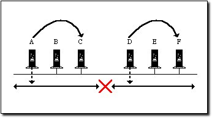

若在中間部署一台 bridge 的話，因為 bridge 的 filter 能力，讓不同 segment 的信號互不干繞\(除非兩端跨 segment 傳送\)。因此，對 CS 與 CD 都有很大提昇，當節點越多的時侯，bridge 的好處就更明顯：

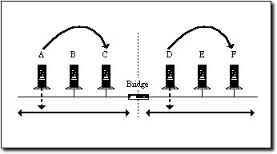

### **交換器\(Switch\)**

當您了解 Repeater 與 Bridge 的差異之後，您大概也能理解 Hub 與 Switch 的差別：我們知道 hub 就好比一個多 port 的 repeater ，那麼 switch 大概就是一個多 port 的 bridge 而已。當然了，現在的 switch 除了擁有自己的 switch table 而做到類似 bridge 的過濾功能外，還有自己的 CPU 與 Memory ，提功不同的 queue 及運算能力，在整體上提高整個網路的傳送速度。在 switch 上所採用的傳送方式，大致分 store & forward 及 cut through 兩種技術\(通常通時提供\)。再加上 full duplex 的設計，避免了供享單一傳送媒體所導致的 collision ，在某一程度上，將 CSMA/CD 的弊端作了最大的化解\(甚至有人認為連 CSMA/CD 都不存在了\)！

通常來說，Switch 是用來建構高速乙太網\( fast ethernet，最低為 100Mbps \) 的設備，不太可能用 hub\(repeater\) 來連接的。在我們的應用中，switch 也可以工作於 OSI 模型中的不同層級：L2、L3、L4、L7 等。不同的層級，在封包的處理能力上也大大不同，若沒有特別指明，一般是指 L2 Switch 。就算是同層級的 Switch，不同 的功能其價格上也差異很大，比方說，是否能切割 VLAN 、是否可作 Truncking、是否支援 SNMP、CPU/RAM/演算法、等等... 總之，一分錢一分貨就對了！只是要看錢是否花得其所而已。

### **路由器\(Router\)**

和 bridge 差不多﹐router 是一個用來將資料從一個網路主機傳送到其它網路主機的硬體或軟體設備。

在使用 bridge 的時候﹐它的工作較累，就算是同一國度裡面的人民相互分享資料﹐傳譯員也要先檢查一下﹐確定是否要進行翻譯傳遞。就算真的不需傳遞，bridge 也要進行判斷。這方面﹐router 比 bridge 聰明些﹐也不像 bridge 那樣勞碌。在 router 上面，如果資料是傳遞到相同的國度裡去﹐router 就根本無需理會﹐而讓資料按其正常的方法傳遞﹐就如根本沒有 router 存在一樣。只有那些需要翻譯的資料﹐router 才會理會。因為在 routing 的層面來說，每一台主機在將封包丟出去之前，就已自行判斷了改封包是否需要傳給 router ﹔但在低層的硬體傳輸曾面來說，信號是以廣播方式在共享媒體上傳輸，bridge 必需比較完兩端的實體位址才能決定是否要 filter/forward 。

從 OSI 層級來分﹕bridge 屬於第二層，只要上層的傳輸協定是一致的，那 bridge 就能讓不同的硬體 segment 溝通。而 router 則是第三層的設備，它所負責的是傳輸協定本身的溝通。換句話說，bridge 跟本不必操心也讀不懂傳輸協定的羅輯位址長甚麼樣子，它只讀得懂底層的硬體位﹔反過來，router 只需讀懂羅輯位址就行，而跟本不需要知到硬體位址如何，因為， router 在判斷完羅輯位址後，真正的傳輸工作，則往下交給底層的設備完城。這需要您對 OSI 模型非常了解才能理解，若現在不是很清楚，沒關係，等我們日後講完 OSI 再回來溫習就好。

還要一種叫做**Brouter**\(我也不知道如何翻譯好\)的設備﹐可以應用於不同的傳輸協定上面﹐它揉合了bidge 和 router 的優點所在﹕既可以使用不同的上層協定﹐也可以直接將數據以最快的路徑傳遞。當然﹐它的問題是比較難昂貴﹐而且安裝也是件非常頭疼的事情﹕它需要對每一個不同的網路進行細緻的調校。如果您有一個比較複雜的具有多種平臺的大型網路環境﹐使用 brouter 通常可以獲得最佳的效能﹐盡管安裝比較困難﹐但一旦設好了﹐自是受益非淺。

### **網關\(Gateway\)**

Gateway 可以說是 internerworking 的最終極設備了﹐它通常是一些硬卡跑著一些軟體﹐專門是設計給兩個完全不同的網路結構\(比如 PC 網路和 SNA Mainframe\)之間進行溝通的。因為， gateway 的工作囊括了整個 OSI 的七個層級。

如若 bridge \(工作於第二層\) 和 router \(工作於第三層\) 所使用的傳譯員僅能夠翻譯語言﹐gateway 這個更高級的翻譯卻能完全的將各自不同的交流模式進行翻譯﹐並能讓對方可以理解﹐不管他們使用的是畫畫還是跳舞。

## **Bridge 的使用**

正如剛才提到 bridge 的時候﹐已經知道它的主要功能就是過濾\(filter\)和傳遞\(forward\)﹐當 bridge 接到一個封包的時候﹐它就得問自己﹕“這個封包究竟是留在這個區段內﹐還是應該傳遞到下一個區段呢﹖”

讓我們先假設在兩個 Ethernet 區段之間架設了一個 bridge ﹐您有一個資料想從區段甲的節點 A 送到區段乙的節點 B﹐其過程有的像這樣﹕當節點 A 送出的封包抵達 bridge 的時候﹐bridge 會先檢查封包的來源地和目的地﹐如果是寄往同一區段的其它節點的話\(在 bridge 的同一邊\)﹐橋就不會向區段乙進行傳送了﹐我們稱這功能為**過濾**﹐這樣區段乙就減少了無必要的交通﹐參考下圖﹕

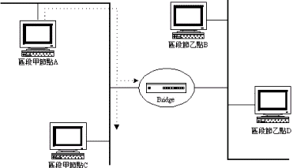

但是﹐如果封包的來源地與目的地不一個區段的﹐或是一個 Layer 2 層級的廣播封包，那麼 bridge 就將封包向另外一邊傳送﹐這動作我們稱之為**傳遞**﹕

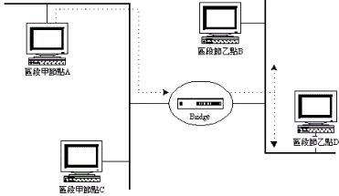

Bridge 通常是獨立協定之外的﹐可以同時支持多個協定﹐它只關心封包的來源和目的位址﹐不管雙方使用的封包是 IPX 還是 TCP/IP﹐bridge 都毫不理會。只要它讀得懂來源和目的位址﹐就能夠判定要對封包進行過濾還是傳遞。

一般的 bridge 都有一種 learning 能力，會保持一個表格記錄哪些位址屬於哪個區段﹐每次有封包在網路中傳遞的時候﹐bridge 都會參考記錄檢查其封包位址﹐並進行必要的更新。但並不是所有 bridge 都會這樣做﹐有些比較低檔的 bridge 就不管三七二十一﹐凡是接到封包就給它傳遞出去﹐我們稱這樣的 bridge 為**forward-only bridge**﹐請參考下圖﹕

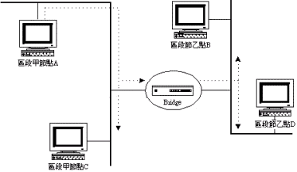

有些 bridge 或會連接兩個以上的區段﹐當有廣播封包\(就是給所有節點的封包\)要發送的時候﹐由於它是要傳遞給網路上所有節點的﹐bridge 就會將它傳遞給所有連接上來的區段﹐我們稱這樣的情形為 **flooding**。越多這樣的廣播封包﹐flooding 的出現也就越頻繁﹐網路也就越慢﹕

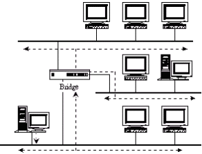

那究竟我們如何避免flooding呢﹖下面有兩個選擇﹕

* 如果您需要使用一個bridge來連接多個區段﹐確定您購買的是learning bridge﹐也就是能夠追蹤每個節點位址的bridge。
* 您還可以購買**half-bridge**﹐也就是使用一對bridge將過濾和傳遞工作分開。見圖﹕

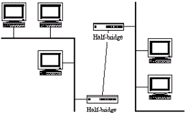

Half-bridge也有被稱做remote bridge﹐通常是配對的用來連接兩個區段﹐而各自只負責一半處理。例如﹐有一個封包要由區段甲的節點A送到區段乙的節點B﹐先會到達區段甲的half-bridge﹐這個half-bridge只會記著自己所連接的區段之內的位址﹐如果位址不是在此區段﹐那麼就將封包傳給另外一個half-bridge﹔當另外的half-bridge收到封包之後﹐看看位址是否屬于它所屬的區段﹐如果不是的話﹐這個封包就會被忽略﹐也不會被重發。這樣﹐網路的交通就會被限制在最低的情況之下了。

如果您的網路擴展到一定範圍的時候﹐您就要考慮增加 bridge 了。然而﹐當使用多個 bridge 的時候﹐您就會有風險遇到**broadcast storm**的問題。這通常發生在當區段之間有超過一個路徑的時候﹕

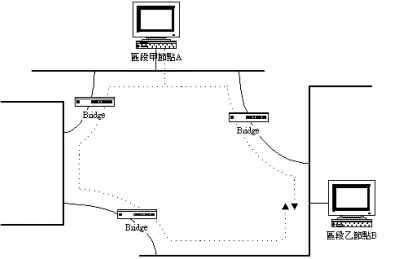

如上圖所示﹐當區段甲的節點 A 對本區段進行廣播\(在 Layer 2 上的廣博\)﹐有兩個 bridge 接收到信息﹐因未是廣播的關系，皆認為可以向區段乙傳遞。但是，當其中一個 bridge 將信號 forward 到另一個 bridge 的時侯，這個廣播會讓 bridge 再 forward 一次\(回到區段甲\)﹔然後又送到另一個 bridge ，再重復 forward 下去，因而造成一個無窮回迴圈。

不過可以告訴大家的是﹐bridge looping 只會在 Ethernet 邏輯形態和 Bus 物理形態上面出現﹐若使用 802.5 的 Token Ring 網路，對它是免疫的。

## **Bridge的標準**

由於 bridge 只有很低的處理能力﹐如果網路交通太忙的話﹐有可能出現封包丟失的情形。為了解決這樣的問題﹐一些 bridge 的標準相繼的被開發出來﹐通常有兩個標準是比較廣泛被接受的﹐它們是﹕spanning tree和 source-route bridging 標準。而且﹐這些標準還可以解決 looping 和 flooding 的問題呢﹗不錯哦~~

### **Spanning Tree Standard**

此標準裡面﹐網路會有一個 root bridge ﹐然後其下還有一些 child bridge ﹐這個 root bridge 會決定目的封包要傳遞給哪一個 child bridge。由於上級 bridge 只會將封包傳遞給包含該目的位址的下級 bridge ﹐因而也就避免了產生 looping 的可能性。

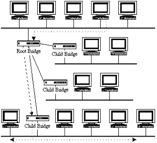

Spanning Tree 是由 Digital Equipment Corporation \(DEC\) 開發的﹐是專門給 802.3 \(邏輯bus或Ethernet\) 和 802.4\(token bus\)網路使用的。給 802.5 的 Token Ring 使用的是下個要說的標準。

### **Source-route Bridging Standard**

在 Source-rout Bridging 標準裡面﹐發送端節點要先判定哪個傳送路徑是最佳的﹐再將封包傳給 bridge ﹐然後再傳給目的地的 bridge。這時候 bridge 可以當成網關\(gateway\)一樣。它們的連接如下圖﹕

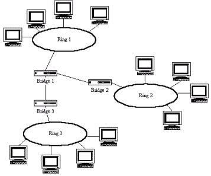

當一個 bridge 判定了兩個節點之間的最佳路徑之後﹐就會永遠地使用此一路徑﹐就算以後還有更佳路徑的出現也不會被考慮的了。如果您想您的 bridge 能夠適應不同的網路交通層次﹐並能報告出進行橋接過程的錯誤信息﹐那麼您需要的並非 bridge ﹐而是 router 了。

## **Router 的使用**

Router 有那些功能呢﹖先讓我們先將它和 bridge 做一個透視比較﹕

* Router 可以在節點間進行多工處理
* Router 可以直接和使用者設備溝通
* Router 可以協助管理網路交通
* 不像 bridge﹐router並不會閱讀所有在網路上面的封包﹐只會閱讀那些需要進行路由的封包
* 由於 router 是用來連接不同網路的﹐所以他們並不能獨立協定之外

為了更好的了解 router 的功能﹐您最好先要明白 router 是如何工作的﹐以及它和 bridge 的分別。它們主要的分別是它們如何看待所連接上來的區段﹕當使用 bridge 連接兩個網路的時候﹐它們僅屬於同一網路之內的兩個區段﹔如果使用 router 來連接兩個網路﹐它們是各自獨立的網路。

如下圖所見﹕當網路 1 的節點 A 要傳送一個封包網路 6 的節點 B﹐節點 A 會先將封包傳給連接到網路 1 的 router 1。當 router 1 接到封包的時候﹐他就得要判定哪條是最佳的傳遞給網路 6 的路徑，也就是下一站是誰？通常，最佳的路由路徑會在好幾個不同的 router 之間換來換去的﹐但無論如何﹐在 router 將送出封包之前﹐都會根據當前情況而選擇最佳的路徑。Router 具備這種搜索路徑的能力是非常有用的﹐不過這要基於它能否看到其它 router 的能力而定。

