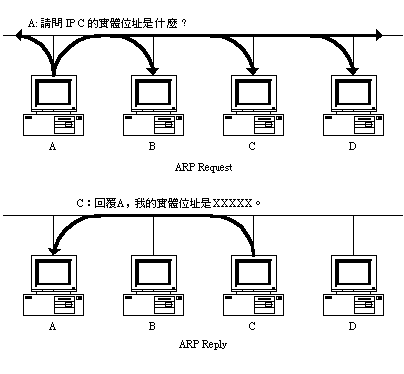
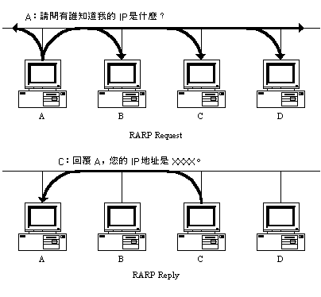
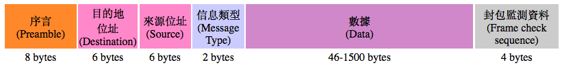

# 2-3 ARP 協定

嚴格來說，TCP/IP 協定家族並沒有定義 "TCP/IP 專屬的" 網路硬體規格。硬體的範圍實在太過廣泛了﹐標準非常多﹐當今大部份的低層網路硬體標準都是由 IEEE 制定的，但也有許多標準是廠商專屬的。要讓 TCP/IP 協定能夠順利與不同類型的硬體進行溝通﹐那麼就需要建立起一些標準協定來讓大家共同參考。以我們最常用的乙太網\(Ethernet\)為例﹐我們無需理會廠商如何設計網路界面的驅動程式﹐一旦它能夠被系統接納﹐網路儲存層\(Datalink\)就能使用網路界面在實體網路上傳送和接收資料了。

## **IP 位址和實體位址對應之困擾**

在「網路基礎」課程中﹐我們知道乙太網上面使用的傳送方式叫 **CSMA/CD** \(Carrier-Sensing Multiple Access with Collision Detection\)﹕雖然訊框會在整個網段\(segment\)中用廣播的方式傳遞﹐而且所有節點都會收到訊框﹐然而﹐只有目的位址符合自己實體位址的訊框才會被接收下來。因此，不管上層協定是哪一種\(可以是 TCP/IP 也可以是其它\)，在底層的傳送若是使用 Ethernet 的話，就得使用 MAC \(Media Access Control\) 實體位址。若要查詢到當前系統目前所有界面的實體位址，我們可在 Linux 系統裡面輸入 ifconfig 命令﹕


從上面的命令結果中可發現：關於每一個界面的第一行資訊﹐最後的部份就是該界面的實體位址。訊框在實體網路上面傳送的過程中﹐IP 位址\(或曰羅輯位址\)一點都派不上用場。但問題是：當我們使用 TCP/IP 的時侯，上層的協定都是以 IP 位址為傳送依據的。那麼﹐這時候我們就必須有一套方法來對應 IP 位址和實體位址了。

在此一過程中﹐關鍵點是如果將 IP 位址對與實體位址做對應。有些使用簡單實體位址的網路\(如 proNET-10 \)﹐其實體位址只佔一個 byte 的長度﹐而且允許使用者在配置網路卡的是選擇自己的實體位址。在這樣的網路上進行 IP 位址和實體位址的對應﹐是比較簡單的﹐我們可以把實體位址設為和 IP 位址設為一樣。例如﹐假設某一個節點的 IP 位址為 192.168.1.17﹐那麼我們可以將該實體位址設為 17。 這樣﹐在 proNET 就可以輕易的根據 IP 位址來得到實體位址。這樣的對應非常簡單﹐而且要維護起來也很容易﹐在新機器假如網路的時候﹐並不需要修改或重編已存的資料。

然而﹐我們知道在乙太網上﹐每一個實體界面都有一個 48bit\(6byte\) 的 MAC 位址﹐而 IP \(v4\)使用的位址則為 32bit\(4byte\)﹔每各位址格式都只提供相應的層級協定使用﹐彼此是不能互換使用的。這時候我們就無法用簡單的數學關係來做 IP 位址和實體位址的對應了。


## **IP 位址和實體位址的對應方法**

### 建立表格 

首先﹐我們想到的最簡單方法是在每一台機器上建立一個 IP 位址和實體位址的對應表格\( table \)。不過這個方法還是沒辦法解決如下的情形﹕

* 網路上的節點數量多如恆河沙數﹐要想將全部節點的對應關係列入表格之中幾近不可能任務。
* 如果某一個節點產生異動情形\(例如更換網卡\)﹐那麼如果讓所有表格正確做出相應修改﹐也是個頭痛的問題。
* 對某無磁碟工作站來說﹐因為沒有本機的儲存設備﹐將無非建立表格。

### 寫入高階程式

除了建立表格﹐我們還可以將實際的網路位址寫死在高階網路程式裡面。不過﹐和前一個方法一樣﹐如果遇到硬體位址變更等異動動情形﹐那麼﹐程式也需要重新編譯過才行。

顯然﹐上述兩個方法都不怎麼高明。

### ARP 協定

這裡我們要介紹的是 Address Resolution Protocol \(ARP\)。 ARP 是 TCP/IP 設計者利用乙太網的廣播性質﹐設計出來的位址解釋協定。它的主要特性和優點是它的位址對應關係是動態的﹐它以查詢的方式來獲得 IP 位址和實體位址的對應。它的工作原理非常簡單﹕

1. 首先﹐每一台主機都會在 ARP 快取緩衝區 \(ARP Cache\)中建立一個 ARP 表格﹐用來記錄 IP 位址和實體位址的對應關係。這個 Table 的每一筆資料會根據自身的存活時間遞減而最終消失﹐以確保資料的真實性。 
2. 當發送主機有一個封包要傳送給目的主機的時候﹐並且獲得目的主機的 IP 位址﹔那發送主機會先檢查自己的 ARP 表格中有沒有該 IP 位址的實體位址對應。如果有﹐就直接使用此位址來傳送框包﹔如果沒有﹐則向網路發出一個 ARP Request 廣播封包﹐查詢目的主機的實體位址。這個封包會包含發送端的 IP 位址和實體位址資料。 
3. 這時﹐網路上所有的主機都會收到這個廣播封包﹐會檢查封包的 IP 欄位是否和自己的 IP 位址一致。如果不是則忽略﹔如果是則會先將發送端的實體位址和 IP 資料更新到自己的 ARP 表格去﹐如果已經有該 IP 的對應﹐則用新資料覆蓋原來的﹔然後再回應一個 ARP Reply 封包給對方﹐告知發送主機關於自己的實體位址﹔
4. 當發送端接到 ARP Reply 之後﹐也會更新自己的 ARP 表格﹔然後就可以用此紀錄進行傳送了。
5. 如果發送端沒有得到 ARP Reply ﹐則宣告查詢失敗。 

#### ARP 的查詢過程可參考下圖



前面說的 ARP 表格﹐只有在 TCP/IP 協定被載入核心之後才會建立﹐如果 TCP/IP 協定被卸載或關閉機器﹐那麼表格就會被清空﹔到下次協定載入或開機的時候再重新建立﹐而同時會向網路發出一個 ARP 廣播﹐告訴其它機器它的目前位址是什麼﹐以便所有機器都能保持最正確的資料。

然而﹐ARP cache 的大小是有所限制的﹐如果超過了界限﹐那麼越長時間沒被使用過渡資料就必須清理掉﹐以騰出空間來儲存更新的資料。所以﹐當機器收到 ARP equest 封包時﹐如果查詢對象不是自己﹐則不會根據發送端位址資料來更新自己的 ARP 表格﹐而是完全忽略該封包。同時﹐每筆存在 cache 中的資料﹐都不是永久保存的﹕每筆資料再更新的時候﹐都會被賦予一個存活倒數計時值﹐如果在倒數時間到達的時候﹐該資料就會被清掉。然而﹐如果該資料在倒數時間到達之前被使用過﹐則計時值會被重新賦予。

當然了﹐ARP 尚有一套機制來處理當 ARP 表格資料不符合實際位址資料的狀況\(例如﹐在當前連線尚未結束前﹐收到目的端的位址資料更新訊息\)﹔或是目的主機太忙碌而未能回答 ARP 請求等狀況。

## **RARP 協定**

剛才介紹的 ARP 協定是透過向網路查詢而找出實體位址﹐那我們接下來探討的 RARP 協定則相反﹕它是籍由查詢網路上其它主機而得到自己的 IP 位址。

通常﹐我們使用的乙太網卡﹐在出廠的時候就有生產廠家把網卡的實體位址燒在 ROM 裡面﹐這個位址是不能改變的\(某些型號的網路卡﹐或是透過其它技術手段﹐是允許您修改實體位址的\)。不管系統是否起來﹐這個位址都會存在﹐而且要讓系統獲得它也很容易。然而，在一些無磁碟\(diskless\)工作站上面﹐系統檔案都存放在遠端的伺服器﹐當它在啟動的時候﹐因為本身沒有 IP 位址﹐也就無法和伺服器溝通﹐更不能將系統檔案載入。那麼﹐我們就必須要有一個辦法﹐讓這樣的無磁碟工作站在和伺服器溝通之前獲得自己的 IP 位址。RAPR 協定就是為解決此問題而設計出來的。

和 ARP 協定一樣﹐RARP 也是用廣播的形式來進行查詢﹐只不過這時候問的 IP 位址不是別人﹐而是自己的 IP 位址而已。我們可以從下圖看出 RARP 的運作﹐其實和 ARP 是極其相似的﹕



首先是查詢主機向網路送出一個 RARP Request 廣播封包﹐向別的主機查詢自己的 IP。在時候﹐網路上的 RARP 伺服器就會將發送端的 IP 位址用 RARP Reply 封包回應給查詢者。這樣查詢主機就獲得自己的 IP 位址了。

然而不像 ARP﹐查詢主機將 RARP Request 封包丟出去之後﹐可能得到的 RARP Reply 會不止一個 \(在 ARP 查詢中﹐我們可以確定只會獲得一個回應而已\)。因為網路上可能存在不止一台 RARP 伺服器\(基於備份和分擔考量﹐極有可能如此設計\)﹐那麼﹐所有收到 RARP 請求的伺服器都會嘗試向查詢主機作出 RARP Reply 回應。如果這樣的話﹐網路上將充斥這種 RARP 回應﹐做成額外的負荷。這時候﹐我們有兩種方法來解決RARP 的回應問題。

第一種方法﹐為每一個做 RARP 請求的主機分配一主伺服器﹐正常來說﹐只有主伺服器才回做出 RARP 回應﹐其它主機只是記錄下接收到 RARP 請求的時間而已。假如主伺服器不能順利作出回應﹐那麼查詢主機在等待逾時再次用廣播方式發送 RARP 請求﹐其它非主伺服器假如在接到第一個請求後很短時間內再收到相同請求的話﹐才會作出回應動作。

第二種方法也很類似﹕正常來說﹐主伺服器當收到 RARP 請求之後﹐會直接作出回應﹔為避免所有非主伺服器同時傳回 RARP 回應﹐每台非主伺服器都會隨機等待一段時間再作出回應。如果主伺服器未能作出回應的話﹐查詢主機會延遲一段時間才會進行第二次請求﹐以確保這段時間內獲得非主伺服器的回應。當然﹐設計者可以精心的設計延遲時間至一個合理的間隔。

## **PROXY ARP**

代理 \(Proxy\) ARP 通常用來在路由器上代為回答在它後面的某個網路主機的 ARP 請求。這是一種欺騙手法﹐因為查詢端會以為目標主機就是路由器本身﹐但事實上﹐機器是在另一個網路裡面。

Proxy ARP 常使用於遠端連接網路\(如撥接\)環境中。例如在本地網路中有一台撥接主機﹐提供其他主機撥接上來連接本地網。當本地主機要查詢遠端撥接主機的 ARP 請求的時候﹐因為它的廣播封包是無法到達遠端的﹔此時撥接伺服器就可以代替遠端主機回答這個 ARP 請求﹐然後本地主機就將封包送給撥接伺服器﹐伺服器再將封包傳給遠端主機。

Proxy ARP 還有另一個功能﹕就是將路由器所連接的兩端實體網路相互「隱藏」起來。這樣﹐兩邊的網路就能夠使用同一個網路識別碼\(我們會在後面的章節中說明這個概念\)﹐只要中間的路由器被配置 Proxy ARP﹐便能替任何一端網路回應另一端網路的 ARP 請求。這樣的配置﹐除了能夠解決現代主機與古老的機器之間的溝通\(前者使用全部 0 代表主機﹐而後者則使用全部 1 代表主機﹔這個我們在後面的章節中再說明這個概念\)。

Proxy ARP 另一個很有用的場合﹐是解決 IP 不足下的子網路切割情況。例如現在台灣的商業性 ADSL 網路只能分配到 5 個可用 IP﹐如果要在這麼小的範圍下做子網的切割﹐那麼﹐除路由器所佔用的兩個 IP 之外﹐剩下的就只有一個 IP 可以使用。這是毫無意義的﹐但使用 Proxy ARP 之後﹐我們可以使用的 IP 將不會被浪費掉。

## **ARP 和 RARP 之封包格式**

讓我們溫習前面討論 OSI 層級時提到的乙太網路框包格式﹕



我們可以發現標準的乙太網框包其中有一段 46 到 1500 byte 長度的數據空間﹐假如這是一個 ARP 封包的話﹐那麼該段數據空間就用來包裝整個 ARP 封。ARP 和 RARP 的封包格式是一模一樣的﹕


  
下面我們就封包中每一欄位做一個簡單的說明﹕

### **HARDWARE TYPE**

這是指網路界面卡的種類﹐如果該值為 1﹐則表示為乙太網 \( Ethernet \)。

### **PROTOCOL TYPE**

這是指高階網路協定位址種類﹐如果該值為 0x0800﹐則表示為 IP 位址格式。

### **HLEN**

這是指硬體位址長度\(單位為 byte\)﹐乙太網的位址長度為 6 。

### **PLEN**

這是指網路協定位址的長度\(單位為 byte\)﹐IP 協定位址長度為 4。

### **OPERATION**

這是指封包類別﹐一共有四種﹕

1. ARP Request
2. ARP Reply
3. RARP Request
4. RARP Reply

### **SENDER HA**

這是指發送端的實體位址﹐如果是乙太網的話﹐將會是一個 6 byte 長度的乙太網位址。

### **SENDER IP**

這是指發送端的 IP 位址﹐會是一個 4 byte 長度的 IP 位址。

### **TARGET HA**

這是指目的端的實體位址﹐如果是乙太網的話﹐將會是一個 6 byte 長度的乙太網位址。

### **TARGET IP**

這是指目的端的 IP 位址﹐會是一個 4 byte 長度的 IP 位址。

## **ARP 指令**

假如您要在 Linux 系統上驗證一下前面所學的理論﹐只要您的網路功能已經設好﹐您可以用 arp 命令來檢查當前的 ARP 表格內容﹕

```text
# arp -n
Address                 HWtype  HWaddress           Flags Mask            Iface
192.168.20.88           ether   00:10:5A:74:19:A7   C                     eth1
192.168.20.16           ether   00:D0:B7:74:77:74   C                     eth1
192.168.20.140          ether   00:D0:B7:74:77:85   C                     eth1
192.168.20.176          ether   00:02:B3:0B:5A:60   C                     eth1
192.168.16.254          ether   00:D0:B7:85:40:FE   C                     eth1
192.168.22.1            ether   00:50:8B:92:C3:AB   C                     eth1
```

在 Linux 系統中﹐輸入 arp 帶一個 -n 的參數﹐是將資料用數字\(number\)的形式顯示﹐否則它將嘗試用 DNS 或其他主機對應方式來顯示 IP 所對應的主機名稱。大家可以很輕易在每一行資料中找到 IP 位址和實體位址的對應﹐同時還有硬體類型等信息。

假如此時您下一個 ping 命令﹐連接一台沒有在 ARP 表格中出現的 IP ﹕

```text
# ping 1211.20.240.113
PING 211.20.240.113 (211.20.240.113): 56 data bytes
64 bytes from 211.20.240.113: icmp_seq=0 ttl=128 time=0.6 ms
64 bytes from 211.20.240.113: icmp_seq=1 ttl=128 time=0.6 ms
64 bytes from 211.20.240.113: icmp_seq=2 ttl=128 time=0.6 ms
64 bytes from 211.20.240.113: icmp_seq=3 ttl=128 time=0.6 ms
```

此時您再次輸入 arp 命令的話﹐您將發現新主機的 ARP 資料﹕

```text
# arp -n
Address                 HWtype  HWaddress           Flags Mask            Iface
192.168.20.88           ether   00:10:5A:74:19:A7   C                     eth1
192.168.20.16           ether   00:D0:B7:74:77:74   C                     eth1
192.168.20.140          ether   00:D0:B7:74:77:85   C                     eth1
192.168.20.176          ether   00:02:B3:0B:5A:60   C                     eth1
192.168.16.254          ether   00:D0:B7:85:40:FE   C                     eth1
192.168.22.1            ether   00:50:8B:92:C3:AB   C                     eth1
211.20.240.113          ether   00:60:6C:08:2A:24   C                     eth0
```

如果您把這台主機從網路上斷開﹐確定它不會再發送 ARP 請求或作出 ARP 回應﹐那麼過大約 20 分鐘後再輸入 arp 命令﹐您很可能發現許多 ARP 記錄都已經消失了﹐這就是資料存活倒數計時的後果。

假如您的 Linux 系統還裝有封包擷取軟體﹐如 tcpdump ﹐您可以在此期間抓些封包看看﹐細心點就能看出 ARP Request 和 ARP Reply 的過程﹕

```text
09:17:33.803030 0:0:e8:68:98:b3 ff:ff:ff:ff:ff:ff 0806 42: arp who-has 211.20.240.
113 tell 211.20.240.117
09:17:33.803777 0:60:6c:8:2a:24 0:0:e8:68:98:b3 0806 60: arp reply 211.20.240.11
3 is-at 0:60:6c:8:2a:24
```

您如果還有興趣的話﹐還可以找些更強勁的封包擷取工具\(如﹕snifit\)﹐把 ARP 封包的所有細節都抓出來看看。不過這裡暫時不做這樣的動作了。至於如何檢查封包的每一個細節﹐我們將在後面介紹 IP 和 TCP 封包的時候再介紹。

我們用 arp 不僅能查看當前的 ARP 記錄﹐而且我們還可以用 arp 命令來建立 ARP 記錄﹐例如﹐我們前面提到過的 Proxy ARP 功能﹐我們可以用中間的路由器來「隱藏」兩端的網路﹕

```text
# arp -s 211.20.240.115 00:10:B5:3A:8E:00 pub
# arp -n
Address                 HWtype  HWaddress           Flags Mask            Iface
192.168.20.88           ether   00:10:5A:74:19:A7   C                     eth1
192.168.16.254          ether   00:D0:B7:85:40:FE   C                     eth1
192.168.22.1            ether   00:50:8B:92:C3:AB   C                     eth1
211.20.240.115          *       *                   MP                    eth
```

上面 arp 命令中的 -s 參數就是用來設定 \(set\) 一個 ARP 記錄的。接著在輸入 arp 命令﹐就會發現剛纔設定的資料旗標為 MP 。這樣﹐當另一端網路要查詢 211.20.240.115 的時候﹐這個 Linux 路由器就能夠代為回應了。

## **ARP 之 RFC 文件**

ARP 的詳細資料可以查詢 RFC-826﹑RFC-814﹑以及 RFC-1166 等文件。而 RARP 的資料則可以參考 RFC-903﹑RFC-906﹑還有 RFC-1293 等文件。

## 練習

1. 請在 Linux 系統上面找出界面的實體位址。
2. 分別解釋 ARP﹑RARP﹑Proxy ARP 的功能與實現過程。
3. 請描述 ARP / RARP 的封包格式的各欄位說明。
4. 用 Linux 系統實作檢查一下 ARP 表格內容﹐並嘗試連接新主機以觀測表格資料的變化。
5. 有條件的話﹐用封包擷取軟體來擷取 ARP 封包來觀測一下它們是如何工作的。

