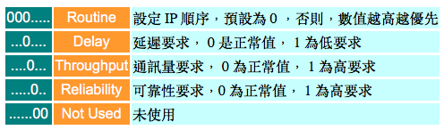
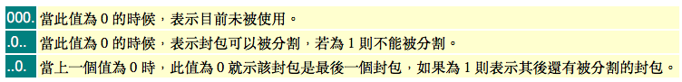

# 2-4 IP 位址

網際網路協定\( IP \)是整個 TCP/IP 協定的基礎﹐它的一些功能在前面的介紹 OSI 和 TCP/IP 模型的時候已經略略提過了﹐不過﹐由於它的重要性實在太值得了解﹐因此我們在這裡再深入的探討一下網際網路層的協定。而事實上，若 IP 這個環節若不過關的話，我會勸您別償試網路相關的工作了，否則會桶苦一輩子！

大體而言，網際網路協定的功能包括如下﹕

* 定義資網際網路中傳輸的基本單位。
* 定義網際網路的定址方式。
* 負責網路存取層和傳送層之間的資料傳遞。
* 決定資料傳送的路由路徑。
* 執行資料的分解和重組。

這層協定主要要做的事情﹐是將從傳送層傳來的資料準確的送到遠端機器上。讓我們溫習一下剛學過的 ARP 協定﹐我們知道當主機獲得應該 IP 後﹐如果在 ARP 表格中找不到目的主機的實體位址的時候\(因為底層的傳送是以實體位址為依據的\)﹐那麼就理由 ARP 協定是以廣播的方式去尋問對方的實體位址。不過﹐這裡有一個限制﹕廣播封包是有限制的﹐只能在同一個網段\( segment \)上的節點才能收到廣播封包。假如當我們有一個封包﹐從教室傳到網際網路上地球另一邊的主機﹐那這時候要如何處理呢﹖

Okay﹐這就是 IP 協定要解決的問題了。讓我們先看看 IP 封包的格式吧。

## **IP 封包表頭格式**

首先﹐讓我們看看IP封包的組成部份﹐以及各部件的長度﹕


在上圖中﹐括號之內的數字就是各部件的長度 \(bit\)﹐如果您夠細心﹐就會計算得出每一行的總長度都是 32bit。事實上，真正的封包是有連續的位元依序排列在一起的，之所以分行，完全是因為排版的關係。下面，我們分別對各部件名稱解釋一下﹕

### **Version**

版本 \(VER\)。表示的是 IP 規格版本﹐目前的 IP 規格多為版本 4 \(version 4\)﹐所以這裡的數值通常為 0x4 \(注意﹕封包使用的數字通常都是十六進位的\)。 

### **Internet Header Length**

標頭長度 \(IHL\)。我們從 IP 封包規格中看到前面的 6 行為 header ﹐如果 Options 和 Padding沒有設定的話﹐也就只有5 行的長度﹔我們知道每行有 32bit ﹐也就是 4byt e﹔那麼， 5 列就是 20byte 了。20 這個數值換成 16 進位就成了 0x14﹐所以﹐當封包標頭長度為最短的時候﹐這裡數值會被換算為 0x14 。

### **Type of Service**

服務類型 \(TOS\)。這裡指的是 IP 封包在傳送過程中要求的服務類型﹐其中一共由 8 個 bit 組成﹐每組 bit 組合分別代表不同的意思﹕



### **Total Length**

封包總長 \(TL\)。通常以 byte 做單位來表示該封包的總長度﹐此數值包括標頭和數據的總和。

### **Identification**

識別碼 \(ID\)。每一個IP封包都有一個 16bit 的唯一識別碼。我們從 OSI 和 TCP/IP 的網路層級知識裡面知道﹕當程式產生的數據要通過網路傳送時﹐都會在傳送層被拆散成封包形式發送﹐當封包要進行重組的時候﹐這個 ID 就是依據了。

### **Flag**

旗標 \(FL\)。這是當封包在傳輸過程中進行最佳組合時使用的 3 個 bit 的識別記號。請參考下表﹕



### **Fragment Offset**

分割定位 \(FO\)。當一個大封包在經過一些傳輸單位\(MTU\)較小的路徑時﹐會被被切割成碎片\(fragment\) 再進行傳送\(這個切割和傳送層的打包有所不同﹐它是由網路層決定的\)。由於網路情況或其它因素影響﹐其抵達順序並不會和當初切割順序一至的。所以當封包進行切割的時候﹐會為各片段做好定位記錄﹐所以在重組的時候﹐就能夠依號入座了。 

如果封包沒有被切割﹐那麼 FO 的值為“0”。

### **Time To Live**

存活時間 \(TTL\)。這個 TTL 的概念﹐在許多網路協定中都會碰到。當一個封包被賦予 TTL 值\(以秒或跳站數目\(hop\)為單位\)﹐之後就會進行倒數計時。在 IP 協定中，TTL 是以 hop 為單位，每經過一個 router 就減一\)﹐如果封包 TTL 值被降為 0 的時候﹐就會被丟棄。這樣﹐當封包在傳遞過程中由於某些原因而未能抵達目的地的時候﹐就可以避免其一直充斥在網路上面。有隻叫做 traceroute 的程式﹐就是一個上佳的 TTL 利用實作﹐我們會在後面的章節裡面討論。

### **Protocol**

協定\(PROT\)。這裡指的是該封包所使用的網路協定類型﹐例如﹕ICMP 或 TCP/UDP 等等。要注意的是﹕這裡使用的協定是網路層的協定﹐這和上層的程式協定\(如﹕FTP﹑HTTP 等\)是不同的。您可以從 Linux 的 /etc/protocol 這個檔案中找到這些協定和其代號﹔其內容如下﹕

```text
------------------------------------------------------
ip      0       IP              # internet protocol, pseudo protocol number
icmp    1       ICMP            # internet control message protocol
igmp    2       IGMP            # Internet Group Management
ggp     3       GGP             # gateway-gateway protocol
ipencap 4       IP-ENCAP        # IP encapsulated in IP (officially ``IP'')
st      5       ST              # ST datagram mode
tcp     6       TCP             # transmission control protocol
egp     8       EGP             # exterior gateway protocol
pup     12      PUP             # PARC universal packet protocol
udp     17      UDP             # user datagram protocol
hmp     20      HMP             # host monitoring protocol
xns-idp 22      XNS-IDP         # Xerox NS IDP
rdp     27      RDP             # "reliable datagram" protocol
iso-tp4 29      ISO-TP4         # ISO Transport Protocol class 4
xtp     36      XTP             # Xpress Tranfer Protocol
ddp     37      DDP             # Datagram Delivery Protocol
idpr-cmtp       39      IDPR-CMTP       # IDPR Control Message Transport
rspf    73      RSPF            #Radio Shortest Path First.
vmtp    81      VMTP            # Versatile Message Transport
ospf    89      OSPFIGP         # Open Shortest Path First IGP
ipip    94      IPIP            # Yet Another IP encapsulation
encap   98      ENCAP           # Yet Another IP encapsulation
------------------------------------------------------
```

### **Header Checksum**

標頭檢驗值\(HC\)。這個數值主要用來檢錯用的﹐用以確保封包被正確無誤的接收到。當封包開始進行傳送後﹐接收端主機會利用這個檢驗值會來檢驗餘下的封包﹐如果一切看來無誤﹐就會發出確認信息﹐表示接收正常。

### **Source IP Address**

來源位址\(SA\)。相信這個不用多解釋了﹐就是發送端的 IP 位址是也﹐長度為 32 bit。

### **Destination IP Address**

目的地位址\(SA\)。也就是接收端的 IP 位址﹐長度為 32 bit。

### **Options & Padding**

這兩個選項甚少使用﹐只有某些特殊的封包需要特定的控制﹐才會利用到。這裡也不作細表啦。

前面所介紹的 IP 封包格式﹐請花點時間研究一下﹐因為在日後的網路生涯中﹐許多概念都要求設計者非常了解 IP 和 TCP 封包\(標頭\)的結構﹐例如﹕防火牆設定和 socket 程式設計。

## **IP 位址**


## **"公共 IP" 與 "私有 IP"**

當我們要將網路連上 Intetnet 的時候﹐我們必須先註冊好 Net ID﹐如果該 ID 已經被使用了﹐您就必須選用另外的 ID 了。負責 Internet IP 註冊的機構叫做 InterNIC \(Network Information Center\)﹐他們的網路位址是 [http://www.internic.net](http://www.internic.net/)。不過，實際上的運作，一般機構或個人是不太可能直接從 InterNIC 上注冊 IP 的，而是經您的 ISP 分配下來。這些經過合法授權使用的 IP ，我們稱之為 **公共 IP\( Public IP \)**

然而，由於 Internet 的爆炸性成長﹐IP 的位址買少見少﹐而且在很多機構裡﹐也不是所有機器都有必要使用註冊的 IP 位址。於是﹐我們就在 A﹑B﹑C 這三個層級裡面﹐各劃出一些位址範圍保留給私有位址所用﹐它們分別是﹕

```text
10.0.0.0 - 10.255.255.255
172.16.0.0 - 172.31.255.255
192.168.0.0 - 192.168.255.255
```

當您使用這些位址的時候﹐當然是有所限制的﹕

* 私有位址的路由資訊不能對外散播 
* 使用私有位址作為來源或目的位址的封包﹐不能透過 Internet 來轉送 
* 關於私有位址的參考紀錄﹐只能限於內部網路使用

正是由於這些限制﹐當我們使用這些私有位址來設定網路的時候﹐就無需擔心會和其它也使用相同位址的網路衝突。而這些無需註冊就能自由使用的 IP ，我們稱之為 **私有 IP\( Private IP \)**。當我們架設 IP 網路的時候，私有 IP 給與我們很大的方便。比方說﹕您目前的公司還沒有連上Internet﹐且也沒有或得公共 IP 的註冊。倘若使用公共 IP 的話﹐等到以後真正要連上網路的時候﹐就很可能和別人衝突了。其壞處是：由於您的 IP 不是合法授權使用的，別人跟本連不進來，而且，與您衝突的 IP 您卻永遠沒法連上去\(若對方是您的最大客戶可就慘了\)。若是那時候再重新規劃 IP 的話﹐將是件非常頭痛的問題！

解決的辦法是：我們可以先利用私有位址來架設網路﹐等到真要連上 intetnet 的時候﹐我們可以使用代理伺服器\( proxy \)或 IP 轉換\( NAT --- Network Addresss Translation\) 等技術﹐配合新註冊的 IP 就可以了。

由於私有位址在 Internet 上是不能路由的﹐用來架設企業內部網路﹐在安全上面也是有所幫助的。當然了﹐如果在課堂上或在家裡架設 IP 網路﹐使用私有位址也是個不錯的主意哦。

說到這裡，不得不提醒一下大家：在平時的技術討論中，許多人愛用 "真實 IP"、"合法 IP"、或 "實體 IP" 來稱呼 Public IP ﹔以 "假 IP"、"非法 IP"、或 "虛擬 IP" 來稱呼 Private IP 。但我認為都不太貼切，雖然在初學階段還不算甚麼，但隨著深入的研究，以後在討論 nat, vpn, vip, ipvs 等進階技術的時侯， 卻很可能因為名詞的誤解而浪費大量的時間在彎路上打轉。為此，我建議您儘量使用 "公共 IP" 與 "私有 IP" 來稱呼 Public IP 與 Private IP ，若您有興趣了解詳細原因，不妨花點時間看看 [請問什麼是虛擬ip?](http://www.pcnet.idv.tw/pcnet/network/virtual_ip.htm) 這篇。

**參考資料﹕**

> IP 協定的 RFC 文件可以參考﹕RFC-791﹑RFC-1122﹑RFC-815﹑RFC-1700。

## 練習

1. 請簡述網際網路層的主要功能。
2. 請描述 IP 封包的格式﹐以及各部件的功能。
3. 請講述如何判斷一個 IP 位址的 Class 屬性﹐以及如何判別各 Class 的 Net\_ID 和 Host\_ID。請用生活實例來模擬 Net\_ID 和 Host\_ID 的作用。
4. 請運用 IP 位址實例來講述 Net Mask 的作用﹐然後以課堂的實際需求以分組原則來切割教學子網。
5. 請問什麼是 CIDR﹖請用實例來探討 CIDR 的作用。
6. 請講述私有 IP 的作用﹐以及它們的範圍。

