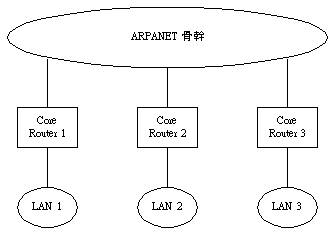
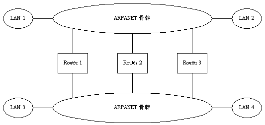
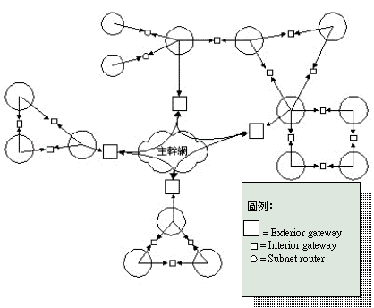
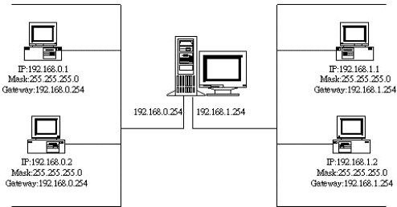
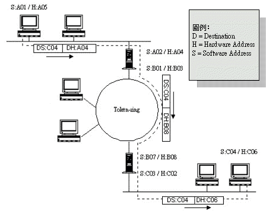

# 2-5 IP Routing

除了 subnetting ，關於 IP 協定的令一個關鍵概念就是：**IP 路由\(routing\)**。

那什麼是路由呢﹖簡單而言﹐就是當一個封包從發送端被傳送到接收端所經過的路徑。

## **IP 路由原理**

若您重看上一章所介紹的 IP 封包格式﹐您會發現第 4 和第 5 行﹐分別用來記錄來源 IP 位址和目的地 IP 位址。必須注意﹐除非封包由特定程式修改過﹐在正常的傳遞中﹐這兩個欄位的位址是永遠不變動。IP 路由的依據主要是看目的地位址﹕如果目的地位址屬於處理封包之設備目前所在的網路範圍之內\(這就是 subnetting 的重要性所在了\)﹐那麼就直接從 ARP 表格中尋找目的地位址的 IP 所對應的實體位址﹐如果沒有的話就用 ARP 協定來查詢。但是﹐如果目的位址在其他網路的話﹐那麼就在 ARP 表格中尋找 **路由器** 的實體位址﹐如果沒有則用 ARP 協定來查詢。

您或許會問﹕這個路由器是怎麼跑出來的﹐機器怎麼會有路由器的 IP 呢﹖答案很簡單﹕在設定網路環境時指定﹐這個可以手工的設定﹐也可以由其他協定如 DHCP 來指定。總之﹐如果您的網路將會和其他網路連接﹐那麼您就一定要為每一台主機指定路由器 IP 位址﹔除非﹐您想讓該主機﹐除了本地網路之外﹐任何地方都連不上。

要判斷一個封包是否要經過路由器﹐前面一段已經講過了﹕要看目的地位址是否在同一個網路上﹐如果不是﹐就一定要經過路由器來傳遞封包。那麼﹐做為路由器本身也不例外\(當然，實際的設定是有例外的，比方說 PPP 或 Static/Prox ARP 等情形\)、也就是說必需與發送端在同一個網路裡面。通常路由器都有最少兩個界面以連接兩個網路\(多個界面連接多個網路\)﹐假如路由器本身的界面位址和封包目的地位址不在同的網路﹐那麼路由器必須要將封包交給下一個它認為最合適的路由器﹐繼續傳送這個封包。情形就像接力游戲一樣﹕一站傳一站﹐直到最後一個路由器發現目的地位址和它其中一個界面在同一個網路﹐然後才透過 ARP 獲得對方的實體位址﹐最後交有下層協定完成最後一段的傳送任務。假設所經路由均在 Ethernet 上﹐那麼，路由器與路由器之間的傳送﹐每兩站之間也是同樣要經過 ARP 來獲得實體位址才能將封包傳給對方。

## **封包的路由選擇**

我們已經知道一隻程式要和遠端主機的程式溝通﹐它所送下來到資料﹐往往會被拆成許多個封包在網路中傳遞。事實上﹐每一個封包所經過的路徑都可能不同。在前面所描述的個路由接力過程中﹐封包從一個實體網路傳到另一個實體網路﹐每一個傳遞都是獨立的﹐與其他封包之間並非存在著必然關係。也就是說﹐從一個來源到一個目的地﹐可以選擇的路徑往往不止一條﹐而且﹐請求封包和回應封包所經過過的路徑也不盡相同。這情形在 Internet 的環境中尤顯突出。

影響每一個封包當前路徑的因素很多﹐都由當時所經過的路由器\(包括連線兩端的主機在內\)所使用的路由表格來決定。而路由表格的維護大致上分為兩種形式：

* **靜態\(Static\)**：也就是由管理員預先設定或手工修改。
* **動態\(Dynamic\)**：則是路由器之間透過 **路由協定** 自動更新。

事實上﹐路由協定是非常多樣的﹐同時也不斷的演變著。早器的網際網路路由器分為兩類﹕

* **核心路由器\(core router\)** 由 Internet Network Operation Center \(INOC\) 控制和管理。
* **非核心路由器** 由個別的群組所控制管理。

在這樣的架構下﹐所有網路都經由一個核心路由系統而達成連接﹐各自的網路會有一筆關於核心系統的預設路由設定。我們可以從下圖看到核心路由系統的架構模式﹕



然而﹐隨著網際網路的迅速成長﹐這樣的單一管理核心架構已經難以為繼了。首先﹐中央管理骨幹的路由將變得越來越複雜﹐核心路由器的一致性也變得異常重要及難以管理。其次﹐並非每一個網點都能連接到核心路由器﹐這就需要新增路由結構和協定。最後﹐基於核心資料一致性的要求﹐所有核心路由器都必須相互交換資料﹐那麼核心結構將不能過於龐大。

有鑒於上述原因﹐網際網路的路由結構已經從核心模式轉向為對等骨幹模式﹐如下圖﹕



對大部份對等式骨幹組態而言﹐路徑的取向依照相連主機之間的幾何傳輸路徑選取最短短路徑。這樣的敘述看起來很簡單﹐但事實上要實現起來是非常困難的。首先﹐雖然標準的 IP 路由演算法是使用 IP 位址中的網路部份來選擇路徑﹐然而在對等骨幹架構中的最近路徑則需要對單個主機進行單獨的路徑選擇。其次﹐兩個骨幹的管理者必須在所有路由器之間達成路徑的一致性﹐以避免路徑迴圈的出現。

以現今的網際網路架構來說﹐路由器的界定並非如早期的界定那麼明顯﹐而網路與網路之間的路由也變得非常複雜多樣﹐路徑的選擇往往是多重的。我們可以從下圖看看簡化了的網際網路路由環境﹕



應用在大型骨幹之間的路由協定非常複雜﹐而且種類繁多﹐例如有﹕Gateway-Gateway Protocol \(GGP\)﹑BGP\(Border Bateway Protocol\) 等等。這些都屬於 **外部閘道協定**\(Exterior Gateway Protocol\) 路由協定﹐在本教材中不打算詳論了﹐同學們可以自行參考 RFC-1102﹑和 RFC-1104 等文件。

## **本地網路的路由選擇**

從上面我們已經了解到網際網路的核心路由結構﹐我們需要知道它是為了幫助我們認識網路與網路之間的路由關係。然而﹐對一般的網路管理人員來說﹐恐怕也難有機會接觸和管理那樣的路由器﹐反而最通常接觸的﹐應該是企業內部的較小型的網路之間的路由。相對而言，內部閘道協定的規模較小、所耗的路由資源也較少。常見的內部路由協定有：RIP\(Routing Information Protocol\)、OSPF\(Open Shortest Path First\)、及 EIGRP\(Enhanced Interior Gateway Protocol\)、等等。內部路由協定的最大缺點是無法應付大型網路的需求。

不管我們管理的網路體積如何﹐只要您的網路是與其它網路相連的﹐路由設定就不能避免。下面先讓我們看看兩個網路之間的路由設定是怎樣的﹕



由上圖我們可以看到 192.168.0.0 這個網路的所有機器﹐其閘道\(gateway\) 都指向 192.168.0.254 這個 IP﹐也就是路由器與該網路所連接的界面。同樣﹐192.168.1.0 這個網路﹐其閘道則是 192.168.1.254。

通常﹐一個路由器可以同時連接好幾個網路﹐只要界面設定好就沒問題。作為路由器﹐必須有最少兩個界面以上﹐來連接不同的網路。同時﹐許多網路也有超過一個路由器和其它的網路連接﹐那麼各主機的路由表格就要一一設定好通往各網路的閘道。

當我們再結合之前學過的 ARP 協定，我們對於封包的路由將有更具體的認知﹕



由上圖我們可以看到﹕當有一個封包從網路 A 經過網路 B 送到網路 C 的時候﹐其 Software Address \(即IP位址\)永遠不變﹐但 Hardware Address \(即實體位址\)卻隨著所經的應體網路而有所不同。這是因為﹕不管封包經過多少個網路﹐在傳輸中歸根結底要靠實體網路達成﹐而實體網路的傳送依據是實體位址﹐只要 ARP 能夠找出路由器的實體位址﹐就能順利將封包傳給它﹔然而﹐ IP 協定的傳送則依據 IP 位址來定﹐路由器會根據目的位址而決定下一站路由的 IP \(在這一層級來說，所依據的是 IP 位址而非硬體位址\) ﹐當封包交由下層協定處理的時侯，運用 ARP 協定就可解決位址的對應問題\(請參考 ARP 協定之章節內容\)。然而，再提醒您一遍：在整個過程中﹐封包的目的位址是不會改變的﹐除非﹐路由器本身啟動了修改封包位址的功能\(如﹕NAT --- Network Address Translation\)。

要維護這樣一個網路數目不多的環境﹐各路由器上面的路由資料不會很複雜﹐這樣的情況之下﹐我們可以使用靜態路由﹐以手動方式為每台機器設定事先計算好的路由。靜態路由的主要好處是它的可預測性﹐而且對路由器或網路做成的負擔不多﹐所佔頻寬較少。

**靜態路由選擇**

為了更好的理解靜態路由﹐我們不妨從單一的主機路由開始研究一下路由表格。事實上，在每一台機器上面﹐都必需存在一分各自獨立的路由表格 \(Routing Table\)﹐記錄著本機的路由資訊。我們可以在 Linux 主機上面用 route 這個命令來查看當前的路由狀況﹕

```text
Kernel IP routing table
Destination     Gateway Genmask         Flags Metric Ref Use Iface
192.168.0.17    *       255.255.255.255 UH    0      0     0 eth1
203.30.35.134   *       255.255.255.255 UH    0      0     0 eth0
203.30.35.128   *       255.255.255.224 U     0      0     0 eth0
192.168.0.0     *       255.255.255.0   U     0      0     0 eth1
192.168.0.0     *       255.255.255.0   U     0      0     0 eth0
203.168.168.0   rhroute 255.255.255.0   UG    0      0     0 eth1
127.0.0.0       *       255.0.0.0       U     0      0     0 lo
0.0.0.0       	rhgw    0.0.0.0  	    U     0      0     0 lo
```

第一列是目的“目的地位址”﹐可以是一個網路﹐也可以是一台主機﹔然後“閘道位址”\(假如輸入 -n 參數﹐則以 IP 位址顯示，‘\*’表示無需使用閘道﹐例如本地網路位址或本機位址\)﹔接下來是目的地使用的 Netmask \(這非常重要﹐我們已在前面介紹子網路時說明過了\)﹔然後是“旗標”﹐這裡的 U 是“Up”的意思﹐也就是目前已啟用﹑H 表示目的為一個“Host”﹑ G 表示使用“Gateway”的意思﹔接下來的 Metric 和 Ref 是供路由系統參考的﹔最後是使用的網路界面。

第一列是目的“目的地位址”﹐可以是一個網路﹐也可以是一台主機﹔然後“閘道位址”\(假如輸入 -n 參數﹐則以 IP 位址顯示，‘\*’表示無需使用閘道﹐例如本地網路位址或本機位址\)﹔接下來是目的地使用的 Netmask \(這非常重要﹐我們已在前面介紹子網路時說明過了\)﹔然後是“旗標”﹐這裡的 U 是“Up”的意思﹐也就是目前已啟用﹑H 表示目的為一個“Host”﹑ G 表示使用“Gateway”的意思﹔接下來的 Metric 和 Ref 是供路由系統參考的﹔最後是使用的網路界面。 

最後有一個路徑要特別提醒一下﹐目的地位址為 0.0.0.0 代表那是一個預設路由。也就是說﹐在路由表上找不到關於目的地的路由資訊﹐則嘗試把封包傳給預設路由所指的路由器處理。 

使用這個 route 命令﹐我們還可以修改﹑增加﹑和刪除系統的路由表格設定﹐它可以用來告訴機器通往某一個網路或主機使用哪一個閘道﹑matrix﹑以及使用哪一個界面等等。下面我們將會示範一下如何使用這個命令。

在此例子中﹐首先要先將原已出現在路由表格的設定移除掉\(否則待會會出現複設定\)﹕ 

 `/sbin/route del -net 203.168.168.0 netmask 255.255.255.0 dev eth1` 

這時再輸入一次 /sbin/route 就可以確定有關 203.168.168.0 這網路的路由設定已經給移除掉了。 好了﹐我現在可以用 route 將剛才移除的路由設定加進系統的路由表格去﹕

 `/sbin/route add -net 203.168.168.0 gw 192.168.0.4 netmask 255.255.255.0 dev eth1` 

相信您現在不難看出﹕增加和移除路由設定﹐分別是使用‘add’和‘del’來做命令選項。 這時候再用 route 命令就可以看到路由設定又回到路由表格中去了。然而，這裡要特別提醒的是：**如果要兩個網路能夠成功的達成路由﹐對方網路也必須有相應的路由設定指向本地網路才行**。 

剛才我們用 route 這個命令來設定某些網路 \(net ID\) ﹐但有時候如果我們使用 ifconfig 手工的增加了一個界面﹐嚴格來說﹐我們還應該為界面增加一個‘H’記錄的﹕

 `/sbin/route add -host 192.168.0.25 dev eth0:0` 

事實上﹐使用 -host 選項﹐我們也可以指定通往某一主機的靜態路由﹐尤其在多重可選路徑出現的時候。

上面只是一個非常簡單的路由表格而已﹐機器所連的網路越多﹑安裝的界面越多﹐路由表格也越複雜。如果您的機器有撥接連線\( MODEM \)﹐當您成功連上 ISP 之後﹐您再跑一次 route ﹐你就會發現多了通往 ISP 網路的路由設定了﹐而且﹐Default Gateway也使用了 ISP 那邊的 IP。原因是使用撥接連線﹐內定是會使用 Remote Default Gateway 的設定。除非您網路本身連得上 internet﹐否則您就無法和外面的世界溝通。然而，若是您要是使用 ADSL 播接\( PPPoE \)的話，只要您的路由表格已出線 Default Gateway 的話，pppoe 程式似乎並不會修改這個設定。如果您發現撥接後預設的路由設定並沒有改變為 ISP 那端的話﹐那就利用前面所教的命令手工修改路由表格了。

