# 2-6 TCP 與 UDP

我們在前面討論 OSI 和 TCP/IP 分層協定概念的時候﹐已經指出﹕不管協定設計者如何定義層級﹐各層級協定大致分成兩類﹕網路群組﹑和使用者群組。前面介紹的 ARP ﹑IP﹑RIP 等協定﹐可以算是網路群組的範圍﹐假如您對前述概念都有一定認識﹐已經知道了一個封包如何從一個節點傳遞到另一個節點。然而﹐這僅是 TCP/IP 協定的一半而已﹐要完全了解 TCP/IP 的精髓﹐在 IP 協定的更上一個層級﹐屬於使用者群組協定之一﹕TCP 協定﹐是不可不知道的。只有當我們同時把 IP 協定和 TCP 協定理解進來﹐才能完整的描述電腦與電腦之間的資料傳送過程﹔也只有如此﹐我們才有把握進行日常的 TCP/IP 網路管理。TCP 與 IP 這對孿生兄弟﹐是每一個網路管理人員必須混熟的朋友。下面﹐我們將一起探討在 TCP/IP 協定中舉足輕重的傳送層﹐是如何影響我們日常的網路資料傳輸的。

## **傳送層的功能**

在前面討論網際網路層的時候﹐我們知道﹕網際網路層協定只提供路由資訊的判斷﹐以確定封包的傳送路徑。但事實上 IP 協定只確保封包交換設備之間的傳輸﹐並沒有提供一套機制來確保數據的傳輸。在低層的通訊裡﹐封包可能在傳送過程中發生錯誤﹐諸如網路硬體的損壞﹑網路負荷過重等等﹐導致封包被丟棄或損壞。由於封包路由的多樣性和複雜性﹐以及影響路由因素眾多及其不可預測性﹐封包之抵達常是不依序的﹐或是會發生重複傳送的情形。因此﹐我們必須提供一套網路技術﹐以達成更可靠和有效的傳送。

再者﹐ IP 封包的體積是有限的﹐然而﹐網路程式之間交換的數據往往會超過這個體積限制﹔那麼﹐我們必須有另一套機制將程式送來的資料進行規劃﹐以符合 IP 封包的傳送要求。在高層的程式裡﹐除非利用非可靠和非連線型\(connectionless\)的資料傳送方式﹐否則，程式設計者必須對每一個一個應用程式處理偵錯和修復的動作﹐這無疑增加了程式設計和修改的難度﹐而且也做成許多重複的處理動作。因此﹐我們也有必要找出一個可靠的資料流傳送方法﹐以建立單獨且適用於所有應用程式的資料傳送協定。這樣就可以將應用程式與網路內部協定隔離﹐同時提供一致的資料流傳送界面。

傳送層的設計可以說是應上述要求而生的﹐它的主要功能有﹕

* 接管由上層協定傳來的資料﹐並以 IP 封包可以接受的格式進行“封裝”工作。
* 進行資料傳送和回應的確認﹐以及處理資料流的檢測和控制。
* 對不同的連線進行追蹤及轉換。

在 TCP/IP 協定組中，關於傳送層的協定就是 TCP 和 UDP 了﹐我們將在下面詳細討論。簡而言之﹐TCP 提供的是一個可靠的資料流傳送服務﹔相對而言﹐UDP 提供的是一個非可靠的非連線型\(connectionless\)的資料流傳送服務。

## **可靠性傳送服務的特性**

在應用程式對 TCP 的可靠性傳送服務之主要要求有五個﹕

* 資料流導向。處理程式之間的大量資料傳送﹐確保雙方的位元資料流之統一性。
* 虛擬電路連接。建立和回應資料流傳送的連線請求﹐並驗證傳送期間的資料﹐同時對通訊進行偵錯。
* 緩衝處理。如果程式送出的資料太小﹐協定將等到收集到一定大小的資料包之後才進行傳送﹐然而協定允許“push”機制強行送出。
* 非結構化資料流。應用程式在建立連線之前﹐要先了解資料流動內容與格式﹐方能使用資料流服務。
* 全雙工連線。允許雙向性的資料傳送﹐各自被視為互不相關的獨立資料流。然而﹐它提供了返回資料流中攜帶傳送控制資訊的機制。

TCP 協定在進行傳輸的時侯，必須依靠 IP 協定傳送封包。相對於 TCP ， IP 協定屬於不可靠協定﹐因為兩個協定必需同時困綁工作，因此只要其一能做到可靠傳輸就可以了。要詳細的描述 TCP 如何提供可靠性傳送是非常複雜的﹐但大部分可靠性協定都採用一定的確認機制來保證傳送之可靠性。這種技術需要接收端以確認信息\(Acknowledgement\) 回應發送端﹐肯定資料無誤的到達﹐同時雙方保留傳送的封包記錄﹐以作下一筆資料的確認依據。此外﹐還利用定時器的機制﹐以在傳送逾時後重新發送封包，以確保資料的完整性。我們可以從下圖中看到確認機制的簡單模式﹕

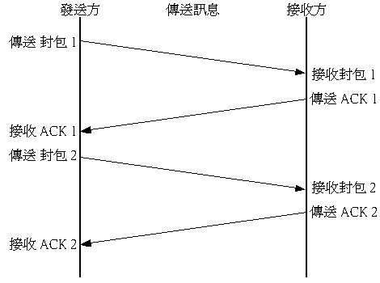

發送端在送出封包之後﹐會起始一個專門針對該封包的計時器﹐當下層網路延遲過久導致封包不能按預估時間獲得接收端的確認信息﹐那麼發送端會認為該封包可能在傳送過程中丟失﹐然後會重新發送該封包、並同時重設計時器﹔如果封包的確認信息在逾時前被接收到﹐則取消該封包的計時器﹐以進行下一封包的傳送。

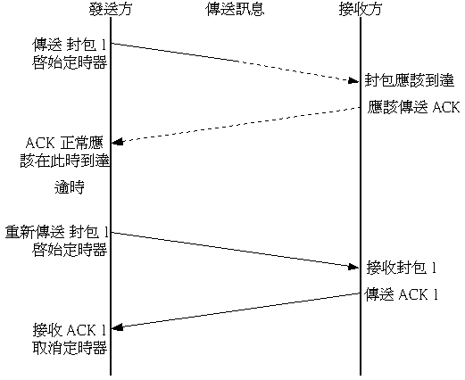

計時器雖然解決了封包丟失的問題﹐但如果封包的抵達只是因為網路延遲的關係沒有在預定時間完成﹐但卻在發送端重發後抵達﹐那麼﹐接收端就有可能接收到重複的封包。為解決這個困繞﹐傳送協定會為每一個封包分配一個序號﹐並要求接收端按封包序號傳回確認信息。這樣﹐當接收端收到封包的時候﹐則可以依據序號判斷封包是否被重複傳送，同時也能正確的重組資料順序﹔而發送端也能根據確認封包的序號來判斷封包是否被正確接收。

## **滑動視窗\(Sliding Window\)**

從剛才介紹的可靠性傳送知識作一個推斷：假如每一個單一封包都需要需要等待前面的封包確認之後才進行傳送的話﹐將會導致整個連線過程時間的增加﹐同時也會造成頻寬的浪費。假如在低速的網路上面﹐或設備延遲﹐甚至還會造成網路處於空閒狀態。有鑒於此﹐聰明的傳送層協定設計者們引入了一個滑動視窗的概念。

我們可以將滑動視窗理解為多重發送和多重確認的技術。它允許發送端在接收到確認信息之前同時傳送多個封包﹐因而能夠更充份的利用網路頻寬和加速資料傳送速度。滑動視窗的操作可以想像為下圖﹕

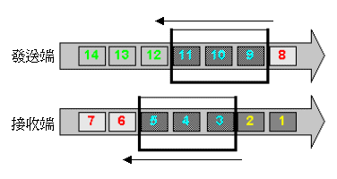

我們利用 Sliding Window 在收發兩端各劃分出一個緩衝範圍\(buffer\)﹐定義了多大的資料量可被打包傳送。在連線建立起來之初﹐兩端都會將 window 的設定值還原到初始值﹐比方說﹕ 3 個封包。發送端一次過發送三個封包出去﹐如果接收端夠順利﹐也能一次處理接收下來的三個封包的話﹐就會向發送端確認全部三個封包，並告知接收端之 window 值為 3 。然後，發送端視窗則會往後移動三個封包﹐填補發送出去之封包的空缺。但如果接收端太忙﹐或是其它因素影響﹐暫時只能處理兩個封包﹐那麼﹐在視窗裡面就剩下一個封包﹐然後就會告訴發送端 window 值為 2。這個時候﹐發送端就只送出兩個封包﹐而視窗就會往後移動兩個封包﹐填補發送出去的空缺。因此，視窗的大小是不固定的，這就是為什麼我們會在視窗前面加上“滑動”字眼的原因了。\(注意：這裡使用封包數目作 window size 是不正確的，僅作例子參考而已。實際上的單位應是位元組，視不同的作業系統而各有不同，一般為 4096 bytes，但也有擴展至 16384 bytes 的。而且視窗的 size 是每個確認封包都不同的，端視當前的緩衝區狀況，其機制比前述複雜許多。\)   
  
在啟動滑動視窗之後﹐封包的傳送看起來如下圖﹕

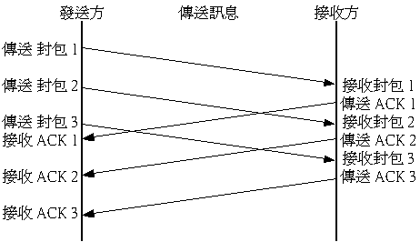

滑動視窗會記住哪些封包已經被確認﹐並且為每一個未被確認的封包保留各自的計時器。如果在逾時後還沒得到該封包的確認﹐則重發該封包。發送端在移動視窗的時候﹐它會移過所有已確認的封包。在視窗中﹐編號最低的封包﹐往往是序列中的第一個未被確認的封包。

## **通訊埠口\(port\)**

大多數的作業系統都提供多工環境﹐允許多個應用程式同時執行﹐在系統術語裡面﹐我們管每一個程式的起止為一個行程。每一個行程都是動態產生的﹐發送端無法預知接收端的某一個行程的實際狀況如何。那麼﹐當一個封包抵達目的地之後﹐接收如何將封包交給正確的行程處理呢﹖ 

在傳送層協定裡面﹐我們為程式產生的行程分配一個通訊埠口﹐其值為一個正正數。當一個應用程式需要建立網路連線的時候﹐傳送層協定就為該應用程式產生的行程建立一個埠口。而事實上，所謂的網路連線，就是兩個通訊埠口之間的連線。關於網路通訊模式的建立有兩種﹕

* 主動連線
* 被動連線

主動連線是當埠口建立之後﹐行程透過該埠口主動發出連線的要求﹔被動模式則是﹐當埠口建立之後﹐行程在該埠口等待連線的請求。在 client/server 的架構之下，連線的建立順序通常是伺服器端先建立好被動連線﹐然後等待客戶端的主動連線。

在技術上﹐行程使用哪一個埠口並不重要﹐關鍵是能讓對方知道埠口是哪一個就行。我們可以把 IP 位址看成主機的門牌號碼﹐而埠口則是服務櫃檯。在多工的環境下﹐行程會在一個門牌上面開啟多個櫃檯。您或許會問：由起始端主動發起之連線封包抵達之後﹐它究竟憑什麼來判斷究竟哪個櫃檯才是正確的行程呢？在日常的生活中﹐大不了逐個櫃檯去問... 然而在網路系統上面﹐這個似乎有點不切實際。因為﹐每一個埠口的建立和關閉都是隨機的﹐在不同的時段裡﹐所開啟的埠口數目和號碼都不盡相同。既然如此﹐等待連線那端何不先將接收行程所使用埠口號碼告知起始端呢？但問題是：既然連線要由起始端主動建立才能連上等待端﹐在沒有真正連上之前如何得知呢？不是雞生蛋、蛋生雞的問題嗎？ 

有見及此﹐在網際網路的實作應用中﹐人們將一些常用的服務程式所使用埠口號碼固定起來。例如﹕21 給 FTP 服務使用﹑23 給 TELNET 服務使用﹑25 給 SMTP 服務使用... 我們稱這樣的埠口為 **Well-Known Port**。在伺服器端﹐這些常用服務會先行建立好被動連線﹐打開所分配的埠口﹐以等待起始端的連線請求。那麼﹐起始端只要在封包填上目的端的埠口值﹐接收端就能將封包傳給正確的服務了， 這也就是透過約定俗成的分配來建立連線。但事實上，您大可架設一個地下網站，故意使用其它非 Well-Known Port 來建立被動連線埠口，這樣，只有那些事先被告知埠口值、且能修改主動連線設定的客戶端才知門而入了。

除了使用 Well-Know Port 讓起始端知道如何建立連線之外﹐傳送協定也允許行程在連線建立之後﹐另行指定新的埠口﹐告知發送端以建立新的連線。例如﹐ftp-data 連線在被動模式下的建立就是一個極佳例子\(請參考其它文件以了解 ftp-data 的被動模式\)。 

無論如何，關於可靠傳輸的一個重要特性，我們不能忘記的一個特性就是﹕**一個連線是雙向的**。在每一個傳送層封包中﹐除了包含目的端的埠口值﹐同時也會附上接收端的來源埠口值。這樣﹐目的端才能將回應資料送返發送端。不過﹐在大多數情況之下﹐起始端所使用的來源埠口都是隨機產生的﹐只有在連線建立的時候才被分配﹐一旦連線結束﹐該埠口也將被釋放。 即使隨後馬上再建立相同的連線，也難以確保所使用的埠口與上一次的一致。事實上，沒有任何人、任何機器、任何程式\(包括建立主動連線的程式\) ，能夠"預知"下一個起始連線會被分配在哪一個埠口之上。我們充其量，只能知到一般客戶端所能建立的埠口值會是 1024 至 65535 之間。也只能知到如此而已，至於具體會是哪個埠口，就沒辦法預知了。請好好記住此一特性，日後在防火牆設定上可是非常有用哦。

## **Socket Pair**

從前面的知識中，我們可以得知，所謂的一個網路連線，事實上就是兩台機器之間的兩個程式之間的連線。我們可以根據 IP 來區別主機、根據埠口\(port\)來區別程式。在 TCP/IP 連線中，這是非常重要的概念，也就是所謂的 **Socket** 啦。

一個 Socket 就是由一個 IP 與一個 Port 來定義的，您可將之視為程式與 TCP/IP 連線之間的界面。準確來說﹐一個連線封包必須有四個元素，也就是所謂的 **Socket Pair**﹕

* 來源位址\(Source Address\)
* 來源埠口\(Source Port\)
* 目的位址\(Destination Address\)
* 目的埠口\(Destination Port\)

任何一個 TCP/IP 封包都肯定帶有這對 Socket 的資訊，缺一不可。然而，來源 Socket 與目的 Socket 卻是相對而言的，若裡開了封包本身的具體連線方向，是沒辦法區分來源與目的的。因為連線是雙向的緣故，若封包從客戶端送往伺服器端，那麼：客戶端為來源、伺服器端為目的﹔若是從伺服器端送往客戶端，則剛好相反。網際網路層依靠位址資訊將封包送抵目的地、處理完畢後將封包交由傳送層處理、然後傳送層則依據埠口值、將封包交由相應的程式處理、至於程式如何處理封包信息﹐那就是應用層所要關心的問題... 這正是我們從 OSI 模型中學到的 "封裝" 概念！

從編程的角度來說﹐程式不必理會底層的封包是如何傳送的﹐只要程式能開啟一個 socket ﹐並能對之進行讀或寫的動作﹐就可以與另一方的程式溝通了。至於 socket 的建立與維護﹐則交給傳送層協定負責。

## **TCP 與 UDP**

在 TCP/ IP 協定家族中﹐傳送層主要有兩個協定﹕TCP 與 UDP。究竟兩者有何不同呢﹖

### TCP

提供的是一個連線導向\(Connection Oriented\)的可靠傳輸﹐前面所介紹的傳送層檢測手續﹐都會在 TCP 中得到實現。

### UDP

則是一個非連線型\(Connectionless\)的非可靠傳輸協定﹐它並不會運用確認機制來保證資料是否正確的被接收、不需要重傳遺失的資料、資料的接收可不必按順序進行、也不提供回傳機制來控制資料流的速度。因此﹐ UDP 信息可能會在網路傳送過程中丟失﹑重複﹑或不依順序﹐而且抵達速度也可能比接收端的處理速度還快。對於某些訊息量較大、時效性大於可靠性的傳輸來說\(比方說語音 / 影像\)，UDP 的確是個不錯的選擇。

從 OSI 模型的封裝原理中我們得知：一個網路封包就是經過層層加封的結果。其中，拿掉 header 的部份，就是 payroll 的空間、也就是上層協定封包及資料。然而，真正交由網路傳送的 IP 封包是有一定的體積限制的 \( IP 封包的最大體積為 65536 bytes \)。由於 UDP 不需要可靠傳輸，因此相較於 TCP 來說，一大堆必需佔據封包表頭的 over head 都可省略，從而換取更大的 payroll 空間。這樣的結果，將令到單一的 IP 封包在作 UDP 連線時所攜載的資料要比 TCP 連線多更多。這是靠犧牲可靠性而換取得來的，若連線需要在 UDP 上作可靠傳輸，那麼，其確認機制將從傳輸層退為應用層進行了、也就是程式本身要提供可靠傳輸機制。

下面﹐我們將分別以 TCP 和 UDP 的封包表頭格式做更進一步的說明﹐以了解這兩個傳送層協定的異同之處。

## **TCP 封包表頭格式**

一個 TCP 封包的表頭包括有如下欄位﹕

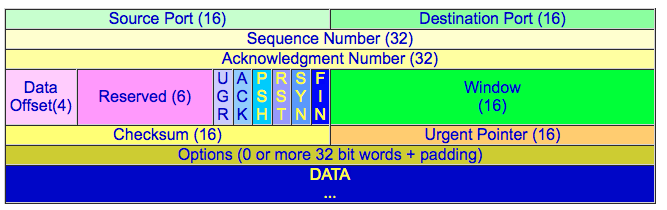

下面是各欄位的名稱和定義﹕ 

### **Source Port & Destination Port**

這就是前述 Socket Pair 中的兩個元素了。下面是一些 Well-Known Port 及其對應的服務名稱﹐有興趣的朋友可以在 Linux 的 /etc/services 這個檔案找到它們﹕

```text
ftp-data    20/tcp
ftp         21/tcp
telnet      23/tcp
smtp        25/tcp      mail
www         80/tcp      http        # WorldWideWeb HTTP
www         80/udp                  # HyperText Transfer Protocol
pop-3       110/tcp                 # POP version 3
pop-3       110/udp
```

每一個 TCP 封包都包含有來源端和目的端的埠口號碼。在 Linux 的實作中﹐ Client 端通常都以大於 1024 的數值作來源埠口號碼。

### **Sequence Number**

封包序號。當資料要從一台主機傳送去另一台主機的時候﹐發送端會為封包建立起一個起始序號﹐然後按照所傳送的資料長度\(位元組數值\)﹐依次的遞增上去﹔根據此一原理，我們可使用遞增之後的值來作為下一個封包的序號。

### **Acknowledge Number**

回應序號。當接收端接收到 TCP 封包並通過檢驗確認之後﹐會依照發送序號、再加上資料長度產生一個回應序號﹐附在下一個回應封包送回給對方\(無需額外的送出專門的確認封包\)﹐這樣接收端就知道剛才的封包已經被成功接收到了。

假如基於網路狀況或其它原因﹐當封包的計時器達到期限時﹐接收端還沒接收到回應序號﹐就會認為該封包丟失了並加以重送。但如果剛好重發封包之後才接收到回應呢﹖這時候接收端就會根據序號來判斷該封包是否被重複發送﹐如果是的話﹐很簡單﹐將之丟棄不做任何處理就是了。

由此可見﹐Sequence 和 Acknowledge 是 TCP 傳送中的重要檢測手段﹐下面我們以一個模擬實例來看看這對號碼是如何工作的。

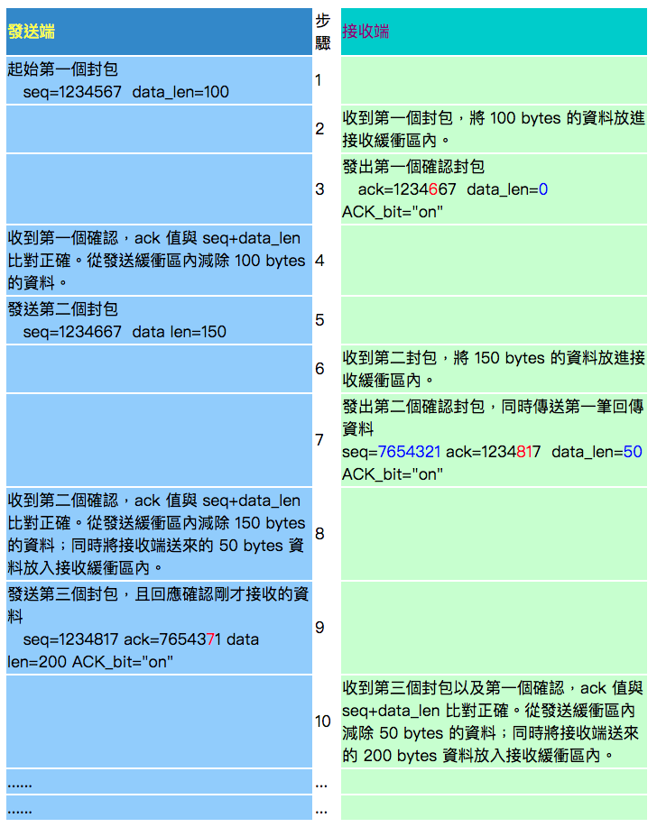

這樣的設計除了能規範封包順序以進行資料重組之外﹐還有另一個非常有用的功能：  **TCP 的確認會指出接收端下一個期望接收到的位元組序號**。請好好記住這個工作原理，某些 state list 防火牆正是利用此一特性以低禦 spoofing 及 hijack 。

### **Data Offset \(HLEN\)**

這是用來記錄表頭長度用的﹐和 IP 封包的 IHL 差不多﹕如果 options 沒設定的話﹐其長度就是 20 bytes ﹐用十六進位表示就是 0x14 了﹐如果以 double word 長度來表示﹐則為 5 。

### **Reserved**

這是保留區間﹐暫時還沒被使用。

### **Contral Flag**

控制旗標。一個有六個﹐它們分別是﹕

**Urgent data**  
當 URG 被設定為 1 的時候﹐就表示這是一個攜有緊急資料的封包，接收端需優先處理。

**Acknowledge field significant**  
當 ACK 為 1 的時候﹐表示此封包的 Acknowledge Number 是有效的﹐也就是用來回應上一個封包。一般都會為 1。剛才介紹 Sequence 和 Acknowledge 的例子中﹐只有第一個封包沒有設。

**Push function**  
如果 PSH 為 1 的時候﹐該封包連同傳送緩衝區的其它封包應立即進行傳送，而無需等待緩衝區滿了才送。接收端必須儘快將此資料交給程式處理。

**Reset**  
如果 RST 為 1 的時候﹐連線會被馬上結束，而無需等待終止確認手續。

**Synchronize sequence number**  
如果 SYN 為 1 時﹐表示要求雙方進行同步處理﹐也就是要求建立連線。

**No more data fro sender \(Finish\)**   
如果封包的 FIN 為 1 的時候﹐就表示傳送結束﹐然後雙方發出結束回應﹐進而正式進入 TCP 傳送的終止流程。

您或許有聽過 TCP/IP 的 Three-Way Handshake ，事實上就是靠上面這幾個旗標來標識封包的。TCP 拹定之所以被認為是一個可靠的連線導向傳輸協定，正是因為它有一套嚴緊的連線建立與結束的機制來確保其可靠性。以 Three-Way HandShake 來說，它是 TCP 連線建立的前提：只有通過 handshake 才能進入真正的連線建立狀態，否則不能建立連線。我們可從下圖看出 Three-Way Handshake 的建立過程：

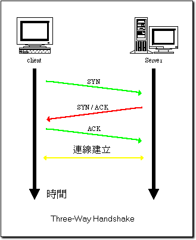

### **Window**

這個就是我們在上前面介紹的“滑動視窗”了﹐在 TCP 封包表頭的這個欄位﹐可得知對方目前的接收緩衝區大小\( bytes \)，從而決定下一個傳送 Window 的大小。

### **Checksum**

當資料要傳送出去的時候﹐發送端會對資料進行一個校驗的動作﹐然後將校驗值填在這裡﹔當接收端收到封包之後﹐會再對資料進行校驗﹐再比對校驗值是否一致。若結果不一致則認為資料已損毀﹐並要求對方重送。

### **Urgent Pointer**

前面講到 Control Flag 的時候我們提到一個 URG 的旗標﹐如果URG 被設定為 1 的時候﹐那這裡就會指示出緊急資料所在位置。不過這種情形非常少見﹐例如當資料流量超出頻寬的時候﹐系統要求網路主機暫緩發送資料﹐所有主機收到這樣的信息﹐都需要優先處理。此時接收端會進入緊急狀態，當緊急資料處理完畢後﹐接收端就會回復正常的接收狀態。

### **Option**

這個選項比較少用。當那些需要同步動作的程式﹐如 Telnet ﹐要處理好終端的交互模式﹐就會使用到 option 來指定資料封包的大小﹐因為 telnet 使用的資料封包都很少﹐但又需要即時回應。

Option 的長度要麼是 0 ﹐要麼就是 32bit 的整倍數﹐即使資料不足數﹐也要使用表頭中沒有的資料來填夠。

## **UDP 封包表頭格式**

因為 UDP 是一種非可靠、非連線型的傳輸協定，因此無須像 TCP 那樣提供額外的欄位來控制傳輸可靠性。比起 TCP 來說，UDP 的封包表頭可精簡多了：

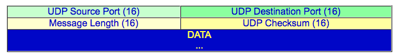

### **Source Port & Destination Port**

跟 TCP 的 Port 一樣：就是 Socket Pair 中的兩個元素，只是給那些透過 UDP 傳送資料的程式使用而已。可在 Linux 的 /etc/services 這個檔案找到各自 Well-Known Port。

### **Message Length**

整個 UDP 封包的長度，以位元組為單位\( byte \)，最小值為 8 。

### **Checksum**

封包及資料的校驗值，跟 TCP 的 checksum 功能一樣，用作資料完整性的檢測依據。然而，關於 UDP 的 checksum 計算卻有點複雜，因為其值必需連同一個所謂的 **UDP 虛擬表頭**\(UDP Pseudo Header\) 一起計算的。虛擬表頭如下：

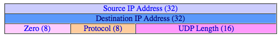

之所以稱為虛擬，是因為其中的 Source IP Address 與 Destinatin IP Address 並不出現在 UDP 封包中，而是在 IP 封包中。但在進行校驗的時侯，發送端與接收端則根據此 "虛擬" 的表頭及資料進行。然而，此表頭是不會出現在任何封包中的。

## **TCP 還是 UDP ?**

如前所述，TCP 與 UDP 主要的差異在於是否提供可靠性傳輸。其真正目的是為上層應用程式提供不同的傳輸選擇：

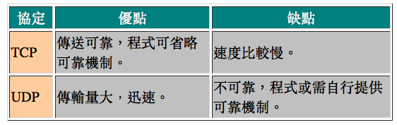

因此，不同的應用程式協定，會跟據自身的資料特性來決定其所需的傳輸服務。在整個 TCP/IP 協定家族中，其層階關係如下圖：

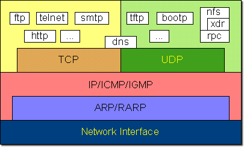

請再次運用所學的 OSI 模型原理，好好理解 TCP/IP 協定之層級關係，自然就有更明晰的觀念了。若您懂得運用工具分析封包結構，將更有幫助。如下圖，是我在 Windows 上用 netxray 抓到的一個封包，看您是否能解讀出其中的欄位？

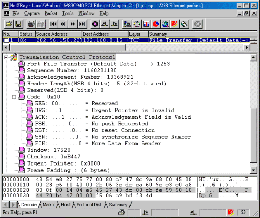

## **TCP 協定之 RFC 文件**

RFC-793﹑RFC-1122﹑RFC-813﹑RFC-879﹑RFC-896

## **UDP 協定之 RFC 文件**

RFC-768

## 練習

1. 請簡單描述傳輸協定的功能。
2. 請概括說明可靠性傳輸服務之要求有哪些。
3. 請簡單描述可靠性傳輸的確認機制。
4. 請問何謂滑動視窗？請描述其必要性及工作原理。
5. 請問埠口的作用是甚麼？何謂 Well-Know Port ？
6. 請說明主動連線及被動連線的差異。
7. 請問 Socket Pare 的元素有哪些，並說明雙向連線中的 Socket 名稱。
8. 請簡單說說 TCP 與 UDP 這兩個傳輸拹定之差異。
9. 請畫出 TCP 與 UDP 表頭的每一個欄位，並逐一加以說明。
10. 請以實例來分析 TCP 表頭的 Sequence 與 Acknowledge 欄位的工作原理。
11. 請簡單描述 Three-Way Handshake 的過程，及 TCP 旗標的狀態。
12. 請說明 UDP 虛擬表頭與 UDP Checksum 的關係。
13. 請償試以圖表方式畫出 TCP/IP 協定家族的層階關係。
14. 請以實作方式，運用封包分析工具來觀察與解讀 TCP 和 UDP 封包的結構。

