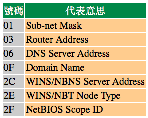
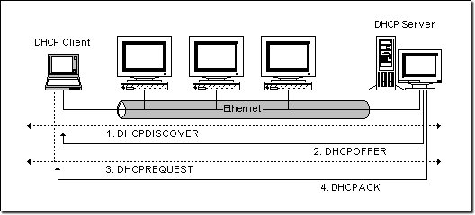
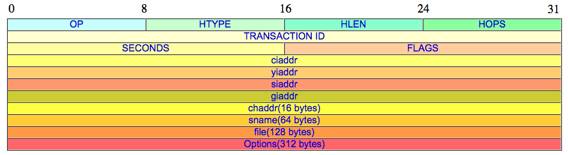
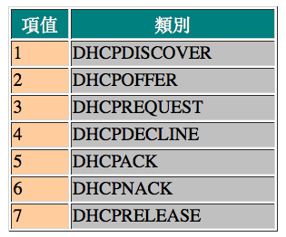

# 2-8 DHCP 協定

經過了前面的學習，相信您不再認為設定與管理 TCP/IP 網路是件輕鬆的事情。要成功的將您的網路用 TCP/IP 連接起來，您就得為每台電腦設定 IP、mask、gateway、等等繁瑣的事情。要是您想管理好一個比較大的網路﹐或是電腦節點經常改變\(如手提電腦或撥接\)﹐這樣的工作可以說是非常令人討厭的﹐而且出錯的機會也比較多。要是，萬一日後要進行 IP 重新規劃﹐其工作量也是相當驚人的。

面對這些情形﹐DHCP 可以說您的菩薩了﹕它不但救苦救難﹐而且神通廣大。

## **什麼是 DHCP？**

DHCP 是 Dynamic Host Configuration Protocol 之縮寫﹐它的前身是 **BOOTP**。BOOTP 原本是用於無磁碟主機連接的網路上面的﹕網路主機使用 BOOT ROM 而不是磁碟起動並連接上網路﹐BOOTP 則可以自動地為那些主機設定 TCP/IP 環境。但 BOOTP 有一個缺點：您在設定前須事先獲得客戶端的硬體位址，而且，與 IP 的對應是靜態的。換而言之，BOOTP 非常缺乏 "動態性" ，若在有限的 IP 資源環境中，BOOTP 的一對一對應會造成非常可觀的浪費。

DHCP 可以說是 BOOTP 的增強版本﹐它分為兩個部份﹕一個是**伺服器端**﹐而另一個是**客戶端**。所有的 IP 網路設定資料都由 DHCP 伺服器集中管理﹐並負責處理客戶端的 DHCP 要求﹔而客戶端則會使用從伺服器分配下來的IP環境資料。比較起 BOOTP ，DHCP 透過 "租約" 的概念，有效且動態的分配客戶端的 TCP/IP 設定，而且，作為兼容考量，DHCP 也完全照顧了 BOOTP Client 的需求。

## **DHCP 的分配形式**

首先﹐必須至少有一台 DHCP 工作在網路上面﹐它會監聽網路的 DHCP 請求﹐並與客戶端搓商 TCP/IP 的設定環境。它提供兩種 IP 定位方式﹕

### **Automatic Allocation**

自動分配﹐其情形是﹕一旦 DHCP 客戶端第一次成功的從 DHCP 伺服器端租用到 IP 位址之後﹐就永遠使用這個位址。

### **Dynamic Allocation**

動態分配﹐當 DHCP 第一次從 HDCP 伺服器端租用到 IP 位址之後﹐並非永久的使用該位址﹐只要租約到期﹐客戶端就得釋放\(release\)這個 IP 位址﹐以給其它工作站使用。當然﹐客戶端可以比其它主機更優先的延續\(renew\)租約﹐或是租用其它的 IP 位址。

動態分配顯然比自動分配更加靈活﹐尤其是當您的實際 IP 位址不足的時候﹐例如﹕您是一家 ISP ﹐只能提供 200 個IP位址用來給撥接客戶﹐但並不意味著您的客戶最多只能有 200 個。因為要知道﹐您的客戶們不可能全部同一時間上網的﹐除了他們各自的行為習慣的不同﹐也有可能是電話線路的限制。這樣﹐您就可以將這 200 個位址﹐輪流的租用給撥接上來的客戶使用了。這也是為什麼當您查看 IP 位址的時候﹐會因每次撥接而不同的原因了\(除非您申請的是一個固定 IP ﹐通常的 ISP 都可以滿足這樣的要求﹐這或許要另外收費\)。當然﹐ISP 不一定使用 DHCP 來分配位址﹐但這個概念和使用 IP Pool 的原理是一樣的。

DHCP 除了能動態的設定 IP 位址之外﹐還可以將一些 IP 保留下來給一些特殊用途的機器使用﹐它可以按照硬體位址來固定的分配 IP 位址﹐這樣可以給您更大的設計空間。同時﹐DHCP 還可以幫客戶端指定 router﹑netmask﹑DNS Server﹑WINS Server﹑等等項目﹐您在客戶端上面﹐除了將 DHCP 選項打勾之外﹐幾乎無需做任何的 IP 環境設定。

## **DHCP 的工作原理**

視乎客戶端是否第一次登錄網路﹐DHCP 的工作形式會有所不同。

**第一次登錄的時候：**

### **尋找 Server**

當 DHCP 客戶端第一次登錄網路的時候﹐也就是客戶發現本機上沒有任何 IP 資料設定﹐它會向網路發出一個 **DHCPDISCOVER** 封包。因為客戶端還不知道自己屬於哪一個網路﹐所以封包的來源位址會為 0.0.0.0 ﹐而目的位址則為 255.255.255.255 ﹐然後再附上 Dhcpdiscover 的信息﹐向網路進行廣播。

在 Windows 的預設情形下，Dhcpdiscover 的等待時間預設為 1 秒﹐也就是當客戶端將第一個 Dhcpdiscover 封包送出去之後﹐在 1 秒之內沒有得到回應的話﹐就會進行第二次 Dhcpdiscover 廣播。若一直得不到回應的情況下﹐客戶端一共會有四次 Dhcpdiscover 廣播\(包括第一次在內\)﹐除了第一次會等待 1 秒之外﹐其余三次的等待時間分別是 9﹑13﹑16 秒。如果都沒有得到 DHCP 伺服器的回應﹐客戶端則會顯示錯誤信息﹐宣告 Dhcpdiscover 的失敗。之後﹐基於使用者的選擇﹐系統會繼續在 5 分鐘之後再重複一次 Dhcpdiscover 的過程。

### **提供 IP 租用位址**

當 DHCP 伺服器監聽到客戶端發出的 Dhcpdiscover 廣播後﹐它會從那些還沒有租出的位址範圍內﹐選擇最前面的的空置 IP ，連同其它 TCP/IP 設定，回應給客戶端一個 **DHCPOFFER** 封包。

由於客戶端在開始的時候還沒有 IP 位址﹐所以在其 Dhcpdiscover 封包內會帶有其 MAC 位址信息﹐並且有一個 XID 編號來辨別該封包﹐DHCP 伺服器回應的 Dhcpoffer 封包則會根據這些資料傳遞給要求租約的客戶。根據伺服器端的設定﹐Dhcpoffer 封包會包含一個租約期限的信息。

### **接受 IP 租約**

如果客戶端收到網路上多台 DHCP 伺服器的回應﹐只會挑選其中一個 Dhcpoffer 而已\(通常是最先抵達的那個\)﹐並且會向網路發送一個**Dhcprequest**廣播封包﹐告訴所有 DHCP 伺服器它將指定接受哪一台伺服器提供的 IP 位址。

同時﹐客戶端還會向網路發送一個 ARP 封包﹐查詢網路上面有沒有其它機器使用該 IP 位址﹔如果發現該 IP 已經被佔用﹐客戶端則會送出一個 **DHCPDECLINE** 封包給 DHCP 伺服器﹐拒絕接受其 Dhcpoffer ﹐並重新發送 Dhcpdiscover 信息。 

事實上﹐並不是所有 DHCP 客戶端都會無條件接受 DHCP 伺服器的 offer ﹐尤其這些主機安裝有其它 TCP/IP 相關的客戶軟體。客戶端也可以用 Dhcprequest 向伺服器提出 DHCP 選擇﹐而這些選擇會以不同的號碼填寫在 DHCP Option Field 裡面﹕

換一句話說﹐在 DHCP 伺服器上面的設定﹐未必是客戶端全都接受﹐客戶端可以保留自己的一些 TCP/IP 設定。而主動權永遠在客戶端這邊。

### **租約確認**

當 DHCP 伺服器接收到客戶端的 Dhcprequest 之後﹐會向客戶端發出一個 **DHCPACK** 回應﹐以確認 IP 租約的正式生效﹐也就結束了一個完整的 DHCP 工作過程。

如上的工作流程如下圖：

**第一次登錄之後**﹕

一旦 DHCP 客戶端成功地從伺服器哪裡取得 DHCP 租約之後﹐除非其租約已經失效並且 IP 位址也重新設定回 0.0.0.0 ﹐否則就無需再發送 Dhcpdiscover 信息了﹐而會直接使用已經租用到的 IP 位址向之前之 DHCP 伺服器發出 Dhcprequest 信息﹐DHCP 伺服器會儘量讓客戶端使用原來的 IP 位址﹐如果沒問題的話﹐直接回應 Dhcpack 來確認則可。如果該位址已經失效或已經被其它機器使用了﹐伺服器則會回應一個 **DHCPNACK**封包給客戶端﹐要求其從新執行 Dhcpdiscover。

至於 IP 的租約期限卻是非常考究的﹐並非如我們租房子那樣簡單﹐ 以 NT 為例子﹕DHCP 工作站除了在開機的時候發出 dhcprequest 請求之外﹐在租約期限一半的時候也會發出 dhcprequest ﹐如果此時得不到 DHCP 伺服器的確認的話﹐工作站還可以繼續使用該 IP ﹔然後在剩下的租約期限的再一半的時候\(即租約的75%\)﹐還得不到確認的話﹐那麼工作站就不能擁有這個 IP 了。至於為什麼不是到租約期限完全結束才放棄 IP 呢﹖﹐對不起﹐小弟也是不學無術之人﹐沒有去深究了﹐只知道要回答 MCSE 題目的時候﹐您一定要記得 NT 是這麼工作的就是了。

要是您想退租，可以隨時送出 DHCPLEREASE 命令解約﹐就算您的租約在前一秒鐘才獲得的。

## **跨網路的 DHCP 運作**

從前面描述的過程中，我們不難發現：DHCDISCOVER 是以廣播方式進行的，其情形只能在同一網路之內進行﹐因為 router 是不會將廣播傳送出去的。但如果 DHCP 伺服器安設在其它的網路上面呢﹖由於 DHCP 客戶端還沒有 IP 環境設定﹐所以也不知道 Router 位址﹐而且有些 Router 也不會將 DHCP 廣播封包傳遞出去﹐因此這情形下 DHCPDISCOVER 是永遠沒辦法抵達 DHCP 伺服器那端的，當然也不會發生 OFFER 及其他動作了。要解決這個問題，我們可以用 DHCP Agent \(或 DHCP Proxy \)主機來接管客戶的 DHCP 請求﹐然後將此請求傳遞給真正的 DHCP 伺服器﹐然後將伺服器的回覆傳給客戶。這裡﹐Proxy 主機必須自己具有路由能力，且能將雙方的封包互傳對方。

若不使用 Proxy，您也可以在每一個網路之中安裝 DHCP 伺服器﹐但這樣的話﹐一來設備成本會增加﹐而且﹐管理上面也比較分散。當然囉﹐如果在一個十分大型的網路中﹐這樣的均衡式架構還是可取的。端視您的實際情況而定了。

## **DHCP 封包格式**

  
以下為各欄位的簡要說明：

**OP**  
若是 client 送給 server 的封包，設為 1 ，反向為 2 。

**HTYPE**  
硬體類別，Ethernet 為 1 。

**HLEN**  
硬體位址長度， Ethernet 為 6 。

**HOPS**  
若封包需經過 router 傳送，每站加 1 ，若在同一網內，為 0 。

**TRANSACTION ID**  
DHCPREQUEST 時產生的數值，以作 DHCPREPLY 時的依據。

**SECONDS**  
Client 端啟動時間\(秒\)。

**FLAGS**  
從 0 到 15 共 16 bits ，最左一 bit 為 1 時表示 server 將以廣播方式傳送封包給 client ，其餘尚未使用。

**ciaddr**  
要是 client 端想繼續使用之前取得之 IP 位址，則列於這裡。

**yiaddr**  
從 server 送回 client 之 DHCPOFFER 與 DHCPACK 封包中，此欄填寫分配給 client 的 IP 位址。

**siaddr**  
若 client 需要透過網路開機，從 server 送出之 DHCPOFFER、DHCPACK、DHCPNACK 封包中，此欄填寫開機程式碼所在 server 之位址。

**giaddr**  
若需跨網域進行 DHCP 發放，此欄為 relay agent 的位址，否則為 0 。

**chaddr**  
Client 之硬體位址。

**sname**  
Server 之名稱字串，以 0x00 結尾。

**file**  
若 client 需要透過網路開機，此欄將指出開機程式名稱，稍後以 TFTP 傳送。

**options**  
允許廠商定議選項\(Vendor-Specific Area\)，以提供更多的設定資訊\(如：Netmask、Gateway、DNS、等等\)。其長度可變，同時可攜帶多個選項，每一選項之第一個 byte 為資訊代碼，其後一個 byte 為該項資料長度，最後為項目內容。

允許廠商定議選項\(Vendor-Specific Area\)，以提供更多的設定資訊\(如：Netmask、Gateway、DNS、等等\)。其長度可變，同時可攜帶多個選項，每一選項之第一個 byte 為資訊代碼，其後一個 byte 為該項資料長度，最後為項目內容。

此欄位完全兼容 BOOTP ，同時擴充了更多選項。其中，DHCP 封包可利用編碼為 0x53 之選項來設定封包類別：

DHCP 的選項非常多，有空請查閱 RFC 或相關文獻，並好好理解，這裡不再敘述了。

## **DHCP 協定之 RFC 文件**

RFC-951﹑RFC-1084﹑RFC-1123﹑RFC-1533﹑RFC-1534﹑RFC-1497﹑RFC-1541

## 練習

1. 請問 DHCP 的前身是甚麼？還有，DHCP 是做甚麼用的？
2. 請列舉 DHCP 的分配形式，並加以說明。
3. 請詳述 DHCP 的發放流程，並留意不同階段所用的封包類型。
4. 請用圖畫出 DHCP 的簡單發放流程。
5. 請問跨網路的 DHCP 是如何運作的？
6. 請繪 DHCP 的封包結構，並嘗試簡述每一欄位的意思。
7. 請說明編碼為 0x53 至 DHCP Options 有哪些值，及其代表含意。

