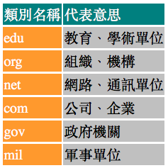
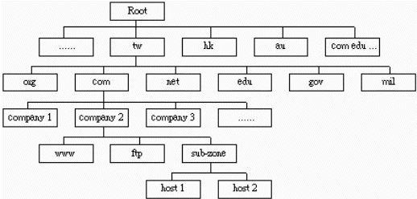
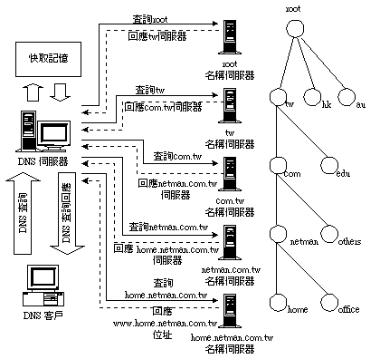
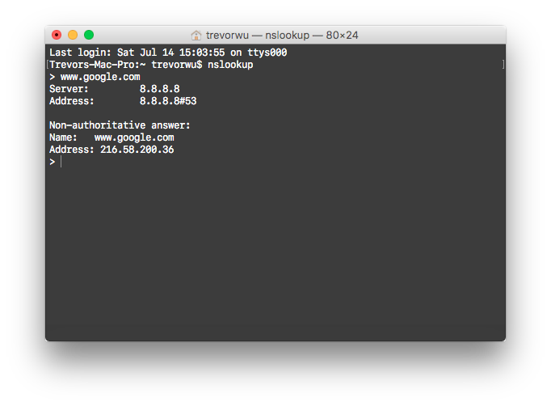

# 2-9 DNS 協定

## **DNS 的來由**

如果您為您的機器設定過 internet 連線﹐那麼您一定接觸過 DNS 了﹐但 DNS 又是什麼東東呢﹖  
說穿了﹐DNS 是用來幫助記憶網路位址的﹐完全是為了遷就人類的記憶思維而設的。

DNS 的全稱是 Domain Name System（或 Service） ﹐當您連上一個網址﹐在URL打上﹕www.google.com 的時候﹐可以說就是使用了 DNS 的服務了。但如果您知道這個 www.google.com 的 IP 位址﹐直接輸入 ~~216.239.53.101~~ 172.217.160.68 也同樣可以到達這個網址。其實﹐電腦使用的只是 IP 位址而已（最終也是 0 和 1 啦）﹐這個 www.google.com 只是讓人們容易記憶而設的。因為我們人類﹐對一些比較有意義的文字記憶\(如﹕www.google.com\)﹐比記憶那些毫無頭緒的號碼（如﹕172.217.160.68）﹐往往容易得多。DNS 的作用就是為我們在文字和 IP 之間擔當了翻譯﹐而免除了強記號碼的痛苦。

假如您的電話有名字記憶功能﹐您只需知道對方的名字﹐就可以撥號給友人了﹐我們可以說﹐這電話也具備如 DNS 的功能了呢﹗但是﹐我們在網路中使用的 DNS 系統﹐就是這麼簡單嗎﹖非也﹐複雜得很呢﹗下面﹐就讓我們一起去探索一下 DNS 的奧秘﹕

在早期的 IP 網路世界裡面﹐每台電腦都只用 IP 位址來表示﹐不久人們就發現這樣很難記憶﹐於是﹐一些 UNIX 的管理者﹐就建立一個 HOSTS 對應表﹐將 IP 和主機名字對應起來﹐這樣﹐用戶只需輸入電腦名字﹐就可以代替 IP 來進行溝通了。如果你安裝了 Linux 系統﹐在 /etc 下面就可以找到這個 hosts 檔案﹔在 NT 的系統裡﹐你也可以在C磁碟下的 windows\system32\drivers\etc 下面找到它。不過這個 HOSTS 檔是要由管理者手工維護的﹐最大的問題是無法適用於大型網路﹐而且更新也是件非常頭痛的事情。這就是 DNS 大派用場的時候了。


編輯Host請愛用Notepad++，內建的記事本要改一堆權限才能對Host進行修改


## **DNS 的結構**

DNS 是一個分層級的分散式名稱對應系統﹐有點像電腦的目錄樹結構﹕在最頂端的是一個“root”﹐然後其下分為好幾個基本類別名稱﹐如﹕com﹑org﹑edu 等﹔再下面是組織名稱﹐如﹕ibm﹑microsoft﹑intel 等﹔繼而是主機名稱﹐如﹕www﹑mail﹑ftp 等。因為當初 internet 是從美國發展起的﹐所以當時並沒有國域名稱﹐但隨著後來 internet 的蓬勃發展﹐DNS 也加進了諸如 tw﹑hk﹑cn 等國域名稱。所以一個完整的 dns 名稱就好像是這樣的﹕www.xyz.com.tw﹐而整個名稱對應的就是一個\(或多個\) IP 位址了。

在早期的設計下﹐root 下面只有六個組織類別﹕



不過﹐自從組織類別名稱開放以後﹐各種各樣五花八門的名稱也相繼涌現出來了﹐但無論如何﹐取名的規則最好儘量適合網站性質。除了原來的類別資料由美國本土的 NIC\(Network Information Center\) 管理之外﹐其它在國域以下的類別分別由該國的 NIC 管理\(比方說台灣的 DNS 將授權給 TWNIC 來管理\)。這樣的結構看起來就像這樣﹕



在結構中﹐各組織的 DNS 經過申請後由該組織或其委託主機管理\(通常當您申請註冊一個 domain 域名稱的時候﹐都要指定兩台 DNS 主機負責該域名的 DNS 管理\)。

## **DNS 的運作**

在我們設定 IP 網路環境的時候﹐都要告訴每台主機關於 DNS 伺服器的位址\(我們可以手動的在每一台主機上面設置﹐也可以使用 DHCP 來指定\)。但這設定的義意何在呢？從前面的介紹我們或可知道：其目的就是請 DNS 幫忙解析主機名稱與 IP 位址啦。在這個設定過程中，DNS 被稱為 resolver \(也就是負責解析的 DNS Server\)，而被設定主機，則只是單純的 DNS Client 了，也就是提出解析請求的主機。

下面讓我們看看 DNS 是怎樣運作的﹕

1. 當被詢問到有關本域名之內的主機名稱的時候﹐DNS 伺服器會直接做出回答﹔
2. 客戶端向伺服器提出查詢項目﹔
3. 當被詢問到有關本域名之內的主機名稱的時候﹐DNS 伺服器會直接做出回答﹔ 
4. 如果所查詢的主機名稱屬於其它域名的話﹐會檢查快取記憶體\(Cache\)﹐看看有沒有相關資料﹔
5. 如果沒有發現﹐則會轉向 root 伺服器查詢﹔
6. 然後 root 伺服器會將該域名之下一層授權\(authoritative\)伺服器的位址告知\(可能會超過一台\)﹔
7. 本地伺服器然後會向其中的一台伺服器查詢﹐並將這些伺服器名單存到記憶體中﹐以備將來之需\(省卻再向 root 查詢的步驟\)﹔
8. 遠方伺服器回應查詢﹔
9. 若該回應並非最後一層的答案，則繼續往下一層查詢，直到獲的客戶端所查詢的結果為止﹔
10. 將查詢結果回應給客戶端﹐並同時將結果儲存一個備份在自己的快取記憶裡面﹔
11. 如果在存放時間尚未過時之前再接到相同的查詢﹐則以存放於快取記憶裡面的資料來做回應。

從這個過程我們可以看出﹐沒有任何一台 DNS 主機會包含所有域名的 DNS 資料﹐資料都是分散在全部的 DNS 伺服器中﹐而 NIC 只需知道各 DNS 伺服器位址就可以了。

為了更好地理解一下 DNS 的運作﹐讓我們用下圖看看查詢 www.home.netman.com.tw 這台主機位址的過程﹕



在這個例子中﹐www.home.netman.com.tw 台主機的 DNS 對應資料﹐是由負責 home.netman.com.tw 這個域名的 DNS 伺服器管理的。\(在 DNS 術語中﹐我們稱一個域名為“zone”﹐這個 zone 可以是您從 NIC 申請回來的域名﹐也可以是從該域名之下延伸出來的“sub-zone”\)。在這台 DNS 伺服器上面﹐必須有一個關於 home.netman.com.tw 這個 zone 的檔案﹐而這檔案裡面必須有一筆關於 www 的記錄\(任何主機都是以“記錄”來表示，稱為 Resource Record\)。這個記錄可以為一個 IP 位址﹐也可以以別名形式來對應一台主機名稱﹐但無論如何﹐所對應的主機名稱最終是要被一個 IP 位址所對應著就是了。

同時﹐DNS 還能提供“反查詢”\(reverse lookup\) 功能﹐也就是以 IP 來查詢主機名稱。網路上面的許多服務﹐如﹕FTP, SMTP﹑等等﹐都需要到這個功能。其實﹐DNS 服務本身就必須要使用反查詢功能﹐而且在設定上﹐也必須要為每個網路建立起 reverse zone。雖然有些人發覺即使沒有 reverse zone 也可以使用到 DNS 服務﹐但其中弊端卻不容易被察覺到﹐在這個\(中文\)網頁﹕http://dnsrd.nctu.edu.tw/Basic/WhenToUse-Rev.html 上面﹐您可以看到忽略 revers zone 所致一些問題。

## **DNS 的名稱記錄**

事實上﹐DNS 不僅僅是用來解釋位址用的﹐而且還可以回答更多關於網路和主機的其它信息﹐其中很重要的一個功能就是可以供郵件系統進行路由。這些資料﹐通常會以不同的“記錄”名稱出現在DNS的資料檔案中。下面讓我們參考一個 Linux 的 DNS 檔案﹐看看這些記錄是如何表示的﹕

```text
;
; Zone file for siyongc.domain
;
; Then full zone file
;
$TTL 86400
@  IN	SOA	redhat52.siyongc.domain. netman.siyongc.domain. (
			1999092801	; serial
			8H		; refresh
			2H		; retry
			1W		; expire
			1D )		; minimun
;
	IN	TXT	"A test domain, created by Netman"
	IN	NS	redhat52
	IN	NS	debian.home
	IN	MX	10	redhat52.siyongc.domain.
	IN	MX	20	debian.home
;
localhost	IN	A	127.0.0.1
﹔
gw	IN	A	192.168.0.17
	IN	HINFO	"Redhat" "MASQ"
	IN	TXT	"The masquerade gateway to internet"
﹔
redhat52	IN	A	192.168.0.17
	IN	MX	10	redhat52
	IN	MX	20	debian.home
	IN	HINFO	"Dell PII 266" "Linux RedHat"
www	IN	CNAME	redhat52
mail	IN	CNAME	redhat52
ftp	IN	CNAME	redhat52
news	IN	CNAME	redhat52
smtp	IN	CNAME	redhat52
﹔
pii266	IN	A	192.168.0.15
	IN	MX	10	redhat52.siyongc.domain.
	IN	MX	20	debian.home.
﹔
slware36	IN	A	192.168.0.18
	IN	MX	10	redhat52.siyongc.domain.
	IN	MX	20	debian.home.
﹔
rhroute	IN	A	192.168.0.4
	IN	MX	10	redhat52.siyongc.domain.
	IN	MX	20	debian.home.
﹔
home	IN	ns	debian.home.siyongc.domain.
debian.home	IN	A	10.0.2.101
```

我們姑且不理會開頭那幾行的意思﹐那是給 DNS 系統本身使用的\(我將會在“學習 Linux”文章裡面再詳細討論\)﹐這裡我們只是看看幾個記錄名稱而已﹕


## **分擔 DNS 工作**

由於 DNS 的重要性日益顯著，為提高其容錯能力及查詢效能，我們在架設某一單一 zone 的時侯，常以多台伺服器來負責該 zone 的服務。其中，我們必需指定一台 Primary\(master\) DNS 伺服器，它是架設在某一個網域下被主要授權並控制所有名稱記錄的主控伺服器﹐管轄著該網域的所有記錄資料﹐這些記錄資料只有 primary\(master\) 可以修改。

但如果在一個比較大型的網路中﹐DNS 伺服器就會變得很繁忙﹐所以您可以設定多個 DNS 來分擔 master 的工作﹐但您或許不願意到每一個 DNS 伺服器去更新資料吧﹖而且就算您願意這樣做﹐也容易出現錯誤或資料不同步的情形。這樣您可以設定其它的伺服器為 secondary \(slave\) DNS 來複製 master 上面的記錄資料﹐這樣﹐其它的電腦可以被分派到不同的 DNS 做查詢﹐既可以分擔 master 的工作﹐而且資料也可以自動進行同步工作。為確保資料的一致性，master 每次更新過資料後會以 notify 機制主動通知 slave 前來同步。此外，您可以設定 DNS 資料同步的時間間隔﹐在 dns 檔案中的 Refresh 設定就是了。在檔案中，您還會看到 Serial ﹐當 slave 的上面的 serial 數字少於它﹐資料就會被複製﹐否則會被忽略。

## **驗證 DNS 工作**

當您建立好一個 DNS 伺服器之後﹐除了可以直接使用命令 ping 直接 ping 一下上面的記錄之外﹐最好還是使用“nslookup”這個命令進行檢測或除錯﹐\(Windows9x系統並不包含此命令\)。下面讓我們在 Linux 中驗證一下﹕當您輸入 nslookup 之後﹐您會看到您機器目前指定的 DNS 伺服器的回應﹕

```text
Default Server:  redhat52.siyongc.domain
Address:  192.168.0.17
```

然後您輸入欲查詢的主機或 IP 位址﹐您會看到從 DNS 回來的結果﹕

```text
> pii266.siyongc.domain
Server:  redhat52.siyongc
Address:  192.168.0.17

Name:    pii266.siyongc.domain
Address:  192.168.0.15  

> www.hinet.net 
Server:  redhat52.siyongc.domain
Address:  192.168.0.17

Non-authoritative answer:
Name:    w3c2.hinet.net
Address:  168.95.1.84
Aliases:  www.hinet.net
```

這是一個標準模式下面的查詢﹐我們可以看到﹕不是這台 DNS 伺服器管理的查詢﹐而且已經在 cache 裡面的話﹐會附加一個﹕“Non-authoritative answer:”的回應信息。因為在 cache 中的資料未必與真正授權主機上的一致。


如下圖，於 macOS 中輸入 nslookup ，並且輸入 www.google.com 作為測試




若想查詢更多資訊，我們可將查詢模式設為 any 之後﹐再輸入同樣的主機名稱試試看﹕

```text
> set q=any
> pii266.siyongc.domain
Server:  redhat52.siyongc.domain
Address:  192.168.0.17

pii266.siyongc.domain  preference = 20, mail exchanger = debian.home
pii266.siyongc.domain  preference = 10, mail exchanger = redhat52.siyongc.domain
pii266.siyongc.domain  internet address = 192.168.0.15
siyongc.domain nameserver = debian.home
siyongc.domain nameserver = redhat52.siyongc.domain
debian.home     internet address = 192.168.0.2
redhat52.siyongc.domain        internet address = 192.168.0.17
```

您就可以看到更多的資料了﹐例如﹕MX﹑NS﹑和它們的 IP 位址等信息。假如您使用“除錯模式”的話﹐看到的資料還將更多﹗

```text
> set debug
> www.hinet.net
Server:  redhat52.siyongc.domain
Address:  192.168.0.17

;; res_nmkquery(QUERY, www.hinet.net, IN, ANY)
------------
Got answer:
    HEADER:
       opcode = QUERY, id = 3102, rcode = NOERROR
       header flags:  response, want recursion, recursion avail.
       questions = 1, answers = 1, authority records = 3, additional = 3

    QUESTIONS:
       www.hinet.net, type = ANY, class = IN
    ANSWERS:
    -> www.hinet.net
       canonical name = w3c2.hinet.net
       ttl = 76134 (21h8m54s)
    AUTHORITY RECORDS:
    -> hinet.net
       nameserver = HNTP1.hinet.net
       ttl = 162533 (1d21h8m53s)
    -> hinet.net
       nameserver = HNTP3.hinet.net
       ttl = 162533 (1d21h8m53s)
    -> hinet.net
       nameserver = DNS.hinet.net
       ttl = 162533 (1d21h8m53s)
    ADDITIONAL RECORDS:
    -> HNTP1.hinet.net
       internet address = 168.95.192.1
       ttl = 162533 (1d21h8m53s)
    -> HNTP3.hinet.net
       internet address = 168.95.192.2
       ttl = 162533 (1d21h8m53s)
    -> DNS.hinet.net
       internet address = 168.95.1.1
       ttl = 162533 (1d21h8m53s)

------------
Non-authoritative answer:
www.hinet.net
       canonical name = w3c2.hinet.net
       ttl = 76134 (21h8m54s)

Authoritative answers can be found from:
hinet.net
       nameserver = HNTP1.hinet.net
       ttl = 162533 (1d21h8m53s)
hinet.net
       nameserver = HNTP3.hinet.net
       ttl = 162533 (1d21h8m53s)
hinet.net
       nameserver = DNS.hinet.net
       ttl = 162533 (1d21h8m53s)
HNTP1.hinet.net
       internet address = 168.95.192.1
       ttl = 162533 (1d21h8m53s)
HNTP3.hinet.net
       internet address = 168.95.192.2
       ttl = 162533 (1d21h8m53s)
DNS.hinet.net
       internet address = 168.95.1.1
       ttl = 162533 (1d21h8m53s)
```

另外﹐您還可以用 set q=mx 或 set q=ptr 等模式來查詢特定的記錄﹐也可以用 ls 後接 domain name 來查看某個 domain 的所有主機記錄。善用 nslookup 我們可以找到許多 DNS 的信息﹐而當有問題發生的時候﹐這個工具就變得非常有用了。

反過來，當您有機會設定 DNS 的時候﹐則需要比較慎密的設計﹐以免不實資料的氾濫。管理好 DNS 系統是每一個網路管理員應盡的義務來的。詳細的 DNS 設定﹐我會在「學習 Linux」裡面討論。

## **DNS 的封包格式**


以下為各欄位的簡要說明：

**QID**  
DNS 查詢封包編號，作為確認依據。

**QR**  
查詢封包為 0 ﹔回應為 1 。長度為 1 byte 。

**OPCodes**  
封包類別\(QUERY, IQUERY, STATUS, Reserved\)。長度為 4 bytes。

**Flags**  
共 4 bytes ，各表示：AA\(Authoritative Answer\)、TC\(Truncation\)、RD\(Recursion Desired\)、RA\(Recursion Avalable\)。

**Reserved**  
保留未用。

**RCodes**  
回應訊息，長 4 bytes ，除 0 及 6-15 保留未用外，1-5 分別為：Format Error、Server Failure、Name Error、Not Implemented、Refused。

**Question Section、Answer Section、Authority Section、Additional Records Section**  
每一 Section 分為 NAME、TYPE、CLASS 三個子欄位，分別作為查詢、應答、授權、額外記錄等封包之資訊，及各自長度。

好了﹐關於 DNS 協定的討論﹐暫時介紹到這裡﹐相信上面說的這些也夠您消化的了。

**DNS 協定之 RFC 文件**  
RFC-822﹑RFC-883﹑RFC-920﹑RFC-973﹑RFC-974﹑RFC-1032﹑RFC-1033﹑RFC-1034﹑RFC-1035﹑RFC-1101﹑RFC-1296

## 練習

1. 請簡單說說 DNS 的功能，及其來由。
2. 請描述 DNS 系統的結構，並以嘗試繪制其層階關係。
3. 請列舉頂層常見之第一級域名，並作簡要說明。
4. 請描述 DNS 的查詢/應答流程，並以實例加以刨析。
5. 請參考文件所指示之參考資料，說明忽略反向查詢之常見幣端。
6. 請列舉常見的 DNS 資源記祿名稱，並加以說明。
7. 請說明 mster 與 slave 的關係，及其設計目的。
8. 請以實作方式，使用 nslookup 驗證 DNS 的工作，並對回應資訊加以分析。
9. 請繪制 DNS 封包格式，並簡要說明各欄位的作用。

\*\*\*\*

