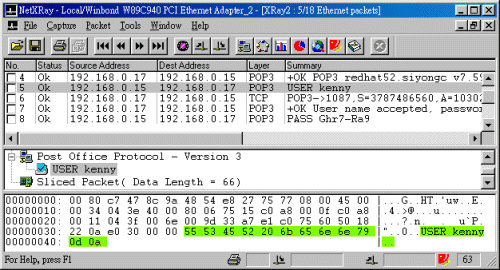
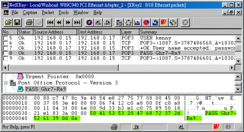
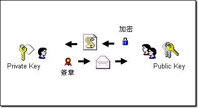

# 3-2 資料加密

## **再看封包內容**

只要封包能流經本機，我們就有很多軟體能將之抓下來。下面讓我們再擷取兩個封包﹐看看您能發現什麼？

沒錯啦﹕就是使用者名稱和密碼﹗哇﹗﹗那還了得﹖那還有保密可言嗎﹖

的確如此﹗假如您使用純文字\(paint text\)方式來傳送密碼的話﹐雖然在您的螢幕上看到的是“\*\*\*\*\*\*”﹐但使用網路封包擷取工具來看的﹐卻是原原本本的文字。雖然這裡使用的例子是擷取本機的封包﹐但其實大部份的封包擷取工具都可以擷取所有流經本地網路的封包，只要 datalink 層級的 frame 能到達本機界面就行\(這也就是為何 switch 要比 hub 更安全的原因了\)。要是您用 hub 來連接網路的話，只要駭客成功的登錄了網路中的其中一台工作站﹐那麼﹐所有資料都無所遁形。這情形在 Internet 上面也非常普遍。之所以現在的網頁流覽器﹐都會在您提交資料的時候提出警告﹐讓您認知到您的資料隨時可能被別人截獲。

那麼﹐有沒有方法避免、或儘量減少資料被竊聽的風險呢？

## **資料加密的手段**

在沒有使用資料加密之前﹐在網路中傳遞的 email 或商業資料﹐或任何文字資料﹐都有如“網路明信片”一般﹐有心人士隨手可得、一覽無遺。有鑒於此﹐人們在傳送資料之前﹐都會將資料進行加密處理\(encrypt\)﹔然後在接收到資料後﹐再進行解密處理\(decrypt\)﹐將資料還原。而在傳送過程中的資料﹐除非您有能力進行 decrypt ﹐否則您看到的只是一些雜亂無章的文字而已。

那麼﹐這個加密和解密是怎樣合作的呢﹖如果您喜歡看二次世界大戰間諜片的話﹐應該知道什麼叫密碼電報和公碼電報吧﹖公碼電報就是使用一套公認的規則﹐將資料轉換成特定的電波信號發送出去﹐然後接收到信號的那一端也使用公認的規則將信號還原成資料。而密碼電報呢﹖是使用一套只有發送者和接收者才知道的規則來發送信號和將信號還原。雖然發送出去的電波任何人都接收得到﹐但如何還原資料﹐也就是如何破解這個秘密的規則﹐就成了反間諜的一項重要任務了。聞說日本偷襲珍珠港之前﹐任何飛機都不能發送通訊﹐也就是為了避免遭美軍攔截到信號從而破解﹐因而偷襲相當成功。不過﹐其策劃者山本五十六後來也是因為美軍破解了日方的密碼電報﹐獲知其行蹤﹐在太平洋上空將其飛機擊落。

那麼﹐我們在網路傳遞資料的時候﹐如果沒有加密的話﹐就好比是公碼電報。不過﹐發送者也可以和接收者擬定自己的一套“密碼電報”﹕我們可以用自己的規則將資料加密後才傳遞出去﹐然後﹐利用秘密的管道將規則傳遞給對方﹐這樣﹐資料的保密性就大大提高了。我們稱這樣的加密方法為“單一鍵值加密”或 “對稱鍵值加密”\(Single/Symmetrical Key Encryption\)。

不過﹐這又有另外應一個問題出現了﹕假如﹐我們要將資料傳遞給上萬個客戶呢﹖要維持好這樣的一套規則恐怕是件非常耗時耗量的工作﹐是非常不符合效益的。而且，我們又如何達成鍵值的交換呢？因為，若是我們在網路上交換鑑值的時侯，若被攔截的話，那麼之後所加密的資料也將被輕易解密。

正所謂路不轉人轉﹐聰明的人們在剛才的“單一鍵值加密”方法的基礎上﹐開發出另一套更靈活的加密方法﹐叫做﹕“雙鍵值加密”或“非對稱鍵值加密”\(Double/Asymmetrical Key Encryption\)。在使用“非對稱鍵值加密”的時候﹐任何人都可以使用公開的鍵值\(public key\)進行加密﹐但需要配合另一個私有鍵值\(private key\)同時工作才能將資料解密。所謂的 public key 與 private key 是惟一的對稱關係，其情形就好像這樣﹕   
我打制了一把只有自己才擁有的鎖匙﹐另外再打制另外一把鎖匙掛在門口﹐任何人都可以拿去複製。   
然後郵局提供一個標準鐵罐來傳遞資料﹐這鐵罐本來是沒有上鎖的。   
如果朋友想傳遞資料給我﹐他就先把我掛在門口的鎖匙拿去複製﹐然後用複製好的鎖匙將鐵罐鎖上。   
一但鐵罐鎖上了﹐只有用我的私有鎖匙才能夠打得開。除非是開鎖專家﹐別人休想看到裡面的東西。

這樣﹐傳送者和接收者就無需事先約定好加密的鍵值了﹕任何人都可以將公用鍵值公佈在網路上﹐任人下載﹐然後用之加密資料送來﹐也只有擁有私有鍵值的人才能夠將資料還原。不過﹐這個時候﹐保護好私有鍵值不被盜竊﹐就成了最重要的保密工作了。

## **加密的應用**

從上面的說明中，我們或許發現使用非隊稱加密更有便利性及彈性，但它的缺點卻是：加密與解密都需要更多的運算資源，因此在效能上並不如對稱加密那樣迅速。

所以，聰明的人們總是能集優而取：大量的資料傳送通常使用對稱加密、而對稱鍵值則用非對稱加密來交換！Bingo~~~ 這樣不就解決了便利性與效能的矛盾了嗎？ ^\_^ 是的，現今許多加密應用軟體，都同時將兩種加密技術應用在一起：

1. 當 client 端連上來之後，從 server 端下載 public key 。
2. Client 端隨機產生用作對稱加密的 session key 。
3. 並使用剛從 server 端下載回來的 public key 作加密，將 session key 送回給 server 。
4. 最後用 session key 作加密，開始傳送加密資料。

當然了，以上只是一個簡單的描述而已，真正的運作會複雜得多，但基本原理則是一樣的。

## **數位簽章**

無需再花費太多的時間來解釋﹐相信您也知道資料加密的重要性和用途之廣了吧。除了可以用來做公司內部的資料傳遞﹐也可以用來和客戶進行保密交易。

在網路上﹐我們還可以使用“數位簽章\(Digital Signature\)”來進行身份確認。數位簽章可以說是一個獨一無二的數值﹐它由使用者的私有鍵值進行加密﹐然後利用公用鍵值進行確認：若 public key 能通過驗證，那我們就肯定所對應的 private key 之正確性，否則，則可排除簽章所用的 private key 。換而言之，數位簽章兼具這兩種雙重屬性："**可確認性**" 及 "**不可抵賴性**" 。

時至今天網路的廣泛應用﹐傳統的手寫簽名顯然派不上用場。但有過網上購物經驗的朋友﹐有幾何使用到“電子數位簽章”呢﹖可以說﹐今天的網上購物還是極俱風險的﹕既沒有簽名﹐也沒有電話確認﹐銀行就照樣從您的信用卡帳戶中過戶給網路商店﹐都不知道他們憑什麼居然這樣兒戲的﹖﹗要是，如果引入了數位簽章系統﹐由於它目前還被認為是“幾乎無法偽造”的特性﹐網上購物才會顯得是安全的﹕您使用您的信用卡和數位簽章進行購物﹐然後商店必須將付款資料連同您電子認證資料一起送給銀行請求授權﹐待核實無誤之後﹐銀行才會進行轉帳。這樣既保障信用卡不會被冒用﹐同時還可以減少錯帳的出現。只可惜的是﹐現今的人們還普遍缺乏網路安全意識﹐就連銀行本身﹐也只顧賺錢﹐不理顧客利益﹐實在是有點可悲的。

## **網路認證的取得**

現在的許多網站為保護流覽者的資料保密性﹐大多會使用由 Netscape 公司開發 SSL\(Security Socket layer\) 技術來進行資料加密﹐它工作於 OSI 的應用層和傳送層之間﹐所以不局限於特定的網路協定之上。不過﹐要提供 SSL 連結服務﹐網路伺服器和和流覽器雙方都必須支援才可。而 SSL 數位認證的簽發﹐目前由美國的 VeriSing \([http://www.verisign.com](http://www.verisign.com/)\) 受理﹐伺服器如果要提供 SSL 服務﹐都必須到該公司註冊才可以。 


免費申請SSL請看這邊：[https://www.sslforfree.com](https://www.sslforfree.com)

教學看這邊：[https://free.com.tw/ssl-for-free/](https://free.com.tw/ssl-for-free/)


而個人數位 ID 的申請，也可從上述網站取得。除了 Verisign 之外，任何一家獲得信任授權的機構，如台灣的網際威信\([http://www.hitrust.com.tw](http://www.hitrust.com.tw/)\)，也可核發全球信任的數位簽章。 

如果您使用網路購物﹐SSL 技術可以保障您的信用卡號碼不會被除了商店之外的人獲得﹐如果再配合數位認證的話﹐其安全性就更高了。

