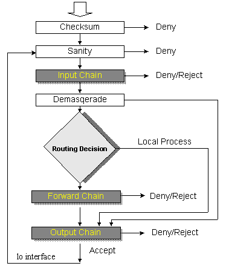
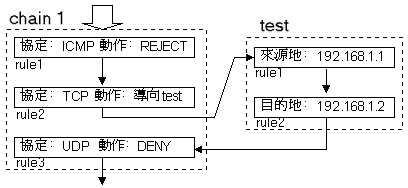
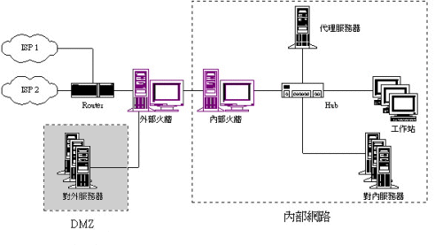

# 3-3 防火牆

我們已經知道如果保護自己的密碼﹐還有如何使用資料加密的手段來保護資料。但是如果您的電腦遭到入侵﹐密碼檔案和私有鍵值都被盜竊了﹐我們所作的努力不就白費了嗎﹖系統遭到入侵，在今天的網路環境來說已是施空見慣的了... ^\_^ 只要您的機器有連上網路，那就有被入侵的可能。因此，所有的網路安全專家所給的意見都是一樣的：**最安全的設定就是拔掉網路線！**

那麼，我們如何做到安全的網路連線呢？**除了小心還是小心！**不過，我們還可以用技術手段來對網路線線加以控制，以便將一些不"必要的"連線排除在外。這樣的技術設備，就是所謂的“防火牆\(Fire Wall\)”了。

## **何謂防火牆﹖**

Firewall 一詞，原本是建築物上用來阻隔火災的結構，也有說是位於引擎室與駕駛艙之間的汽車部件。網路的火牆就是這麼用途的啦﹕將危險的、不安全的連線阻隔在您的網路之外。而我們通常說的火牆有兩種﹕**過濾性火牆**\(filter\) 和 **代理性火牆**\(proxy\)。若沒特別說明，我們一般所說的火牆是指過濾性火牆。

然而﹐從安全覺度來看，proxy 比起 filter 來說，將更加可靠：因為它將內部與外部網路完全區隔開來了，除非它幫您做連線代理，否則別想建立連線。而且，內部網路對外部網路而言，是完全"隱形"的！除此之外，proxy 也有其非常好用的地方﹐比方說我們可以利用單一的連線﹐如使用 modem/adsl﹐然後讓整個內部網路連接外部資源﹐不僅節省硬體成本﹐而也無需支付多個 ISP 帳號與電話線路。Proxy 的功能就是“代理”﹐可以分為“程式代理”和“socks 代理”，如無特指，一般是指程式代理。

前者可以說是為你代理所有應用軟體的連線工作﹕當您需要連接外部資源的時候﹐您的請求是直接送給 proxy ﹐然後﹐proxy 會幫您到真正的目的地去獲取﹐然後再轉送給您。而每一次的代理動作﹐它都會將資料保留一個備份﹐存在它的快取區去﹐如果再接獲相同的請求\(不管是原來的機器﹐還是另外別的機器發出的\)﹐它就將存於快取裡面的資料做為回覆。有些聰明的 proxy 還能知道快取裡面的資料是否和實際目的地的資料同步呢﹐如果發現實際目的地的資料經過更新﹐它就會再次複製進自己的快取去。

從上面的這個過程﹐我們可以看得出﹐proxy 還可以提高網路的存取速度哦﹐因為如果資料已經在快取裡面了﹐其傳送都在 LAN 裡面進行﹐而無需經過複雜的路由程序。同時﹐因為資料無需從外面重複傳遞﹐實際上﹐也令到網路的流量減少許多。而且﹐通過 proxy ﹐我們也可以省下許多 IP 位址﹐因為其他機器盡可以使用私有 IP 就行了。目前正時興的網咖\(Internet Cafe\)﹐許多就是利用 proxy 來降低成本和提高 www 的瀏覽速度。另外﹐proxy 還可以再經由上游 proxy\(或proxy陣列\) 連接 internet ﹐從而再可以提高效率和安全性。

而 socks 代理呢﹖就好像接線生那樣﹐僅是將您的 TCP 連接由裡面的接口搭至外面的接口而且。還記得在“網路概念”裡面提到的 API 嗎﹖socks 代理其實就是代理 API 請求而已﹐而真正處理工作的﹐還是發出請求的主機本身。

這裡還要一提的是“**NAT**\(Network Address Translation\)”﹐它的工作原理也非常近似 socks proxy ﹐不過﹐它是利用轉換封包的位址來達到目的。如果本地網路主機要將一個封包送到外面網路﹐當火牆收到這個封包的時候﹐就會啟動 IP 偽裝功能\(maquerading\)﹐將來源位址暫時轉換成其本身位址﹐然後等到接到回應封包之後﹐再將位址進行還原\(demasquerading\)。在裡面的機器根本就無需知道這個動作﹐一切都由火牆處理好了。這和 Proxy 一樣﹐也可以節省大量的 IP 位址﹐而讓使用私有 IP 位址的主機也能夠存取 internet 了。因此，有人也將 NAT 稱為 IP Proxy 。

## **防火牆的運作原理**

如果您對 TCP 與 IP 協定已經相當了解的話﹐尤其是 IP 封包和 TCP 封包格式﹐那麼，您將會更容易了解\(過濾性\)防火牆的運作﹕火牆會對所有經過的封包進行檢查﹐按照一系列規則\(rule\)﹐來決定封包的處理方式。火牆一般都會根據封包的來源和目的位址﹑協定﹑port﹑界面等因素進行判斷﹐決定是否讓封包通過。提醒一下：firewall 只管放行與否，至於要送到哪裡去，則是 routing 所負責的。

以 Linux 2.2.x 核心的 ipchains 為例，我們可以為火牆建立一些基本原則來定義好各種的鏈\(chain\)﹕傳入\(input\)﹑傳出\(output\)﹑轉遞\(forward\)﹑重導\(redirect\)﹑等﹐來決定封包的處理動作﹕接受\(accept\)﹑拒絕\(deny\)﹑回絕\(reject\)﹑轉遞\(forward\)﹑偽裝\(masquerade\)﹑等。在此基礎上﹐然後再配合實際情形設定更多規則加以限制。

我們設定規則的時候是非常多樣性的﹐也可以由一個 chain 導向另一個 chian ﹐直到符合我們的要求為止。下面讓我們看一看一個非常陽春的規則設定例子﹕

當我們從一個 chain 跳到另一個自定義的 chain 的時候﹐如果自定義的 chain 沒有將封包剔除的話﹐就會回到剛才的 chain 的下一個規則去﹐繼續其後的規則檢查。從上例中我們可以看到﹕只有從 192.168.1.1 傳給 192.168.1.2 的 TCP 封包才能過關﹐其它諸如 ICMP 和 UDP 封包﹐及其他位址的封包一律會被擋掉。只要我們精心設計﹐不難設定出一個適合自己情形的不太鬆也不太緊的火牆的。

## **防火牆的設定技巧**

從上面的防火牆運作來看﹐我們可以運用設定規則﹐將一些重要的主機保護起來﹐讓其只允許特定的網路存取﹐也就可以將大部份的網路入侵者擯於門外。不過﹐對於那些絕頂駭客高手而言﹐還是會從您的設定漏洞攻破您的把守的﹐例如﹕他們通常會使用“取道”的方法﹐繞過那些被禁止的位址﹐以及通過不斷改變位址來逃避追蹤。有些較優秀的火牆程式﹐可以自動檢測一些駭客常用的攻擊方法﹐除了會對網路管理員發出預警之外﹐還可以即時切斷該等連線﹐和追查路徑等動作。

同時﹐利用不同系統來設定多個火牆﹐也能提高防禦能力﹕除非駭客對所有系統都熟悉﹐否則﹐過了一道火牆﹐還是過不了第二道火牆﹔而且由於第一道火牆的屏隔﹐要探測第二道火牆的難度也高許多。當然﹐要設定的規則就更為複雜了﹐通常都會造成過於嚴厲而令到一些網路資源無法使用﹐或降低了網路的效能。

所以﹐設計一套完善的規則﹐其實是件極具挑戰性的事情﹐其後也需要不斷的測試以修補漏洞﹐這也是非常耗時的工作。如果對一個繁忙的網路來說﹐事先的測試工作就顯得非常重要了﹕您總不能在收到一大堆不能連線的投訴之後而關閉火牆作調試吧﹖

通常我們在設定火牆的時候﹐劃分一個“非軍事區\(DMZ - Demilitarized Zone\)”是非常好用的﹕

我們可以設定火牆﹐允許外部直接傳入到 DMZ 上面的伺服器﹐但僅限制於某些特定的協定﹐如 DNS﹑WWW﹑FTP﹑MAIL 等﹐同時也允許內部網路使用這些服務。但外部網路是完全禁止進入內部網路的﹐而內部網路則可以通過 Proxy 存取外部資源﹔我們也允許內部伺服器使用 rsync 協定來和 DMZ 上面的機器進行資料同步。一般我們不會將重要的資料存放在 DMZ 上面的機器﹐而且郵件也會在 DMZ 接收後由內部伺服器提取進來。這樣﹐就算那裡的機器被攻破了﹐也不至於損失太多。

至於如何一一設定﹐恐怕不是這裡能夠詳細論述的了。

