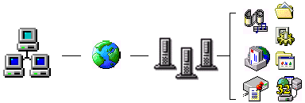
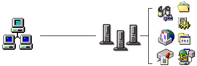
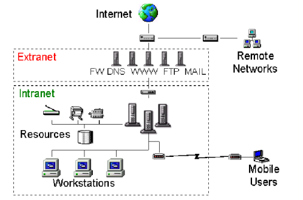

# 1-1 何為網路？

在定義上非常簡單﹕網路就是一群通過一定形式連接起來的電腦。

一個網路可以由兩台電腦組成﹐也可以擁有在同一大樓裡面的上千台電腦和使用者。我們通常指這樣的網路為**局域網**\(LAN﹐ Local Area Network\)﹐由LAN再延伸出去更大的範圍﹐比如整個城市甚至整個國家﹐這樣的網路我們稱為**廣域網**\(WAN﹐ Wide Area Network\)﹐當然您如果要再仔細劃分的話﹐還可以有MAN\(Metropolitan Area Network\) 和 CAN\(Citywide Area Network\)﹐這些網路都需要有專門的管理人員進行維護。

而我們最常觸的**Internet**則是由這些無數的LAN和WAN共同組成的。Internet僅是提供了它們之間的連接﹐但卻沒有專門的人進行管理\(除了維護連接和制定使用標準外\)﹐可以說Internet是最自由和最沒王管的地方了。在Internet上面是沒有國界種族之分的﹐只要連上去﹐在地球另一邊的電腦和您室友的電腦其實沒有什麼兩樣的。

因為我們最常使用的還是LAN﹐\(即使我們從家中連上Internet﹐其實也是先連上ISP的LAN\)﹐所以這裡我們主要討論的還是以LAN為主。LAN可以說是眾多網路裡面的最基本單位了﹐等您對LAN有了一定的認識﹐再去了解WAN和Internet就比較容易入手了﹐只不過需要了解更多更複雜的通訊手段而已。

### **Internet? In**tra**net? Extranet?**

接觸過網路的朋友﹐或多或少都應該聽過上面幾個名詞吧﹖不過﹐大家可知道它們之間的分別和如何定義嗎﹖

其實﹐最早出現的名詞應該是 Internet﹐然後人民將 Internet 的概念和技巧引入到內部的私人網路﹐可以是獨立的一個 LAN 也可以是專屬的 WAN ﹐於是就稱為 Intranet 了。它們之間的最大分別是﹕開放性。Internet 是開放的﹐不屬於任何人﹐只要能連接得到您就屬於其中一員﹐也就能獲得上面開放的資源﹔相對而言﹐Intranet 則是專屬的﹑非開放的﹐它往往存在於於私有網路之上﹐只是其結構和服務方式和設計﹐都參考 Internet 的模式而已。

至於 Extranet﹐算得上是針對 Intranet 而延伸出來的概念。既然 Intranet 是指內網路部而言﹐那麼 Extranet 則指外部的網路了。Extranet 通常是企業和 Internet 連接﹐以向公共提供服務的網路。不過﹐這並非是單純根據物理或邏輯位置來定義﹐主要是以連接的形式和功能來區分。例如某個外部網路﹐如果單純的透過網路來連接我們的 Extranet 或 Intranet ﹐那它只是一個毫不相關的外部個體而已﹔但是﹐如果我們用 VPN 或其它信任形式將對方連接起來﹐那麼對方也可以屬於 Extranet 或 Internet 的部份。

