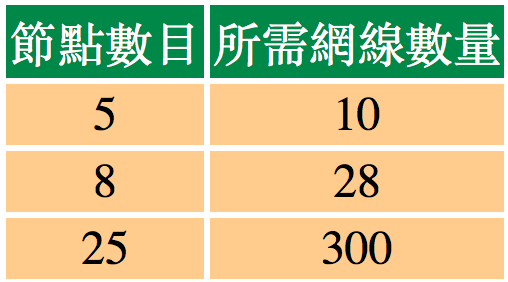
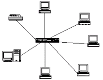
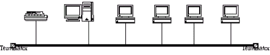
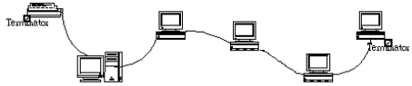
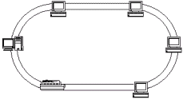
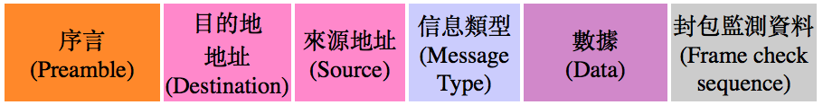
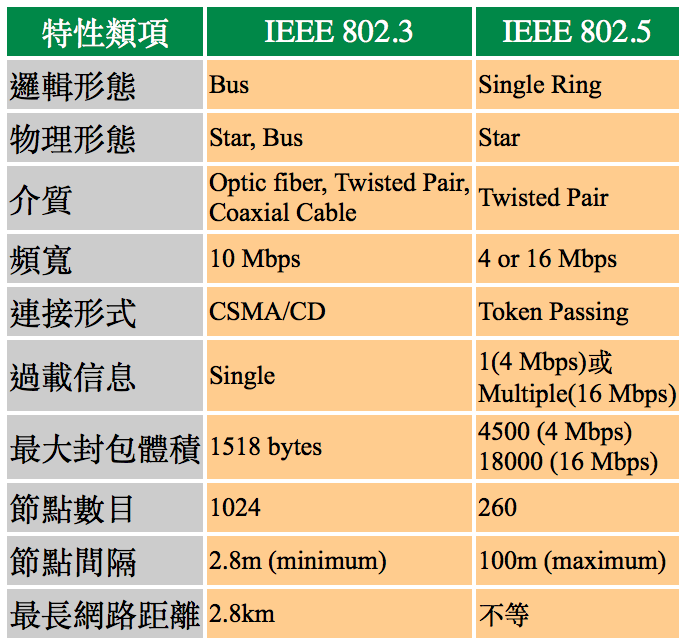
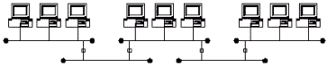

# 1-5 網路架構

在這裡我們將要討論一些網路物理和邏輯形態﹐以及它們各自的特征﹐同時也會開始介紹IEEE的802.x標準。

## **網線的困繞**

要組成網路﹐當然先要將幾個機器連接起來啦。假如您喜歡的話﹐我們可以將每兩個網路節點都直接用網線連接起來﹐如果材料夠﹐地方又允許的話﹐這完全是有可能的。那麼按此接法﹐我們需要的網線數量 = 節點數目 x \( 節點數目 - 1 \) / 2 ﹐也可以從下面的列表中直接看出來﹕

天哪﹗如果有一百台電腦起不是整個辦公室都佈滿網線了﹖﹗而且網線也需要錢買的啊﹐所以實際上﹐是沒有人會採用這樣的連線方法的。

## **物理形態**

### **星狀形態\(Star Topology\)**

一個星狀的網路形態裡面﹐在中央是一個集線器\(hub\)﹐或MAU \(Multistation Acces Unit\)﹐所有的工作站﹑伺服器和印表機都接到hub上面﹐看上去就象一顆星星向四週放射星光一樣﹐因而得名。

Hub通常有兩種﹕**惰性\(Passive\) Hub** 和 **活性\(Active\) Hub**。前者僅僅是將各個接口\(port\)連接起來﹐也就是將上面的那個接線方法從一個辦公室縮小為一個盒子罷了﹐再無其它功能了﹔而後者除了會起到增益器\(Repeater\)的作用之外\(其實這是活性Hub的最基本功能了\)﹐還可能肩負 **網橋\(Bridge\)** 和 **路由器\(Router\)** 的功能\(這兩種功能稍後會解析\)。

星狀的形態裡面﹐hub是不可缺少的部件﹐如果一個hub的接口都接滿了﹐我們還可以引一條線出去接另外一個hub﹐這樣就有另外一個星星了﹐但最多可以串接**4個** Hub \(也就是共5個\)。

星狀形態的優點是﹕

* 容易傳輸
* 容易除錯
* 容易佈線

使用星狀形態﹐伺服器無需知道信息請求是從哪個節點來的﹐也不必擔心回應給誰﹐只需知道哪個port就可以了﹐然後hub會決定如何傳遞給真正的機器。這也給除錯帶來方便﹐如果有哪台機器不能連上網路﹐我們只需要查看這台機器和hub之間的連接就是了。如果您的機器都四散東西﹐甚至樓上樓下的﹐使用星裝形態的話﹐你就不必擔心如何將它們整體的連接起來﹐只需關心各台機器怎樣集中到hub而已。

### **總線形態\(Bus Topology\)**

在 **Bus** 形態裡面也有兩個類型﹕一是 **Thick Ethernet**﹐另一是 **Thin Ethernet**。前者使用一條厚厚的中央網線\(10base5\)﹐兩頭帶有終端電阻﹐然後各接點再通過一條較幼的網線連到這條厚線上面﹔而後者則只使用10base2 網線將所有的節點連接起來﹐網線和節點之間使用T型接口連接﹐而在兩端的接點則各連接一個終端電阻。

Bus形態的最大問題是出現問題的時候的問題\(繞口令？\)﹐網路這時候需要整個停下來檢查﹐如果是因為終端電阻沒接好那還好辦﹐換一個就可以。但要是其中一個節點有問題的話﹐你就得慢慢找出來了。在star形態裡面﹐要是該節點有問題﹐受影響的僅是其接點罷了。但在bus上面則不同﹐如果一個節點是關閉的話﹐封包會略過它而直接通過T型接頭傳給下一個開著的節點。然而﹐要是該有問題的接點開著的話﹐也會接收和發送封包﹐但卻會令到網路越來越慢甚至停頓下來。

順便一提﹐我們在給10Base2網路除錯的時候﹐一個較好的方法是﹕先從中間斷起。就是將其中一個終端電阻接到中間的節點去﹐然後檢查各自分開的部份﹐找有問題那邊﹔再繼續斷開中間﹐如此一直到找到問題的節點為止。

Bus形態唯一好處是便宜﹕無需hub而且省cable﹑省錢。如果在家裡玩玩或接點不多﹐Bus形態也是值得考慮的。

### **環狀形態\(Ring Topology\)**

一般來說﹐這樣的形態我們是比較少見到的﹐因為其佈線是一個非常頭痛的問題﹐您大概從下圖可見一斑﹕

Ring形態可以說補足了bus的短處﹐且無需使用終端電阻。因為它使用雙網線連接﹐當然其佈線數量也是雙倍增加了。但在一般的辦公室環境裡面甚少會見到物理Ring形態的網路﹐它通常是用來做為連接數建築物之間的高速龍骨幹網﹐如FDDI等。

## **邏輯形態**

雖然我也知道我很囉嗦﹐但我還是要提醒大家﹐網路形態和邏輯形態是兩碼子事情﹐在學習邏輯形態的時候我建議您先將物理形態忘記掉。

### **Bus / Ethernet**

我想Ethernet恐怕是最佳的邏輯bus形態例子了﹐它也是現在最普遍的LAN類型。

這個邏輯bus形態是如何工作的呢﹖很簡單﹐就是每次只能有一個節點在網路上傳遞數據給其它節點﹐其形式是通過對整個網路進行廣播\(broadcast\)。然後其它接點收聽到廣播之後﹐就看看數據是否傳個自己的﹐如果是﹐則接收下來﹔如果不是﹐則略過。每一節點都有一個自己用的48bit的地址\(也可以稱為Node ID﹐也就是在前面說的網卡地址了\)﹐而每一個在網路中傳輸的數據都是以這個地址為傳送和接收依據的。

當任何一個節點進行廣播的時候﹐所有的其它節點都收聽得到。其情形就像我們上課一樣﹐老師說﹕“第幾排第幾號同學出來拿作業﹗”雖然全班同學都聽得到﹐但卻只有一位同學可以拿到。Bus形態也和這種形式很類似﹐當然具有更嚴謹的一套法則啦。在bus上面的數據都是以框包\(frame\)形式傳遞的﹐框包送出來之後﹐會同時向bus兩端廣播﹐當目的地接收到給它的框包﹐也不是據為己有的﹐而是複製一份給自己﹐而原來的框包則還是會繼續被送給下一個節點﹐直到封包抵達終端電阻才會被銷毀。

任何類型的數據要在這一網路上面傳遞的話﹐都必須嚴格的遵循既定的框包格式﹕**Data Link Layer Frame 格式**﹐是給網路用來安排數據的。Ethernet的Data Link Layer Frame看起來如圖﹕

每一個 frame 都不可以超過1518bytes﹐這樣就可以確保任何一個工作站都不會佔用網路太久。工作站對網路廣播之前﹐都會先傾聽一下有沒其它人在使用網路﹐如果聽起來很安靜﹐則它會發送廣播。但要是網路上仍然嘈嘈的呢﹖\(這個情形就是bus形態最擔心的\)﹐這時候工作站就需等待了。

假如節點A和節點B相隔得太遠的話﹐當他們傾聽的時候可能都還沒聽得到對方有話要說﹐就都同時把封包出去﹐這就是所謂的**碰撞\(collision\)**了。如果當一個碰撞發生了﹐就會在網線產生一個頻率徊蕩\( frequecy ripple\)。如果第一個節點監測到有這樣的 ripple ﹐它就會發出一個高頻信號去清除所有其它信號。這個信號告訴所有節點碰撞已經發生﹐這樣全部節點都不會再發送封包了。這時候﹐每一個節點都會隨機的等待一段時間再重新進行廣播﹐總共可以進行16次嘗試大家才會最終放棄。不過其情形也不會好到哪裡﹐因為在大家等待之後﹐彼此都有封包要發送﹐誰都想先發送自己的封包﹐如果節點越多﹐距離越長﹐發生碰撞的機會也就越高。

情形就象上課時您要發言﹐得先看看有沒有其它同學在發言﹐如果已經有人在說話了﹐那你就先等他/她講完再舉手。要是兩個人都同時舉手﹐老師就會宣佈重新再舉手﹐這時候大家可以在一秒鐘之內再舉手﹔要是還是一樣﹐那麼可以再於兩秒之內任何時段舉手﹔再來就4秒﹑8秒﹑16秒....的延續下去﹐要試過16次都還一樣﹐沒辦法了﹐大家都不要說好了。

在網路上﹐我們稱這樣的方法為 **CSMA/CD** \(Carrier-Sensing Multiple Access with Collision Detection\)。

**要注意的是**﹐所有這些處理過程都必須在Ethernet 網卡上面進行﹐也就是說﹐如果您要選用Ethernet形態﹐那麼你就必須全部使用Ethernet網卡。Ethernet可以在bus, star 等物理形態上面使用。10baseT就是使用star的物理形態﹐但邏輯上卻是bus形態來的﹐同樣也是Ethernet﹐使用的是IEEE802.3標準。

### **Token Ring**

Token Ring網路在物理上也和100BaseT Ethernet一樣使用star形態。只不過代替hub的是MAU而已﹐一個MAU可以連接八台電腦﹐然後還可以連接到另一個MUA。一塊Token Ring網卡上面﹐其中有端會帶有一個D-shell類型的接頭﹐而另一端則有一個odd-looking IBM接頭。在Token Ring上面無需使用終端電阻﹐網線的一頭接到網卡﹐另一頭接在MUA就可以了。

我們還記得在Ethernet系統上面使用廣播形式傳送封包﹐然而在Token Ring裡面﹐每一個節點都只會得到其前面的一個節點送來的信息。Token Ring的靈魂所在是一個叫做 Token Packet的封包。為了避免碰撞發生﹐Token Ring可以確保每次只能有一個工作站可以發送資料﹐它們使用token packet\(或曰token stick\)來達到這一目的。只有獲得這個Token packet的接點才可以發送資料。

舉個例子﹐同學們在班上為了避免同時有兩個人發言﹐於是就使用一個令牌﹐由一個同學傳給下一個同學﹐然後最後的同學傳回給最前面的同學。拿到令牌的同學﹐看看如果令牌是空的﹐就把說話寫在令牌上面\(寫滿為止﹐如果不夠用﹐等下次再寫\)﹐然後註明來源地址和目的地址﹐再將令牌傳給下一位同學。接到令牌的同學﹐會檢查目的地址﹐如果不是給自己的﹐就傳給下一位﹐如果地址是給自己的﹐則抄一份保存﹐原來的令牌照樣傳遞下去。因為令牌是繞著圓圈的傳遞﹐所以始終會到自己手上的。當那位原先發送信息的同學收回令牌﹐看到來源地址是自己的﹐就把令牌擦乾淨﹐然後把令牌交給下一位同學﹐就算他還有話要說﹐也要這樣做。如果下一位同學沒有東西要寫﹐就簡單的把令牌交給下再一位則可﹔如果有東西要寫﹐就重複剛才的規則。

Token Ring上使用的是類似的方法﹐只是略有不同而已﹕當一個節點獲得Token Packet並完成了信息準備之後﹐它會傳給下一個節點﹐如果沒有人接下來﹐就再傳一次﹐如果第二次都沒有人要﹐則給整個網路發送一個solicit successor fram的常規請求﹐詢問“有誰想要這一個Token啊﹖”﹐如果有節點回應這個請求﹐它就把Token直接傳到該地址。

不過同是使用Ring形態的FDDI則略有不同﹐也拿剛才的例子說明﹕凡是拿到令牌的同學﹐先把要說的東西寫在紙條上面﹐也註明是誰寫給誰的﹐然後把紙條夾在令牌上傳給下一位﹔要是沒有話要說就把令牌直接傳給下一位即可。等收到令牌的時候﹐就看看信息是否給自己的﹐如果是就抄一份保存下來﹐如果同時還有信息要送呢﹐再按格式填寫紙條﹐也夾在令牌上面傳給下一位同學。等令牌在繞回來的時候﹐檢查上面的那些紙條﹐如果發現發信人是自己的話﹐就把紙條拿下來﹐然後撕掉就行了。

在網路上﹐我們稱這種方法做﹕**Token Passing**。

### **IEEE802.3 vs. IEEE802.5**

我們稱Ethernet的傳遞形式為廣播\(broadcast\)形式﹐Token Ring使用的則是指定\(dedicated\)形式﹔broadcast屬于probabilistic形式的協定﹐也就是不能夠保證工作站可以獲得接通網線的能力。Token Ring則屬于deterministic形式的協定﹐也就是使用一套規則來保證工作站有接通網線的能力。在IEEE定標準面﹐Ethernet屬于802.3標準﹐而Token Ring則屬于802.5標準：

另外還要一提的是﹐有個IEEE802.4標準﹐在物理上使用bus形態的﹐但卻以Token Passing的形式來傳遞資料。和Token Ring一樣﹐只有得到Token的節點才可以發送資料﹐但一旦其獲得了接收節點的確認回應﹐就得把Token交給下一節點了。在網路裡必須有一套機制來追蹤哪一個節點會是下一個得到Token的節點。在網路上面會有一個master的角色﹐如果token丟失或由某些原因不能傳送﹐master會先對全網路發出請求﹐然後宣佈取消舊的token而重新發放一個﹐它比任何其它節點要有最優先權獲得Token。

不過比起Token Ring的star形態來說﹐802.4畢竟還是有其不足之處的。比如在802.5裡面使用的mart hub﹐有能力偵測到工作不良的節點﹐從而可以把Token繞過它來傳遞﹐同時會指示出哪一個節點有問題﹐而802.4則做不到這點。

## **五四三原則**

我們知道網線的傳輸距離都是有限的﹐如果節點之間的距離太遠﹐我們就需要在中間使用增益器\(Repeater\)來將信號放大後繼續傳輸。如果使用802.3協定的時候﹐有一個原則我們是必需遵守的﹕**五四三原則**。意思就是網路上最多只能有﹕

* **5**個網段\(segment\)。所謂segment就在物理連接上最接近的一組電腦﹐在一個BNC網段裡面最多只能接30台電腦﹐且網線總長不能超過185m。
* **4**個增益器\(repeater\)。也就是將信號放大的裝置。
* **3**個電腦群體\(population\)。這個不好理解﹐也就是說前面所說的5個segment之中﹐只能有3個可以裝電腦﹐其它兩個不行。

這個原則看上去就好像這樣﹕

